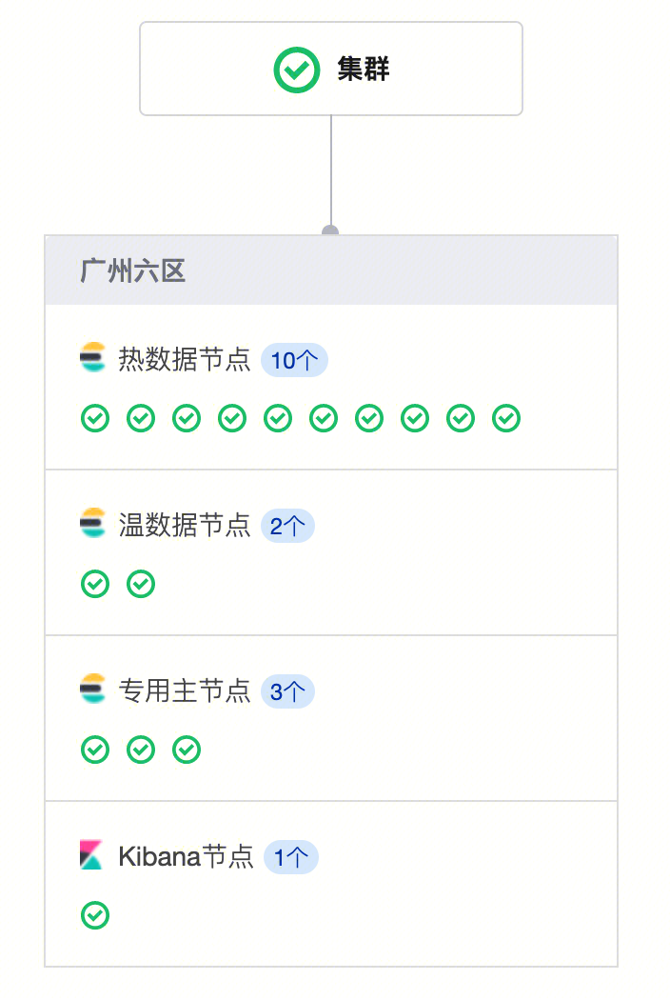
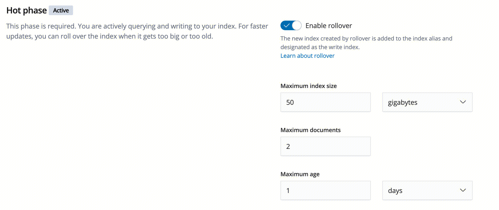
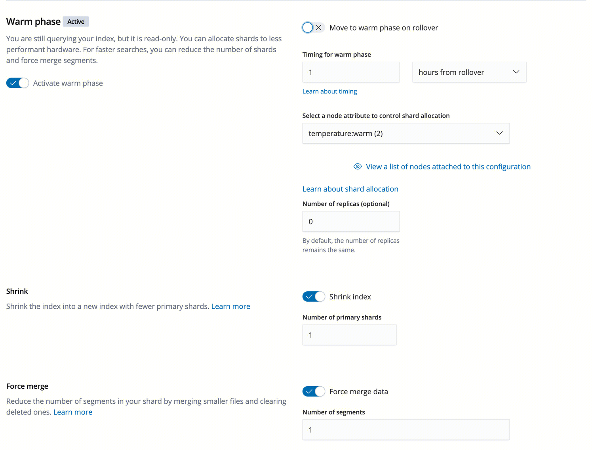
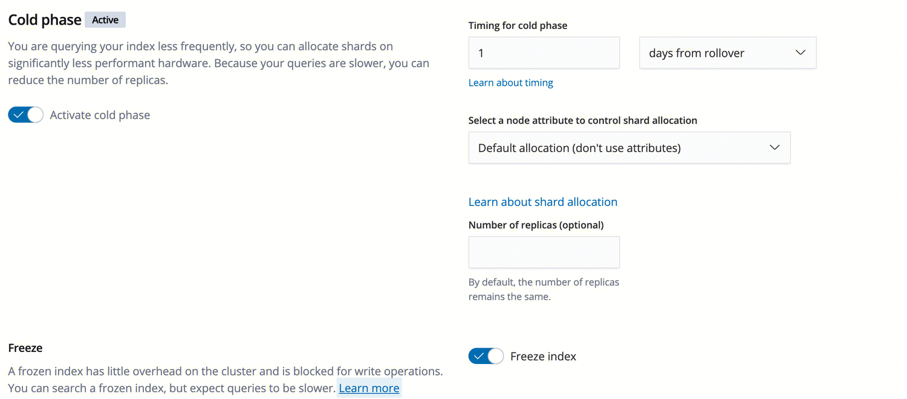

## es 的集群架构
### 1. 开源ES版本
6.8.2
### 2. 集群架构：

热数据节点：（CPU32核 内存64G SSD6300GB）x 10 个
温数据节点： （CPU8核 内存16G  SATA20GB）x 2 个
专用主节点： （CPU8核 内存16G） x  3 个 。当集群超过10个数据节点时，建议配置专用主节点；当未选择专用主节点时，数据节点充当专用主节点的角色。
Kibana节点： （CPU1核 内存2G）x  1 个

### 3. 索引生命周期：
Elasticsearch 主要用于海量数据的存储和检索，若将所有数据都放在 SSD 硬盘上，成本会非常高。可通过冷热分离来解决这个问题，冷热集群可以在一个集群内包含冷、热两种属性的节点，从而兼顾性能和容量之间的矛盾：

- 对读写性能要求比较高的热数据（例如7天内的日志）可以在热节点上以 SSD 磁盘存储。
- 对存储量需求比较大但对读写性能要求较低的索引（例如1个月甚至更长时间的日志）可以在冷节点上以 SATA 磁盘存储。

在kibana上的Manager页面中，使用Index Lifecycle Policies配置索引生命周期策略：
#### Hot phase 

**主要功能：** 
根据索引的文档数、大小、时长决定是否调用 rollover API 来滚动索引。This phase is required. You are actively querying and writing to your index. For faster updates, you can roll over the index when it gets too big or too old.

**rollover API**：（本身需要主动调用的API）
把写别名指向滚动生成的新的索引，生成新索引的条件为文档数、大小、时长。
https://www.elastic.co/guide/en/elasticsearch/reference/6.8/indices-rollover-index.html

#### Warm phase

**主要功能：**
进入该阶段的索引会被设置为 read-only，并放入warm节点中。You are still querying your index, but it is read-only. You can allocate shards to less performant hardware. For faster searches, you can reduce the number of shards and force merge segments.

1. 规定索引在发生rollover之后多久进入warm phase
2. 进入warm phase之后，数据从hot节点挪到warm节点
3. Shrink 
4. Force Merge

##### Shrink
在 Elasticsearch 中，每个索引都包含多个分片，而 Elasticsearch 集群中的每个分片都有助于使用cpu，内存，文件描述符等。这无疑有助于并行处理的性能。 以时间序列数据为例，你将对带有当前日期的索引进行大量读写。
如果该索引下降了请求，并且仅时不时地从该索引中读取数据，那么我们不再需要那么多分片，并且如果我们有多个分片，它们可能会建立并占用大量的计算能力。对于要减少索引大小的情况，可以使用 Shrink API 减少主分片的数量。
1. 设置index为只读，并将index的所有分片**relocated到一个节点**（shrink_node）. It can take a while to relocate the source index.
```
PUT /my_source_index/_settings
{
  "settings": {
    "index.routing.allocation.require._name": "shrink_node_name", 
    "index.blocks.write": true 
  }
}
```
2. 利用shrink创建新的index，可以指定新的分片数量和replica数量
```
POST my_source_index/_shrink/my_target_index?copy_settings=true
{
  "settings": {
    "index.number_of_replicas": 1,
    "index.number_of_shards": 1, 
    "index.codec": "best_compression" 
  },
  "aliases": {
    "my_search_indices": {}
  }
}
```
https://www.elastic.co/guide/en/elasticsearch/reference/6.8/indices-shrink-index.html

##### Force Merge
为什么需要merge： https://cloud.tencent.com/developer/article/1846903
lucene底层数据存储是基于segment的，多个segment组合将构成一个index。但是segment是不可变更的，因此ES删除和更新数据都是标记的。
删除：每个segment中维护一个.del 文件，ES 只是逻辑删除文档，在.del 文件中标记为已删除，查询依然可以查到，但是会在结果中过滤掉。
更新：引入版本的概念，旧版本的记录将对应的segement的 .del 文件中标记为删除，新版本的文档将被索引到一个新段（Segment）。
因此，不管是更新还是删除，segment中的数据都是不会改变的，磁盘空间也并没有回收。再查询的时候会查询所有segment，然后根据.del去过滤。**segment越多，搜索速度就越慢。** 因此，制定合理的merge 策略以及如何自动的进行force merge是ES性能优化的手段。

Merge的时候，会将多个segment合并成指定数量的segment。并把del标记的记录从磁盘上删除，这个时候才真正的删除了数据，释放了磁盘空间。


#### Cold phase

**主要功能**：进入cold阶段，可以把数据挪到性能更差的cold node上。（相当于第三层冷热分离）。支持设置freeze操作。

##### freeze
https://blog.51cto.com/noregrets/3048995
ES索引内容在内存中放了一些数据结构让你高效搜索、索引数据。如果有许多索引，那么这些数据存放的内存会增大到一个不容小觑的量级。频繁搜索的索引最好将这些数据结构放在内存，因为重建他们要花时间。与此同时，**那些你几乎不用的索引，你可以释放适量的内存（freeze）**，在每次搜索时重建数据结构。

##### Delete phase
在rollover多久之后删除该index。You no longer need your index. You can define when it is safe to delete it.

#### 设置ilm
1. kibana设置ilm策略
``` 
GET _ilm/policy

"block-page-feedback-policy" : {
    "version" : 3,
    "modified_date" : "2023-01-11T08:04:40.602Z",
    "policy" : {
      "phases" : {
        "warm" : {
          "min_age" : "1h",
          "actions" : {
            "allocate" : {
              "number_of_replicas" : 0,
              "include" : { },
              "exclude" : { },
              "require" : {
                "temperature" : "warm"
              }
            },
            "forcemerge" : {
              "max_num_segments" : 1
            },
            "shrink" : {
              "number_of_shards" : 1
            }
          }
        },
        "cold" : {
          "min_age" : "1d",
          "actions" : {
            "allocate" : {
              "number_of_replicas" : 0,
              "include" : { },
              "exclude" : { },
              "require" : { }
            },
            "freeze" : { }
          }
        },
        "hot" : {
          "min_age" : "0ms",
          "actions" : {
            "rollover" : {
              "max_size" : "50gb",
              "max_age" : "1d",
              "max_docs" : 2
            },
            "set_priority" : {
              "priority" : 100
            }
          }
        },
        "delete" : {
          "min_age" : "30d",
          "actions" : {
            "delete" : { }
          }
        }
      }
    }
  }
```

2. 索引模版关联ilm策略

``` 
GET _template  

"block_page_feedback_with_policy_template" : {
	"order" : 99,
	"index_patterns" : [
	  "block-page-feedback-*"
	],
	"settings" : {
	  "index" : {
		"lifecycle" : {
		  "name" : "block-page-feedback-policy",
		  "rollover_alias" : "block-page-feedback_write_alias"
		},
		"refresh_interval" : "10s", //当数据添加到索引后并不能马上被查询到，等到索引刷新后才会被查询到。 refresh_interval 配置的刷新间隔
		"number_of_shards" : "30", // 分片数量
		"max_result_window" : "65536", //最大查询窗口
		"unassigned" : {
		  "node_left" : {
			"delayed_timeout" : "5m"
		  }
		},
		"bulk_routing" : {
		  "enabled" : "true"
		},
		"number_of_replicas" : "0"
	  }
},
```

3. 创建索引，匹配索引模版
``` 
// PUT /<waf-access-log-0-{now/d}-000000001>

PUT /%3Cblock-page-feedback-%7Bnow%2Fd%7D-000000001%3E
{
  "aliases": {
    "lock-page-feedback-write-alias": {
      "is_write_index": true
    }
  }
}
```

## 索引数据大小，分片有多少
索引设计：accesslog 根据客户appid 有大约 15个index滚动更新。....
索引大小 ： WAF根据索引模版和索引生命周期，每个索引滚动策略为 "max_size" : "160gb", "max_age" : "4h","max_docs" : 1000000000。 
索引分片： 30 sharding
索引备份：0 replica （成本问题）
24小时总数据量 ：690,204,071 （约7亿）


## 调优手段
### 设计阶段调优
1. 使用生命周期管理索引，基于rollover API滚动索引。
2. 使用生命周期管理索引，设计数据冷热分离。
3. 冷数据shrink操作，以提升性能和释放空间；
4. 冷数据force_merge 操作，以提升性能和释放空间；
5. Mapping 阶段充分结合各个字段的属性，是否需要检索、是否需要聚合排序等

### 写入调优
1、写入前副本数设置为 0；
2、写入前关闭 refresh_interval 设置为-1，禁用刷新机制；
3、写入过程中：采取 bulk 批量写入；
4、写入后恢复副本数和刷新间隔；
5、尽量使用自动生成的 id。

### 查询调优
1、禁用 wildcard；
2、禁用批量 terms（成百上千的场景）；
3、充分利用倒排索引机制，能 keyword 类型尽量 keyword；
4、数据量大时候，可以先基于时间敲定索引再检索；
5、设置合理的路由机制。


