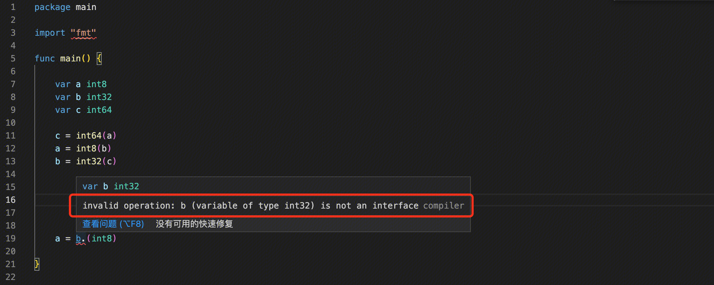
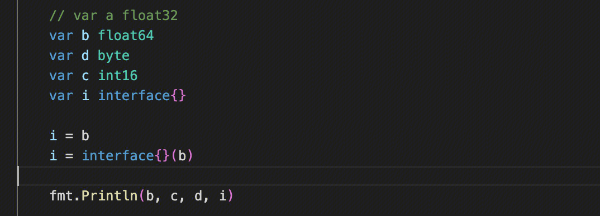
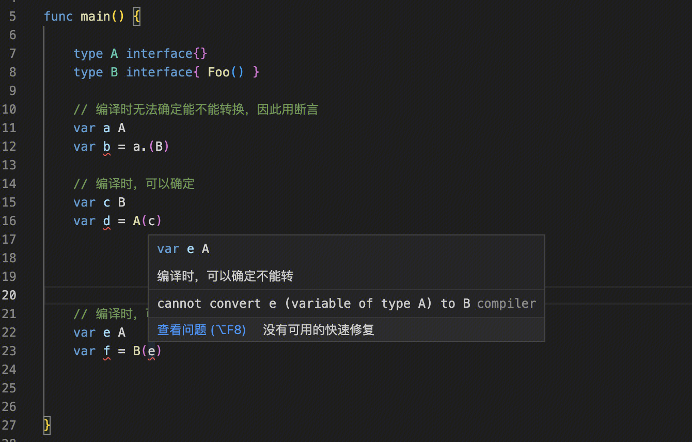

## 基本类型

- int、int8、int16、int32、int64（指bit）
- float32、float64
- string
- bool
- byte

基本类型转换使用**强制类型转换**，无法使用断言（非interface）或者隐式转换

## 转换规则

- int、float、byte(uint8)之间可以转换
- bool无法和其他类型转换
- string可以和[]byte转换

## interface和基本类型
### 基本类型转interface

可以使用强制类型转换或者隐式类型转换
struct同样可以通过强制类型或者隐式类型转换为interface

### interface转基本类型
interface转基本类型或者struct只能通过类型断言。因为需要在程序运行时才能确定interface可以转换的类型。
断言可以使用直接断言（转换失败panic） + 安全性断言（额外提供结果，判断是否成功）+switch断言

## interface转interface
编译时可以确定的，使用强制
运行时才可以确定的，使用断言

# 问题
string 和 []byte进行类型转换的时候，能避免内存拷贝吗？
https://www.cnblogs.com/cheyunhua/p/15570988.html

# 参考
https://www.jianshu.com/p/bd2acab2a8e9
https://studygolang.com/articles/3314
https://juejin.cn/post/6844903973208457224