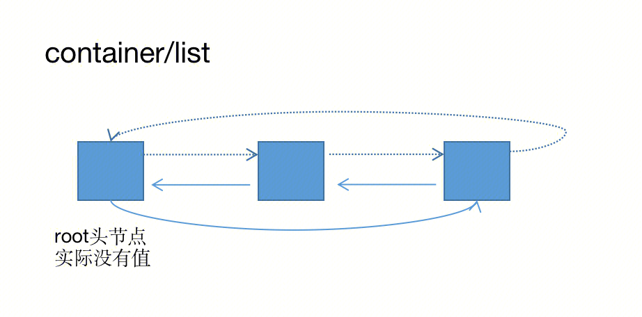

## list


### Element

``` 
type Element struct {
    next, prev *Element
    // The list to which this element belongs.
    list *List
    // The value stored with this element.
    Value interface{} //Value是inerface，因此可以存多种值，但是在取出来的时候要用switch判断该值的类型。
}

// Next returns the next list element or nil.
func (e *Element) Next() *Element {
    if p := e.next; e.list != nil &amp;&amp; p != &amp;e.list.root {
        return p
    }
    return nil
}

// Prev returns the previous list element or nil.
func (e *Element) Prev() *Element {
    if p := e.prev; e.list != nil &amp;&amp; p != &amp;e.list.root {
        return p
    }
    return nil
}
```
### List
``` 
type List struct {
    root Element // 头节点 sentinel list element, only &root, root.prev, and root.next are used
    len  int     // current list length excluding (this) sentinel element
}
```
###  Method
``` 
package main

import (
    "container/list"
    "fmt"
)

func main() {
    var l = list.New()
    //push back or front
    e1 := l.PushBack("33")
    e2 := l.PushFront(1)
    //insert back or front
    e3 := l.InsertBefore(make(map[int]interface{}), e2)
    e4 := l.InsertAfter(make(map[int]interface{}), e1)
    //remove
    v3 := l.Remove(e4)
    switch vv := v3.(type) {  //switch断言+转换类型
    case string:
        fmt.Println(vv)
    case int:
        fmt.Println(vv)
    default:
        fmt.Println("map")
    }
    //move back or front , before or after element
    l.MoveToBack(e3)
    l.MoveToFront(e2)
    l.MoveAfter(e2, e3)
    l.MoveBefore(e2, e3)
    //push front or back otherlist
    l.PushFrontList(l)
    l.PushBackList(l)

}
```
### 遍历
``` 
//这里只能把root（头节点）理解为nil
for e := l.Front(); e != nil; e = e.Next() {
        fmt.Println(e.Value)
    }
for e := l.Back(); e != nil; e = e.Prev() {
        fmt.Println(e.Value)
    }
```
### 资料
- https://ijayer.github.io/post/tech/code/golang/tutorial-go36-03/ （第三方）
- https://pkg.go.dev/container/list （官方）
- https://cs.opensource.google/go/go/+/refs/tags/go1.18:src/container/list/list.go （源码）


### Notice
switch 默认情况下 case 最后自带 break 语句，匹配成功后就不会执行其他 case，如果我们需要执行后面的 case，可以使用 fallthrough


## 堆

- 堆是一个序列，序列满足第i个元素的值大于或小于第2i以及第2i+1个元素的值。
- 堆最核心的操作时down和up操作
- down是指向下调整第i个元素，使得第i个元素以后都满足堆
- up是指向上调整第i个元素，使得第i个元素以上都满足堆

## 堆的操作
- 将一个普通的序列调整为满足堆的序列：从len/2个元素开始down，直到第0个元素down。
- 取最大堆的最大元素/最小堆的最小元素：将堆顶和最后一个元素交换，并down一次堆顶。返回堆最后一个元素。
- 删除堆中元素：将改元素和最后一个元素交换，并down一次或up一次
- 加入元素到堆：假如堆序列尾部，使用一次up
- 改变堆中元素：down一次或up一次

## golang堆的使用方法
golang less方法 控制创建大根堆或者小根堆。
less返回小于 --> 小根堆
less返回大于 --> 大根堆
https://www.cnblogs.com/huxianglin/p/6925119.html
container/heap中提供了heap方法（heap并非一种数据结构）
因为heap算法中涉及元素的比较和交换以及判断长度，这些其实是sort的接口。需要继承
然后，heap还需要有获取序列最后一个元素的pop方法和增加一个元素到序列尾部的push方法
因此，使用heap算法，需要实现五个接口：len，less，swap，pop，push。
举例：
```
type intHeapList []int

func (iHL *intHeapList) Len() int {
    return len(*iHL)
}

func (iHL *intHeapList) Less(i, j int) bool {
    return (*iHL)[i] > (*iHL)[j] //最大堆
}

func (iHL *intHeapList) Swap(i, j int) {
    (*iHL)[i], (*iHL)[j] = (*iHL)[j], (*iHL)[i]
}

//取出iHL的最后一个元素，并且iHL缩短最后一位
func (iHL *intHeapList) Pop() interface{} {
    res := (*iHL)[iHL.Len()-1]
    *iHL = (*iHL)[:iHL.Len()-1]
    return res
}

//向iHL最后加入一个元素
func (iHL *intHeapList) Push(x interface{}) {
    *iHL = append(*iHL, x.(int))
}

func getLeastNumbersByHeap(arr []int, k int) []int {
    if k == 0 {
        return nil
    }
    if len(arr) < k {
        return arr
    }
    h := intHeapList{}
    heap.Init(&h)
    for _, val := range arr {
        if h.Len() < k { //一开始填满heap
            heap.Push(&h, val)
        } else {
            maxInHeap := heap.Pop(&h).(int)  // POP
            if val < maxInHeap {
                heap.Push(&h, val) //小于则替换 PUSH
            } else {
                heap.Push(&h, maxInHeap) //大于则放回
            }
        }
    }
    return h
}

```