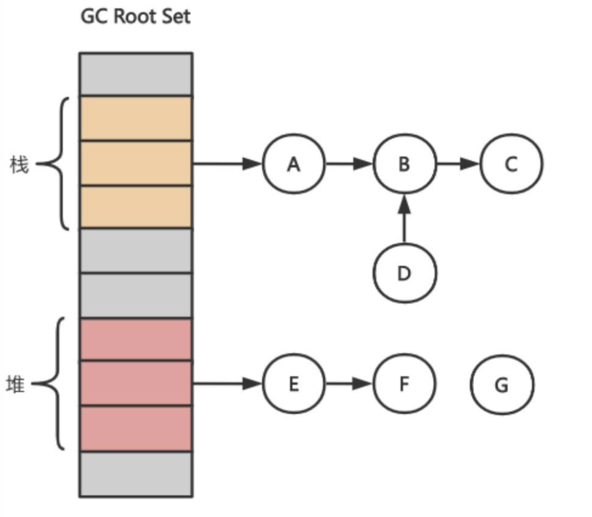
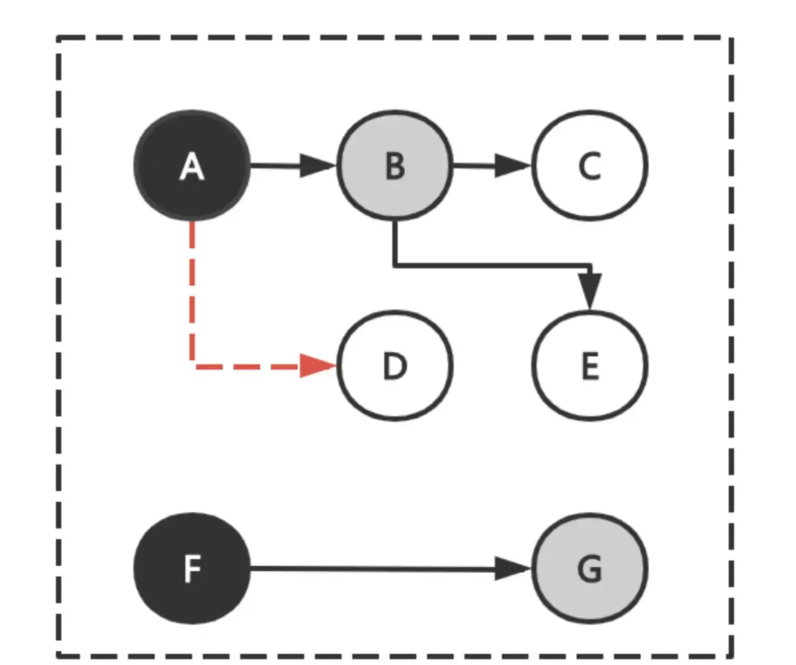
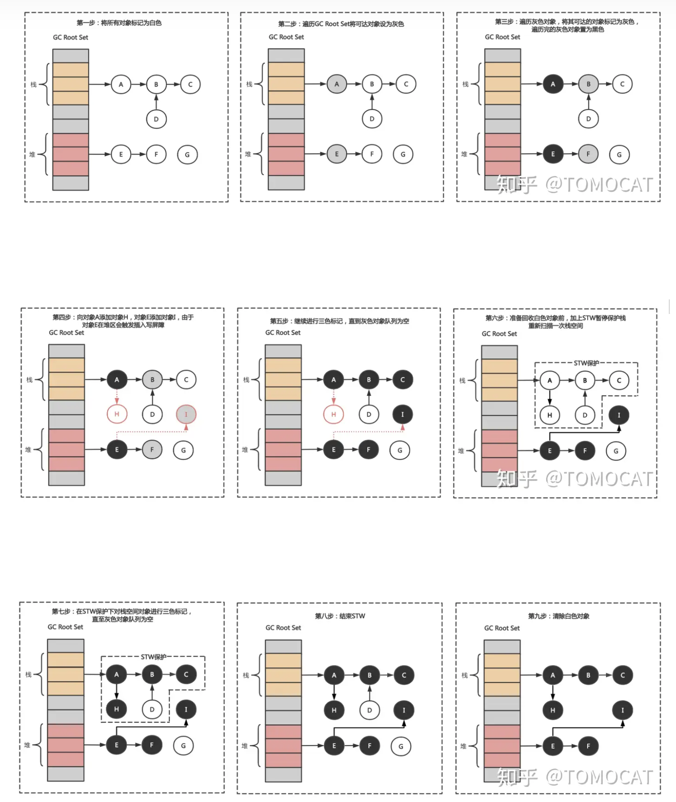
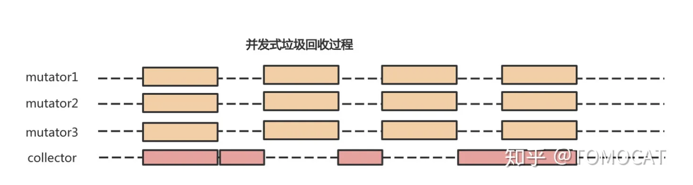

在[堆内存申请](./heap.md)中我们描述了golang程序是如何进行内存申请和管理的。
在本文中我们将介绍golang程序是如何进行内存自动回收的。

## 垃圾回收的意义
如果只进行内存申请，不进行内存回收。程序长时间运行可能导致内存占满。

垃圾回收主要包括三个目标：

- 无内存泄漏：垃圾回收器最基本的目标就是减少防止程序员未及时释放导致的内存泄漏，垃圾回收器会识别并清理内存中的垃圾
- 自动回收无用内存：垃圾回收器作为独立的子任务，不需要程序员显式调用即可自动清理内存垃圾
- 内存整理：如果只是简单回收无用内存，那么堆上的内存空间会存在较多碎片而无法满足分配较大对象的需求，因此垃圾回收器需要重整内存空间，提高内存利用率


## 为什么c++无法自动回收内存
C++支持比较强大的指针计算。
自动回收内存之后，容易引起野指针问题。

```c
int *p = new int;
p += 10; // 指针偏移, 原来p指向的内存不再被引用
// 如果存在自动回收内存，原来p指向的内存可能被回收
p -= 10; // 偏移为指针p初始指向的位置
*p = 10; // 如果p指向的内存被回收的话, 那么这里就会出现野指针的问题
```

golang不支持指针计算，所以能够支持内存自动回收。


## golang垃圾回收

### 参考文章
https://zhuanlan.zhihu.com/p/297177002


### 三色标记清除 垃圾回收算法

#### 流程
将所有对象分为三类：

- 白色：未搜索的对象，在回收周期开始时所有对象都是白色，在回收周期结束时所有的白色都是垃圾对象
- 灰色：正在搜索的对象，但是对象身上还有一个或多个引用没有扫描
- 黑色：已搜索完的对象，所有的引用已经被扫描完

初始时所有对象都是白色对象。从GC Root对象出发，扫描所有可达对象并标记为灰色，放入待处理队列。从队列取出一个灰色对象并标记为黑色，将其所有的引用对象标记为灰色放入队列。重复上一步骤，直到灰色对象队列为空。此时所有剩下的白色对象就是垃圾对象。（类似于广度优先遍历）


利用写屏障，减少STW的时间
在标记的过程中，本来要被回收的内存。goroutine运行中又有对象引用这个内存。就会导致错误的内存回收。所有STW。
但是可以采用写屏障的方式，来阻止这种情景。 goroutine运行中又有对象引用这个内存时，通过写屏障hook，标记该片内存为引用中，这次不回收。下次gc再判断。

gc root 对象是栈和堆上，没有被引用的对象:



#### 问题
整个过程需要STW。如果不STW，GC程序和用户程序并发执行，将可能导致错误回收问题。

例如，三色标记期间，用户程序改变了对象引用。按照三色算法gc程序标记D为垃圾对象，然后用户程序将A引用B修改为A引用D，最后gc程序把D对象回收了。用户程序再次访问D对象时，将发生野指针的内存错误情况。



### 减少STW

#### STW的弊端

STW在执行垃圾回收过程中需要抢占CPU，暂停所有的用户程序。这有两个弊端：

- 通常GC任务都比较繁重，长时间暂停用户程序会影响程序的响应速度，这对于实时性要求较高的程序是致命的缺点
- 对于多核计算机而言，抢占CPU进行垃圾回收会造成计算资源浪费


为了让垃圾收集器和程序并发运行，且为了保证不出现错误回收内存。使用了内存写屏障技术。

#### 内存写屏障技术

垃圾收集中的屏障技术是一个钩子方法，它是在用户程序读取对象、创建新对象以及更新对象指针时执行的一段代码。

根据操作类型的不同，我们可以将它们分成读屏障（Read barrier）和写屏障（Write barrier）两种，因为读屏障需要在读操作中加入代码片段，对用户程序的性能影响很大，所以编程语言往往都会采用写屏障。


在Golang gc程序中，写屏障程序在用护程序增加引用白色对象时，会将白色对象标记为灰色。（将**有存活可能的对象都标记成灰色**，允许部分内存对象本次不回收，下次GC再回收）

一个对象可以存储在内存中的“栈”或者“堆”，由于“栈”空间容量小且要求相应速度较高，因此“插入写屏障”不适合用于“栈”空间。

- 第一步：垃圾回收之前将所有的对象标记为白色
- 第二步：遍历GC Root Set，将可达对象标记为灰色
- 第三步：遍历灰色对象列表，将可达的对象从白色标记为灰色；将遍历完的灰色对象标记为黑色
- 第四步：假如在三色标记过程中用户程序令栈区对象A指向对象H，令堆区对象E指向对象I，由于对象E在堆区从而触发插入写屏障并将黑色对象E指向的白色对象I标记为灰色，栈区对象A不触发
- 第五步：继续三色标记直至灰色对象队列为空
- 第六步：由于栈区对象没有启动插入写屏障，因此栈上可能存在白色对象被引用的情况，因此在回收白色对象前在STW保护下重新扫描一次栈空间
- 第七步：在STW保护下对栈空间一次性进行三色标记，直到灰色对象队列为空
- 第八步：结束STW
- 第九步：最后将栈空间和堆空间的白色垃圾对象进行回收




有了三色标记法 + 内存写屏障之后， gc程序大部分是可以和用户程序一起执行的，除了针对栈对象的STW。



## 如何统计程序执行期间垃圾回收信息

https://blog.csdn.net/caspar_notes/article/details/133627014