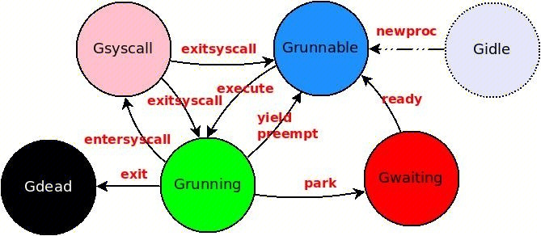
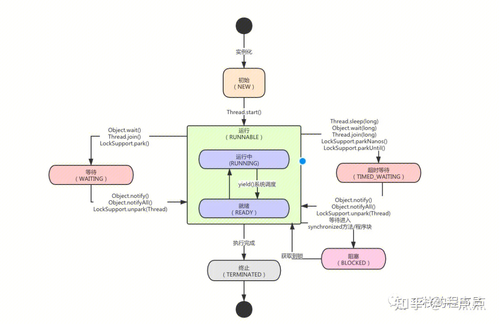

## 协程调度总览
Go运行时的调度器其实可以看成OS调度器的某种简化版 本，一个goroutine在其生命周期之中，同样包含了各种状态的变换。
https://cloud.tencent.com/developer/article/1486609



## 起点 ： Runnable
go关键字最终会被编译器映射为对runtime·newproc的调用。当runtime·newproc完成了资源的分配及初始化后，新任务的状态会被置为Grunnable，然后被添加到当前 P 的私有任务队列中，等待调度执行。
相关初始化代码如下:
``` 
G* runtime·newproc1(FuncVal *fn, byte *argp, int32 narg, int32 nret, void *callerpc) 
{
    G *newg;
    P *p;
    int32 siz;
    ......
    // 获取当前g所在的p，从p中创建一个新g(newg)
    p = g->m->p;
    if((newg = gfget(p)) == nil) {
        ......    
    }
    ......
    // 设置Goroutine状态为Grunnable
    runtime·casgstatus(newg, Gdead,             
        Grunnable);
    .....
    // 新创建的g添加到run队列中
    runqput(p, newg);
    ......
}
```


## Runnable < -- > Running

-  所有状态为Grunnable的任务都可能通过findRunnable函数被调度器（P&M）获取，进而通过execute函数将其状态切换到Grunning, 最后调用runtime·gogo加载其上下文并执行。
-  当系统线程sysmon发现某个任务执行时间过长或者runtime判断需要进行垃圾收集时，会将任务置为”可被抢占“的，当该任务下一次函数调用时， 就会yeild让出处理器并重新切会到Grunnable状态。


## Running <---> Waiting <---> Runable

- 当一个任务需要的资源或运行条件不能被满足时，需要调用runtime·park函数进入Waiting状态.
- 当某个阻塞任务（状态为Gwaiting）的等待条件满足而被唤醒时—如一个任务G1向某个channel写入数据将唤醒之前等待读取该channel数据的任务G2——G1通过调用runtime·ready将G2状态重新置为Grunnable并添加到任务队列.


## Running <----> SysCall <---> Runable

Go运行时为了保证高的并发性能，当会在任务执行OS系统调用前，先调用runtime·entersyscall函数将自己的状态置为Gsyscall——如果系统调用是阻塞式的或者执行过久，则将当前M与P分离——当系统调用返回后，执行线程调用runtime·exitsyscall尝试重新获取P，如果成功且当前任务没有被抢占，则将状态切回Grunning并继续执行；否则将状态置为Grunnable，等待再次被调度执行。


## 线程调度
https://zhuanlan.zhihu.com/p/544746309



## 协程控制
### waitgroup
``` 
var wg sync.WaitGroup
for i := 0; i < 5; i++ {
	wg.Add(1)
	go func(i int) {
		defer wg.Done()
		time.Sleep(1 * time.Millisecond)
		fmt.Println(i)
	}(i)
}
wg.Wait()
```
### select + chan 

``` 
ch := make(chan int, 1)
go func() {
	for {
		select {
		case <-ch:
			return
		default:
			// do something
		}
	}
}()
time.Sleep(time.Second * 2)
ch <- 1
```

### context
### 基本使用
``` 
conext, cancel := context.WithCancel(context.Background())

go func(c context.Context) {
	for {
		select {
		case <-c.Done():
			return
		default:
			fmt.Println("runnning")
			time.Sleep(time.Second * 1)
		}
	}

}(conext)

time.Sleep(time.Second * 2)
cancel()
```
### 核心概念

1. `context.Background()`  返回一个空的Context，这个空的Context一般用于整个Context树的根节点。然后我们使用 `context.WithCancel(parent)` 函数，创建一个可取消的子Context，然后当作参数传给goroutine使用，这样就可以使用这个子Context跟踪这个goroutine。

2. 在goroutine中，使用select调用 `<-ctx.Done()` 判断是否要结束，如果接受到值的话，就可以返回结束goroutine了；如果接收不到，就会继续进行监控。

3. 一个Context是线程安全的，可以把一个context对象传递给任意数量的Goroutine，对这个context执行取消操作时，所有的Groutine都会收到信号。

4. 一个Context不自带Cancel方法，因为Context一般用来在父子操作间传递，子操作中不能Cancel父操作的Context。

### 数据结构
```
type Context interface {
Deadline() (deadline time.Time, ok bool) 
// `Deadline` 方法是获取设置的截止时间的意思，第一个返回式是截止时间，到了这个时间点，Context会自动发起取消请求；第二个返回值ok==false时表示没有设置截止时间，如果需要取消的话，需要调用取消函数进行取消。

Done() <-chan struct{}
// `Done` 方法返回一个只读的chan，类型为 `struct{}` ，我们在goroutine中，如果该方法返回的chan可以读取，则意味着parent context已经发起了取消请求，我们通过 `Done` 方法收到这个信号后，就应该做清理操作，然后退出goroutine，释放资源。

Err() error
// `Err` 方法返回取消的错误原因，因为什么Context被取消。

Value(key interface{}) interface{}
// `Value` 方法获取该Context上绑定的值，是一个键值对，所以要通过一个Key才可以获取对应的值，这个值一般是线程安全的（只读 / 支持原子等）。

}
```

### 包中的方法

```
func WithCancel(parent Context) (ctx Context, cancel CancelFunc)
// `WithCancel` 函数，传递一个父Context作为参数，返回子Context，以及一个取消函数用来取消Context。
func WithDeadline(parent Context, deadline time.Time) (Context, CancelFunc)
// `WithDeadline` 函数，和 `WithCancel` 差不多，它会多传递一个截止时间参数，意味着到了这个时间点，会自动取消Context，当然我们也可以不等到这个时候，可以提前通过取消函数进行取消。
func WithTimeout(parent Context, timeout time.Duration) (Context, CancelFunc)
// `WithTimeout` 和 `WithDeadline` 基本上一样，这个表示是超时自动取消，是多少时间后自动取消Context的意思。
func WithValue(parent Context, key, val interface{}) Context
// 生成绑定了一个键值对数据的Context，这个绑定的数据可以通过 `Context.Value` 方法访问
```


#### WithValue的用处
在实际的生产环境中，比如web服务器http请求处理器中，可以通过WithValue传递通用的字段给请求处理协程，比如用于多个请求之间的链路追踪：
https://juejin.cn/post/7002842000265314335
``` 
package main

import (
    "context"
    "net/http"

    "github.com/google/uuid"
)

func welcome(w http.ResponseWriter, r *http.Request) {
    traceid := ""
    if m := r.Context().Value("traceid"); m != nil {
        if value, ok := m.(string); ok {
            traceid = value
        }
    }
    w.Header().Add("traceid", traceid)
    w.Write([]byte("Welcome to China"))
}

func traceID(next http.Handler) http.Handler {
    return http.HandlerFunc(func(w http.ResponseWriter, r *http.Request) {
        traceid := uuid.New().String()
        ctx := context.WithValue(r.Context(), "traceid", traceid)
        req := r.WithContext(ctx)
        next.ServeHTTP(w, req)
    })
}

func main() {
    welcomeHandler := http.HandlerFunc(welcome)
    http.Handle("/welcome", traceID(welcomeHandler))
    http.ListenAndServe(":9090", nil)
}
```