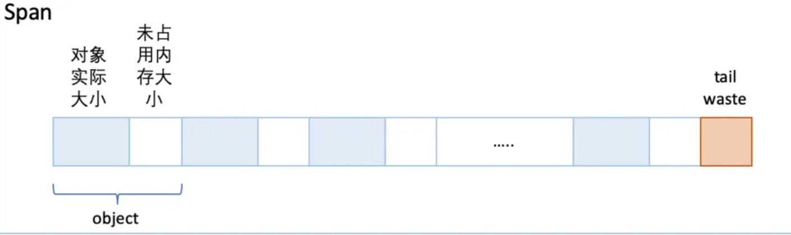
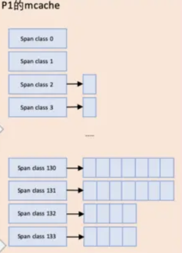
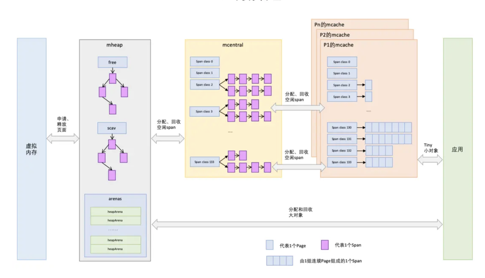

Go内存管理源自TCMalloc，但它比TCMalloc还多了2件东西：[逃逸分析](./stack.md#_13)和[垃圾回收](./gc.md)。

[TCMalloc](../lib/tcmalloc.md) 一文中通过对比了malloc和tcmalloc，解释了tcmalloc的优势。

本文将更加细致的介绍go内存管理，同时也是对tcmalloc细节的补充。

参考 : https://segmentfault.com/a/1190000020338427#item-4


## 二维链式内存

### SPAN
golang内存管理是以span为单位的。
span由n个pages组成，每个pages大小是操作系统内存页的整数倍。
与TCMalloc中的Page相同，x64下1个Page的大小是8KB。

golang中存在67个大小不同的span。最小1个Page到最大10个Page。

### Object
一个span最小为8K。那么Goang会以8K为最小内存来申请内存吗？
当然不会，这样会导致大量的内存浪费。所以golang内存管理将span进一步划分为object。

每个span管理object的方式是 free list：


### span class
划分的策略如下：
``` 
// class  bytes/obj  bytes/span  objects  tail waste  max waste  min align
//     1          8        8192     1024           0     87.50%          8
//     2         16        8192      512           0     43.75%         16
//     3         24        8192      341           8     29.24%          8
//     4         32        8192      256           0     21.88%         32
//     5         48        8192      170          32     31.52%         16
//     6         64        8192      128           0     23.44%         64
//     7         80        8192      102          32     19.07%         16
//     8         96        8192       85          32     15.95%         32
//     9        112        8192       73          16     13.56%         16
//    10        128        8192       64           0     11.72%        128
//    11        144        8192       56         128     11.82%         16
//    12        160        8192       51          32      9.73%         32
//    13        176        8192       46          96      9.59%         16
//    14        192        8192       42         128      9.25%         64
//    15        208        8192       39          80      8.12%         16
//    16        224        8192       36         128      8.15%         32
//    17        240        8192       34          32      6.62%         16
//    18        256        8192       32           0      5.86%        256
//    19        288        8192       28         128     12.16%         32
//    20        320        8192       25         192     11.80%         64
//    21        352        8192       23          96      9.88%         32
//    22        384        8192       21         128      9.51%        128
//    23        416        8192       19         288     10.71%         32
//    24        448        8192       18         128      8.37%         64
//    25        480        8192       17          32      6.82%         32
//    26        512        8192       16           0      6.05%        512
//    27        576        8192       14         128     12.33%         64
//    28        640        8192       12         512     15.48%        128
//    29        704        8192       11         448     13.93%         64
//    30        768        8192       10         512     13.94%        256
//    31        896        8192        9         128     15.52%        128
//    32       1024        8192        8           0     12.40%       1024
//    33       1152        8192        7         128     12.41%        128
//    34       1280        8192        6         512     15.55%        256
//    35       1408       16384       11         896     14.00%        128
//    36       1536        8192        5         512     14.00%        512
//    37       1792       16384        9         256     15.57%        256
//    38       2048        8192        4           0     12.45%       2048
//    39       2304       16384        7         256     12.46%        256
//    40       2688        8192        3         128     15.59%        128
//    41       3072       24576        8           0     12.47%       1024
//    42       3200       16384        5         384      6.22%        128
//    43       3456       24576        7         384      8.83%        128
//    44       4096        8192        2           0     15.60%       4096
//    45       4864       24576        5         256     16.65%        256
//    46       5376       16384        3         256     10.92%        256
//    47       6144       24576        4           0     12.48%       2048
//    48       6528       32768        5         128      6.23%        128
//    49       6784       40960        6         256      4.36%        128
//    50       6912       49152        7         768      3.37%        256
//    51       8192        8192        1           0     15.61%       8192
//    52       9472       57344        6         512     14.28%        256
//    53       9728       49152        5         512      3.64%        512
//    54      10240       40960        4           0      4.99%       2048
//    55      10880       32768        3         128      6.24%        128
//    56      12288       24576        2           0     11.45%       4096
//    57      13568       40960        3         256      9.99%        256
//    58      14336       57344        4           0      5.35%       2048
//    59      16384       16384        1           0     12.49%       8192
//    60      18432       73728        4           0     11.11%       2048
//    61      19072       57344        3         128      3.57%        128
//    62      20480       40960        2           0      6.87%       4096
//    63      21760       65536        3         256      6.25%        256
//    64      24576       24576        1           0     11.45%       8192
//    65      27264       81920        3         128     10.00%        128
//    66      28672       57344        2           0      4.91%       4096
//    67      32768       32768        1           0     12.50%       8192
```
按照obj的大小不同，分成了67个sizeclass。


### span list
> 每个size class会分成两个spanlist。2个span class的span大小相同，只是功能不同，1个用来存放包含指针的对象，一个用来存放不包含指针的对象，不包含指针对象的Span就无需GC扫描了。

例如： 申请的obj内存大小为24kb,对应size class 3，它的对象大小范围是16-32Byte，24Byte刚好在此区间，所以此对象的size class为3。 这个object将从第7（2 * 3 + 1）个spanlist上去分配内存。




## 内存分配

### 小对象内存分配



#### mcache
每个Golang的P初始化时，同时会初始化mcache，初始化会构造完整的1-67个spanclass，即133个spanlist。

每当需要内存分配时，按照spanclass从mcache中申请内存。
当对应的spanlist分配完毕之后，需要向mcentral申请span，挂到spanlist上。

#### mcentral
mcentral也有133个spanlist。
每个spanclass包含连个spanlist

- nonempty：这个链表里的span，所有span都至少有1个空闲的对象空间。这些span是mcache释放span时加入到该链表的。
- empty：这个链表里的span，所有的span都不确定里面是否有空闲的对象空间。当一个span交给mcache的时候，就会加入到empty链表。

mcache向mcentral要span时，mcentral会先从nonempty搜索满足条件的span，如果每找到再从emtpy搜索满足条件的span，然后把找到的span交给mcache。

#### mheap
mheap里保存了2棵二叉排序树，按span的page数量进行排序：

- free：free中保存的span是空闲并且非垃圾回收的span。
- scav：scav中保存的是空闲并且已经垃圾回收的span。

如果是垃圾回收导致的span释放，span会被加入到scav，否则加入到free，比如刚从OS申请的的内存也组成的Span。


mcentral向mcache提供span时，如果emtpy里也没有符合条件的span，mcentral会向mheap申请span。

mcentral需要向mheap提供需要的内存页数和span class级别，然后它优先从free中搜索可用的span，如果没有找到，会从scav中搜索可用的span，如果还没有找到，它会向OS申请内存，把申请的内存页保存到span，然后把span插入到free树 。

再重新搜索2棵树，必然能找到span。如果找到的span比需求的span大，则把span进行分割成2个span，其中1个刚好是需求大小，把剩下的span再加入到free中去，然后设置需求span的基本信息，然后交给mcentral。


### 大对象内存分配
大对象分配，大对象（一般大于 32KB）的分配不经过 mcache，而是直接从堆上分配。这是因为大对象的分配和回收比小对象更少，直接在堆上操作可以减少碎片和管理的复杂性。


## TCmalloc和golang内存分配的区别：

### 1.TCMalloc的本地缓存是给内核线程的，而Golang是给逻辑执行器P的
本地缓存初始就是为内核线程设计的，防止内核线程在申请内存时需要加锁。
而在Golang中，却给了逻辑执行器。这与Golang的调度模型GMP有关。M对应真正的内核线程，P是逻辑执行器，G是用户线程。本地缓存给了P，而非M。
因为 `M` 可能因为执行I/O操作的系统调用被阻塞， `M` 会和当前 `P` 解绑，当前 `P` 绑定其他闲置或者新的 `M` ，之前的 `M` 结束系统调用会被放进闲置 `M` 链表。
 `M`没有使用的过程中 ，该`M`的 `mcache` 就得不到有效的使用，反而 `P` 是一直处于使用过程，所以 `mcache` 绑定到 `P` 上更合适。
