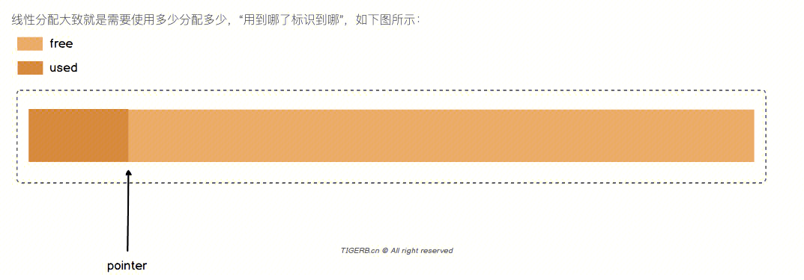
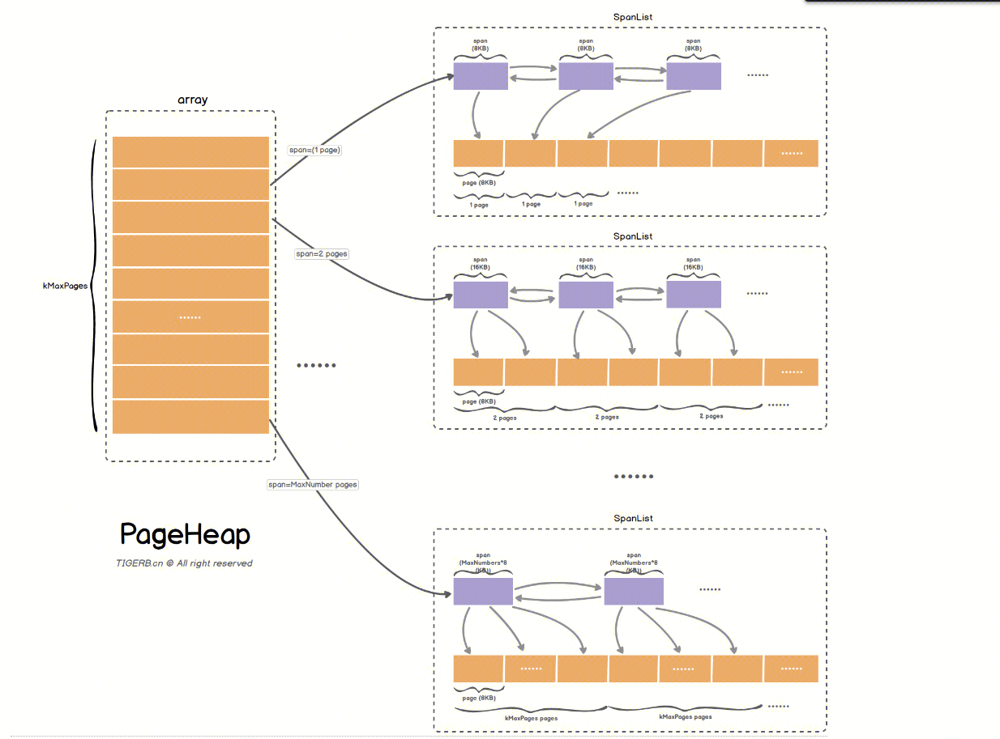
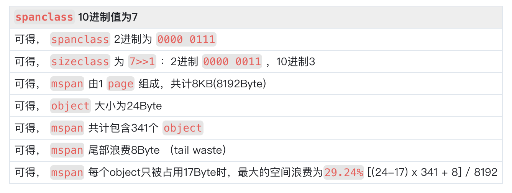
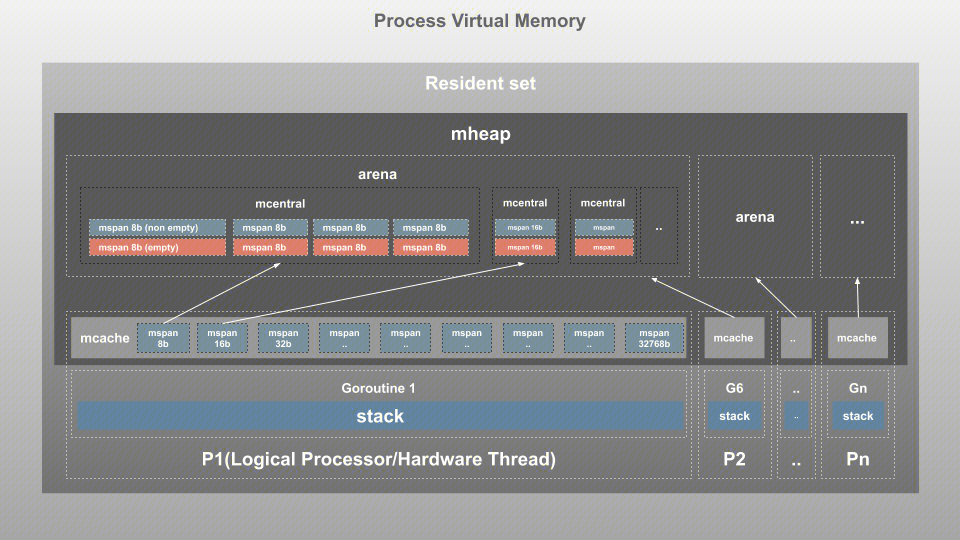

## 为什么需要线程本地缓存？
因为协程通过malloc去申请内存是系统调用。
最终是通过内核线程去申请的内存。
在多核CPU的架构下，不同核心的多个线程申请内存的情况是存在的。
进程是资源分配的最小单位，因此内存是按照进程进行分配的。通过进程的多个线程共享一片内存。
多个线程在竞争同个资源的时候是需要加锁防止冲突的。
为了在内存申请的时候，`减少线程之间的竞争，分配内存时减少锁的过程`
因此，为每个线程都构造了本地缓存`ThreadCache`。线程首先去自己的ThreadCache去申请内存，因为该内存为此线程持有，该过程不需要加锁，避免了加锁消耗的性能。

## 为什么TCMalloc的本地缓存是给内核线程的，而Golang是给逻辑执行器的？
本地缓存初始就是为内核线程设计的，防止内核线程在申请内存时需要加锁。
而在Golang中，却给了逻辑执行器。这与Golang的调度模型GMP有关。M对应真正的内核线程，P是逻辑执行器，G是用户线程。本地缓存给了P，而非M。
因为 `M` 可能因为执行I/O操作的系统调用被阻塞， `M` 会和当前 `P` 解绑，当前 `P` 绑定其他闲置或者新的 `M` ，之前的 `M` 结束系统调用会被放进闲置 `M` 链表。
 `M`没有使用的过程中 ，该`M`的 `mcache` 就得不到有效的使用，反而 `P` 是一直处于使用过程，所以 `mcache` 绑定到 `P` 上更合适。

## 内存分配的发展历程
### malloc
https://blog.csdn.net/flynetcn/article/details/127518847
### tcmalloc
https://wallenwang.com/2018/11/tcmalloc/#ftoc-heading-1
http://tigerb.cn/2021/01/31/go-base/tcmalloc/
### golang
#### 一维线性内存

#### 二维链式内存

将一片内存按照page数量不同，分为多个span。
将pages相同的span链起来。变成二维的内存模型。

每个pages大小为8K。那么Goang会以8K为最小内存来申请内存吗？
当然不会，这样会导致大量的内存浪费。所以golang内存管理将span进一步划分为object。
划分的策略如下：
``` 
// class  bytes/obj  bytes/span  objects  tail waste  max waste  min align
//     1          8        8192     1024           0     87.50%          8
//     2         16        8192      512           0     43.75%         16
//     3         24        8192      341           8     29.24%          8
//     4         32        8192      256           0     21.88%         32
//     5         48        8192      170          32     31.52%         16
//     6         64        8192      128           0     23.44%         64
//     7         80        8192      102          32     19.07%         16
//     8         96        8192       85          32     15.95%         32
//     9        112        8192       73          16     13.56%         16
//    10        128        8192       64           0     11.72%        128
//    11        144        8192       56         128     11.82%         16
//    12        160        8192       51          32      9.73%         32
//    13        176        8192       46          96      9.59%         16
//    14        192        8192       42         128      9.25%         64
//    15        208        8192       39          80      8.12%         16
//    16        224        8192       36         128      8.15%         32
//    17        240        8192       34          32      6.62%         16
//    18        256        8192       32           0      5.86%        256
//    19        288        8192       28         128     12.16%         32
//    20        320        8192       25         192     11.80%         64
//    21        352        8192       23          96      9.88%         32
//    22        384        8192       21         128      9.51%        128
//    23        416        8192       19         288     10.71%         32
//    24        448        8192       18         128      8.37%         64
//    25        480        8192       17          32      6.82%         32
//    26        512        8192       16           0      6.05%        512
//    27        576        8192       14         128     12.33%         64
//    28        640        8192       12         512     15.48%        128
//    29        704        8192       11         448     13.93%         64
//    30        768        8192       10         512     13.94%        256
//    31        896        8192        9         128     15.52%        128
//    32       1024        8192        8           0     12.40%       1024
//    33       1152        8192        7         128     12.41%        128
//    34       1280        8192        6         512     15.55%        256
//    35       1408       16384       11         896     14.00%        128
//    36       1536        8192        5         512     14.00%        512
//    37       1792       16384        9         256     15.57%        256
//    38       2048        8192        4           0     12.45%       2048
//    39       2304       16384        7         256     12.46%        256
//    40       2688        8192        3         128     15.59%        128
//    41       3072       24576        8           0     12.47%       1024
//    42       3200       16384        5         384      6.22%        128
//    43       3456       24576        7         384      8.83%        128
//    44       4096        8192        2           0     15.60%       4096
//    45       4864       24576        5         256     16.65%        256
//    46       5376       16384        3         256     10.92%        256
//    47       6144       24576        4           0     12.48%       2048
//    48       6528       32768        5         128      6.23%        128
//    49       6784       40960        6         256      4.36%        128
//    50       6912       49152        7         768      3.37%        256
//    51       8192        8192        1           0     15.61%       8192
//    52       9472       57344        6         512     14.28%        256
//    53       9728       49152        5         512      3.64%        512
//    54      10240       40960        4           0      4.99%       2048
//    55      10880       32768        3         128      6.24%        128
//    56      12288       24576        2           0     11.45%       4096
//    57      13568       40960        3         256      9.99%        256
//    58      14336       57344        4           0      5.35%       2048
//    59      16384       16384        1           0     12.49%       8192
//    60      18432       73728        4           0     11.11%       2048
//    61      19072       57344        3         128      3.57%        128
//    62      20480       40960        2           0      6.87%       4096
//    63      21760       65536        3         256      6.25%        256
//    64      24576       24576        1           0     11.45%       8192
//    65      27264       81920        3         128     10.00%        128
//    66      28672       57344        2           0      4.91%       4096
//    67      32768       32768        1           0     12.50%       8192
```
按照obj的大小不同，分成了67个sizeclass。最小的span是1page（8192 bytes），最大的span是10page（81920 bytes）。
### SpanClass
实际上Go内存管理单元 `mspan` 被分为了两类：
- 第一类：需要垃圾回收扫描的 `mspan` ，简称 `scan` 
- 第二类：不需要垃圾回收扫描的 `mspan` ，简称 `noscan` 
所以说**并不是所有的Go内存管理单元 `mspan` 会被垃圾回收扫描**。为了区别这两类 `mspan` ，Go语言把类型标识和上面 `sizeclass` 的值一起放在了同一个字段里。这个字段叫做SpanClass。

具体如下：
-  `sizeclass` 值左移一位： `sizeclass << 1` 
-  `sizeclass` 值最后一位存类型
	- 最后一位为1：则是不需要垃圾回收扫描的 `mspan` 
	- 最后一位为0：则是需要垃圾回收扫描的 `mspan`

这里我们以 `spanclass` 的10进制值为7的 `mspan` 为例：



### 内存分配

mheap 管理的对象为arena，每个arena为64MB。每个arena会被按照page大小进行分割。
mcentral按照object的大小组织在一起。
mcache初始化的时候会有完整的1-67个spanclass。
当mcache对应的object使用完的时候，从对应级别的mcentral取。
mcentral对应的object使用完的时候，从mheap中对应的spanlist上去，并划分object。
mheap中则是包含了多个arena。


http://tigerb.cn/2022/04/23/go-base/memory-mspan/
https://draveness.me/golang/docs/part3-runtime/ch07-memory/golang-memory-allocator/#%E7%BA%BF%E7%A8%8B%E7%BC%93%E5%AD%98