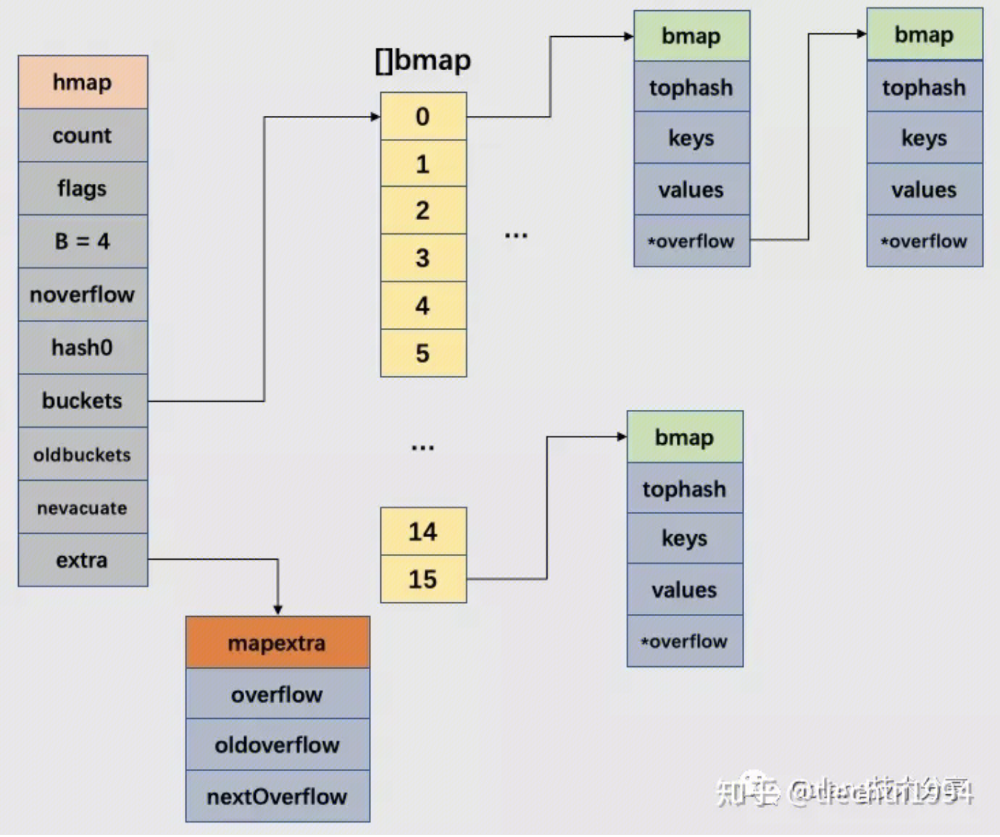
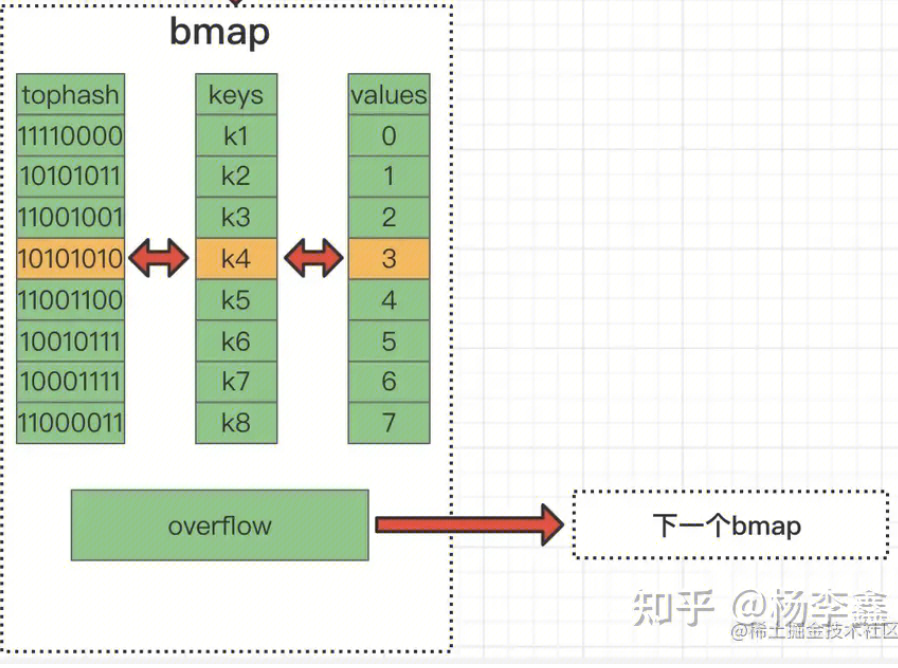

## Map 基本操作

``` 
// 声明
var b map[int]int 

// 初始化
b = make(map[int]int)

// 添加key val
b[1] = 1 
b[2] = 2

// 查询key
if val, ok := b[1]; !ok {
	fmt.Println("not found")
} else {
	fmt.Println("found", val)
}

// 遍历
for key, val := range b {
	fmt.Printf("key %d val %d", key, val)
}

//删除key val
delete(b, 1)
```

## 数据结构
### hmap
```
 type hmap struct {
     count     int    // 元素的个数
     B         uint8  // buckets 数组的长度就是 2^B 个
     overflow uint16 // 溢出桶的数量
     buckets    unsafe.Pointer // 2^B个桶对应的数组指针
     oldbuckets unsafe.Pointer  // 发生扩容时，记录扩容前的buckets数组指针
     extra *mapextra //用于保存溢出桶的地址
 }
```

### bmap
```
type bmap struct {
    topbits  [8]uint8
    keys     [8]keytype
    values   [8]valuetype
    pad      uintptr
    overflow uintptr
}
```


## 读策略

1. 计算key的hash值，在64bit的机器上，hash(key)一般得到64位的二进制。
2. 取hash值的前8位和后B位。后B位确定在buckets中的哪个桶。前8位用于和桶（会依次遍历正常桶和溢出桶中的数据）的tophash进行比较。
3. 前8位和tophash一致的情况下，再比较完整的key是否一致。

如果正在迁移，会读oldbucket
tophash用于加速对比。

## 写策略
1. 走一遍读策略，查看key是否已经存在。存在则修改，不存在则插入。
2. 插入过程：
遍历当前桶，找到第一个可以插入的位置
如果当前桶元素已满，会通过overflow链接创建一个新的桶，来存储数据。

## 扩容策略
在写入的过程，会检查是否满足扩容条件，然后执行扩容策略。

### 扩容条件

1. 判断已经达到装载因子的临界点(6.5), 即元素数量 >= 桶(bucket)个数 * 6.5, 这个时候说明大部分桶是可能是快满了(平均每 个桶插入6.5个键值对). 如果插入新元素, 有大概率在溢出桶(overflow bucket)上。
2. 溢出桶的数量过多：
当 B < 15 时，如果overflow的bucket数量超过 2^B。
当 B >= 15 时，overflow的bucket数量超过 2^15。
比如新加入key的hash值后B位都一样，使得个别桶一直在插入新数据，进而导致它的溢出桶链条越来越长。如此一来，当map在操作数据时，扫描速度就会变得很慢。及时的扩容，可以对这些元素进行重排，使元素在桶的位置更平均一些。

### bucket * 2 的扩容策略（增量扩容）针对扩容条件1
将 B+1, 新建一个buckets数组, 新的buckets大小是原来的2倍, 然后旧的buckets数据搬移到新的buckets. 该方法称为 增量扩容.
增量扩容分为两个部分：`hashGrow()`  和  `growWork()`  两个函数。
`hashGrow()`  是开启扩容, 并没有进行真正的数据"搬移",它只是分配好了新的 buckets, 并将老的 buckets 赋值给 oldbuckets字段上。
真正的 buckets 搬移动作是在  `growWork()`  函数。调用  `mapassign()` (插入,更新) 和  `mapdelete()` (删除) 函数时会尝试搬移 buckets 的工作。

`growWork` 桶搬移操作, 一次最多搬移2个桶
```
// 即如果当前操作的key映射到老的bucket1, 那么就搬迁该bucket1.
// 如果还未完成扩容工作，则再搬迁一个bucket.
```

### 不增加bucket的扩容策略（等量扩容）针对扩容条件2
新建一个buckets数组, 新的buckets大小是和原来保持一致, 然后旧的buckets数据搬移到新的buckets. 该方法称为 等量扩容。主要使得bucket的使用率更高, 进而保证更快的存取. 该方法称为等量扩容。
该解决方案, 存在一个极端情况: 如果插入 map 的 key 哈希都一样, 那么它们就会落到同一个 bucket 里, 超过8个就会产生 overflow bucket, 最终还是会造成overflow bucket过多. 移动元素其实解决不了问题. 但是 Go 的每一个 map 都会在初始化 阶段 makemap 时产生一个随机的哈希种子, 所以构造这种冲突没那么容易。

## 删除策略
如果在扩容，删除时也会存在桶搬移的步骤。

## 细节
map的value可以是func

## 参考
https://zhuanlan.zhihu.com/p/495998623
https://zhuanlan.zhihu.com/p/271145056