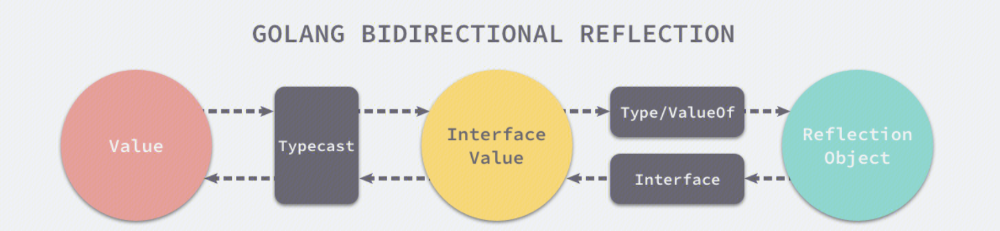
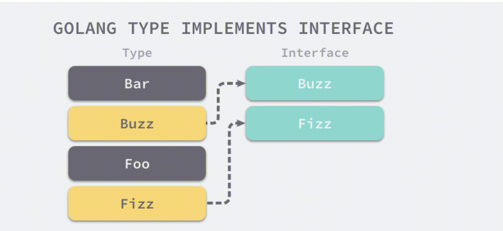

## 反射
Go 语言提供了一种机制在运行时更新变量和检查它们的值、调用它们的方法，但是在编译时并不知道这些变量的具体类型，这称为反射机制。


## 三大法则
### 反射的第一法则是能将   `interface{}`  变量转换成反射对象
因此对非interface类型的变量转换成反射变量的时候，存在将该类型转换为interface的过程。

使用 [`reflect.TypeOf`](https://draveness.me/golang/tree/reflect.TypeOf) 和 [`reflect.ValueOf`](https://draveness.me/golang/tree/reflect.ValueOf) 能够获取 Go 语言中的变量对应的反射对象。一旦获取了反射对象，我们就能得到跟当前类型相关数据和操作，并可以使用这些运行时获取的结构执行方法。

### 第二法则是可以从反射对象可以获取  `interface{}`  变量
```
v := reflect.ValueOf(1)
v.Interface().(int)
```

### 第三法则是如果我们想要更新一个 [`reflect.Value`](https://draveness.me/golang/tree/reflect.Value)，那么它持有的值一定是可以被更新的。
详见 https://iwiki.woa.com/explore/cherry/edit#%E5%88%A9%E7%94%A8%E5%8F%8D%E5%B0%84%E4%BF%AE%E6%94%B9%E5%8F%98%E9%87%8F%E5%80%BC

## 反射转换


- [`reflect.TypeOf`](https://draveness.me/golang/tree/reflect.TypeOf) 能获取类型信息；
- [`reflect.ValueOf`](https://draveness.me/golang/tree/reflect.ValueOf) 能获取数据的运行时表示；

## 转换原理

`interface{}`  类型是通过 [`reflect.emptyInterface`](https://draveness.me/golang/tree/reflect.emptyInterface) 结体表示的，其中的  `rtype`  字段用于表示变量的类型，另一个  `word`  字段指向内部封装的数据：

```
type emptyInterface struct {
	typ  *rtype
	word unsafe.Pointer
}
```

### reflect.TypeOf
对interface使用reflect.TypeOf将转换为reflect.Type（接口）。
[`reflect.TypeOf`](https://draveness.me/golang/tree/reflect.TypeOf) 的实现原理是将一个  `interface{}`  变量转换成了内部的 [`reflect.emptyInterface`](https://draveness.me/golang/tree/reflect.emptyInterface) 表示，然后从中获取相应的类型信息(rtype --> Type)。
``` 
// 注意这里是接受interface类型，所以对非interface进行TypeOf时，还存在一次类型转换。
func TypeOf(i interface{}) Type {
	eface := *(*emptyInterface)(unsafe.Pointer(&amp;i))
	return toType(eface.typ)
}

func toType(t *rtype) Type {
	if t == nil {
	return nil
	}
	return t
}


type Type interface {               
    Align() int         
    FieldAlign() int                                                
    Method(int) Method                                  
    MethodByName(string) (Method, bool)     
    NumMethod() int         
    Name() string                       
    PkgPath() string            
    Size() uintptr                      
    String() string     
    Kind() Kind     
    Implements(u Type) bool     
    AssignableTo(u Type) bool       
    ConvertibleTo(u Type) bool      
    Comparable() bool                                                           
    Bits() int          
    ChanDir() ChanDir                                                   
    IsVariadic() bool           
    Elem() Type             
    Field(i int) StructField                    
    FieldByIndex(index []int) StructField           
    FieldByName(name string) (StructField, bool)                                                    
    FieldByNameFunc(match func(string) bool) (StructField, bool)                
    In(i int) Type          
    Key() Type          
    Len() int           
    NumField() int          
    NumIn() int         
    NumOut() int                
    Out(i int) Type 
    common() *rtype 
    uncommon() *uncommonType
}
```


### reflect.ValueOf
对interface使用reflect.ValueOf将转换为reflect.Value（结构体）。
`reflect.ValueOf`将传入的接口转换成 [`reflect.emptyInterface`](https://draveness.me/golang/tree/reflect.emptyInterface)，然后将具体类型和指针包装成 [`reflect.Value`](https://draveness.me/golang/tree/reflect.Value) 结构体后返回。
``` 
type Value struct {
	// typ holds the type of the value represented by a Value.
    typ *rtype
	// Pointer-valued data or, if flagIndir is set, pointer to data.
    // Valid when either flagIndir is set or typ.pointers() is true.
    ptr unsafe.Pointer
	flag
}
```

- `Value.Type()` 可转换为reflect.Type
- `Value.Elem()` 可获取到指针的具体值 

https://draveness.me/golang/docs/part2-foundation/ch04-basic/golang-reflect/


## 场景
### 利用反射修改变量值
```
func main() {
	i := 1
	v := reflect.ValueOf(&i) //不能直接传递i，因为是值传递 （如果是传i，会认为不可修改，panic）
	v.Elem().SetInt(10)
	fmt.Println(i)
	
	//【类似】
	v := &i
	*v = 10 
}

```
1. 调用 [`reflect.ValueOf`](https://draveness.me/golang/tree/reflect.ValueOf) 获取变量指针；
2. 调用 [`reflect.Value.Elem`](https://draveness.me/golang/tree/reflect.Value.Elem) 获取指针指向的变量；
3. 调用 [`reflect.Value.SetInt`](https://draveness.me/golang/tree/reflect.Value.SetInt) 更新变量的值：覆盖当前反射对象中的指针实现变量的更新


https://draveness.me/golang/docs/part2-foundation/ch04-basic/golang-reflect/


### 利用反射判断某个类型是否实现了某个接口
```
type CustomError struct{}

func (*CustomError) Error() string {
	return ""
}

func main() {
	typeOfError := reflect.TypeOf((*error)(nil)).Elem()
	customErrorPtr := reflect.TypeOf(&amp;CustomError{})
	customError := reflect.TypeOf(CustomError{})

	fmt.Println(customErrorPtr.Implements(typeOfError)) // #=> true
	fmt.Println(customError.Implements(typeOfError)) // #=> false
}
```

-  `CustomError`  类型并没有实现  `error`  接口；
-  `*CustomError`  指针类型实现了  `error`  接口；

方法原理是，遍历接口和类型，判断类型是否实现了接口。（方法都是按照字符排序的）


https://draveness.me/golang/docs/part2-foundation/ch04-basic/golang-reflect/

### 利用反射动态调用方法

- 基于Value的Call方法，利用反射进行函数调用
``` 
func (v Value) Call(in []Value) []Value {
    v.mustBe(Func)
    v.mustBeExported()
    return v.call("Call", in)
}
```
- 基于Value的MethodByName方法，获得结构体中的Func，并转化为Value类型。
``` 
func (v Value) MethodByName(name string) Value {
    if v.typ == nil {
        panic(&amp;ValueError{"reflect.Value.MethodByName", Invalid})
    }
    if v.flag&flagMethod != 0 {
        return Value{}
    }
    m, ok := v.typ.MethodByName(name)
    if !ok {
        return Value{}
    }
    return v.Method(m.Index)
}
```

完整例子
``` 
package main
import (
    "fmt"
    "reflect"
)
type Student struct {
    Name string
    Age int
    Score float64
}
// 定义一个结构体，并为结构体添加带参数和返回值的方法
func (s Student)IsPass(score float64)(isPass bool){
    if s.Score >= score{
        return true
    }
    return false
}
func main() {
    fmt.Println("嗨客网(www.haicoder.net)")
    var p = Student{
        Name:"HaiCoder",
        Age:10,
        Score:99,
    }
    personValue := reflect.ValueOf(p)
    IsPassFunc := personValue.MethodByName("IsPass")
    args := []reflect.Value{reflect.ValueOf(100.0)}
    res := IsPassFunc.Call(args)
    fmt.Println("Pass =", res[0].Bool())
    args = []reflect.Value{reflect.ValueOf(60.0)}
    res = IsPassFunc.Call(args)
    fmt.Println("Pass =", res[0].Bool())
}
```
https://haicoder.net/golang/golang-reflect-methodbyname.html


### 利用反射获取结构体的Tag和方法 （json）

1. Type接口的NumField()方法返回成员数量
2. Type接口的 Field(i int) StructField方法返回成员信息：
``` 
// A StructField describes a single field in a struct.
type StructField struct {
    // Name is the field name.
    Name string
    // PkgPath is the package path that qualifies a lower case (unexported)
    // field name. It is empty for upper case (exported) field names.
    // See https://golang.org/ref/spec#Uniqueness_of_identifiers
    PkgPath string

    Type      Type      // field type
    Tag       StructTag // field tag string
    Offset    uintptr   // offset within struct, in bytes
    Index     []int     // index sequence for Type.FieldByIndex
    Anonymous bool      // is an embedded field
}
```
StructTag是string 但是实现了Get的方法，根据tagkey获得tagvalue

例子：
https://studygolang.com/articles/2553

### 利用反射生成结构体对应的SQL（gorm）
https://juejin.cn/post/7025523426060140551

### 利用反射将Filter中的字符内容转换为结构体成员
``` 
func ConvertFilterToCondiction(ctx context.Context, filter []models.FilterComm, ptr interface{}) error {
    v := reflect.ValueOf(ptr).Elem() // the struct variable 【获取指针指向的变量】
    for i := 0; i < v.NumField(); i++ {
        fieldInfo := v.Type().Field(i) // a reflect.StructField 【Type.Filed(i)】
        tag := fieldInfo.Tag           // a reflect.StructTag【Type.Filed(i).Tag / Name】
        name := tag.Get("json") // 【Type.Filed(i).Tag.Get("json")】

        if name == "" {
            name = strings.ToLower(fieldInfo.Name)  【Type.Filed(i).Name】
        } 

        for _, condiction := range filter {
            if condiction.Name == name { //对比condiction Name内容 和 变量结构体的成员名称
                if reflect.TypeOf(condiction.Values) == v.FieldByName(fieldInfo.Name).Type() { //对比condiction Value类型 和 变量结构体的成员类型
                    if v.FieldByName(fieldInfo.Name).CanSet() { //是否可以设置
                        v.FieldByName(fieldInfo.Name).Set(reflect.ValueOf(condiction.Values)) //设置值
                    }
                } else if reflect.TypeOf(condiction.Values[0]) == v.FieldByName(fieldInfo.Name).Type() {
                    if v.FieldByName(fieldInfo.Name).CanSet() {
                        v.FieldByName(fieldInfo.Name).Set(reflect.ValueOf(condiction.Values[0]))
                    }
                } else {
                    switch v.FieldByName(fieldInfo.Name).Type().Kind() {
                    case reflect.Uint64:
                        newValue, err := strconv.ParseUint(condiction.Values[0], 0, 64)
                        if err != nil {
                            log.ErrorContextf(ctx, "convert condiction value [0] %v to uint64 error. %+v", condiction.Values[0], err)
                            return err
                        } else {
                            if v.FieldByName(fieldInfo.Name).CanSet() {
                                v.FieldByName(fieldInfo.Name).Set(reflect.ValueOf(newValue))
                            }
                        }
                    case reflect.Slice:
                        var arr []uint64
                        if v.FieldByName(fieldInfo.Name).Type() == reflect.TypeOf(arr) {
                            for _, item := range condiction.Values {
                                newValue, err := strconv.ParseUint(item, 0, 64)
                                if err != nil {
                                    log.ErrorContextf(ctx, "convert condiction value [0] %v to uint64 error. %+v", item, err)
                                    return err
                                } else {
                                    arr = append(arr, newValue)
                                }
                            }
                            if v.FieldByName(fieldInfo.Name).CanSet() {
                                v.FieldByName(fieldInfo.Name).Set(reflect.ValueOf(arr))
                            }
                        }
                    default:
                        log.ErrorContextf(ctx, "unknown type %+v, convert error", v.FieldByName(fieldInfo.Name).Type())
                        return errors.New("unknown convert type")
                    }
                }
            }
        }
    }
    return nil
}
```
### 利用反射比较引用类型
值类型可以用==或reflect.DeepEqual比较，引用类型只能用reflect.DeepEqual比较
实测： 指针类型可以用==进行比较

不同类型不能==比较
相同类型，含有不能==比较的类型时也不能==比较
DeepEqual 基本是对引用类型对应的值进行比较。

## 场景总结
使用反射的常见场景有以下两种：

1. 不能明确接口调用哪个函数，需要根据传入的参数在运行时决定。
2. 不能明确传入函数的参数类型，需要在运行时处理任意对象。

不推荐使用反射的理由有哪些？

1. 与反射相关的代码，经常是难以阅读的。在软件工程中，代码可读性也是一个非常重要的指标。
2. Go 语言作为一门静态语言，编码过程中，编译器能提前发现一些类型错误，但是对于反射代码是无能为力的。所以包含反射相关的代码，很可能会运行很久，才会出错，这时候经常是直接 panic，可能会造成严重的后果。
3. 反射对性能影响还是比较大的，比正常代码运行速度慢一到两个数量级。所以，对于一个项目中处于运行效率关键位置的代码，尽量避免使用反射特性。