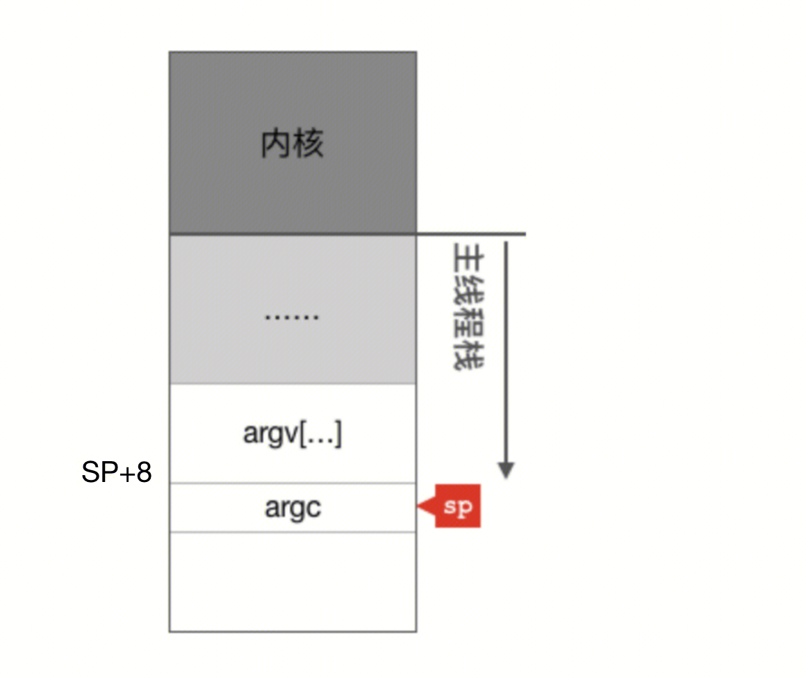
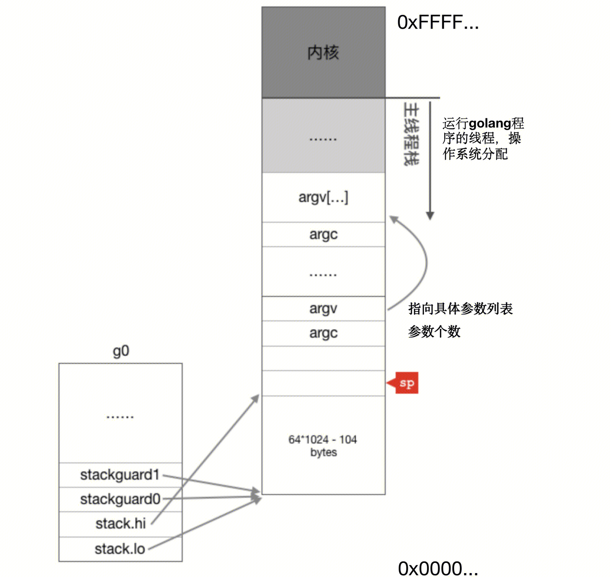
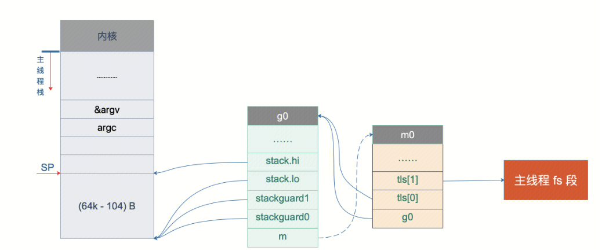
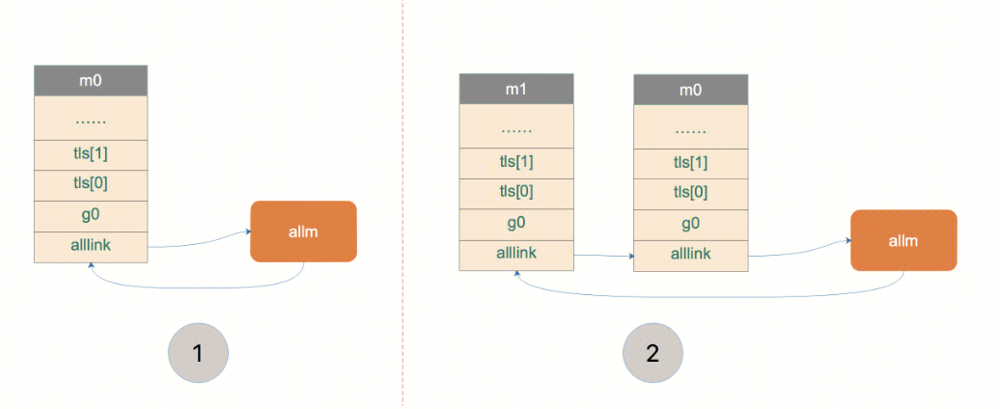
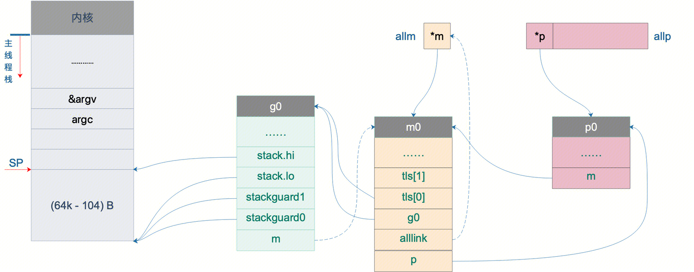

## 汇编部分
### 二进制程序入口
任何一个由编译型语言（不管是C，C++，go还是汇编语言）所编写的程序在被操作系统加载起来运行时都会顺序经过如下几个阶段：

- 从磁盘上把二进制可执行程序读入内存；
- 操作系统创建进程和主线程；
- 操作系统为主线程分配栈空间；
- 把由用户在命令行输入的参数（argc，argv）拷贝到主线程的栈；
- 把主线程放入操作系统的运行队列等待被调度执起来运行
在主线程第一次被调度起来执行第一条指令之前，主线程的函数栈如下图所示：


### Golang程序入口
Golang程序的第一条指令，可以通过gdb查看。不同指令集，会有不同的入口函数。下文都以amd64为例子。
参照：SP （ Stack Pointer 栈顶） SB（Static Base Point 指向全局符号表，比如全局变量）

`rt0_linux_amd64.s`
``` 
TEXT _rt0_amd64_linux(SB),NOSPLIT,$-8
	JMP	_rt0_amd64(SB) //amd64下 Golang程序的第一条指令
```

`asm_amd64.s`
``` 
TEXT _rt0_amd64(SB),NOSPLIT,$-8
	MOVQ	0(SP), DI	// SP + 0(内存地址)【argc】 --> DI寄存器
	LEAQ	8(SP), SI	// SP + 8(内存地址)【argv地址】 --> SI寄存器
	JMP	runtime·rt0_go(SB) 
```
`asm_amd64.s`
``` 
TEXT runtime·rt0_go(SB),NOSPLIT|NOFRAME|TOPFRAME,$0
// --------------- SP 16字节对齐 + 参数------------------
// CPU有一组SSE指令(与并行算法 SIMD 相关)，这些指令中出现的内存地址必须是16的倍数
MOVQ	DI, AX		// DI寄存器 --> AX寄存器
MOVQ	SI, BX		// SI寄存器 --> BX寄存器
ANDL	$~15, SP       `//调整栈顶寄存器使其按16字节对齐`
MOVL	AX, 120(SP)		// 将argc放到 SP + 120 字节处
MOVL	BX, 124(SP)		// 将argv放到 SP + 124 字节处

// --------------- 初始化 g0 栈空间-------------------
MOVQ  $runtime·g0(SB), DI        //g0的地址放入DI寄存器（g0是全局变量，基于SB计算）
LEAQ  (-64*1024+104)(SP), BX     //BX = SP - 64*1024 + 104
MOVQ  BX, g_stackguard0(DI)      //g0.stackguard0 = SP - 64*1024 + 104
MOVQ  BX, g_stackguard1(DI)      //g0.stackguard1 = SP - 64*1024 + 104
MOVQ  BX, (g_stack+stack_lo)(DI) //g0.stack.lo = SP - 64*1024 + 104
MOVQ  SP, (g_stack+stack_hi)(DI) //g0.stack.hi = SP
```
上面部分汇编指令执行完之后，程序的内存空间表现为：

``` 
TEXT runtime·rt0_go(SB),NOSPLIT|NOFRAME|TOPFRAME,$0
// --------------- 关联 m0.TLS和Fs寄存器-------------------
LEAQ	runtime·m0+m_tls(SB), DI //m0.tls的地址放入DI寄存器（m0是全局变量，基于SB计算）
CALL	runtime·settls(SB) // 通过arch_prctl系统调用设置FS段基址。arch_prctl系统调用把m0.tls[1]的地址设置成了fs段的段基址。CPU中的fs的段寄存器与之对应。操作系统在把线程调离CPU运行时会帮我们把所有寄存器中的值保存在内存中，调度线程起来运行时又会从内存中把这些寄存器的值恢复到CPU。这样，在此之后，工作线程代码就可以通过fs寄存器来找到m.tls。【TLS实现】

// --------------- 绑定 m0和g0--------------------
get_tls(BX)               //获取fs段基址到BX寄存器
LEAQ runtime·g0(SB), CX   //CX = g0的地址
MOVQ CX, g(BX)            //1. 把g0的地址保存在线程本地存储里面，也就是m0.tls[0]=&g0
LEAQ runtime·m0(SB), AX   //AX = m0的地址
MOVQ CX, m_g0(AX)          //2. m0.g0 = g0
MOVQ AX, g_m(CX)           //3. g0.m = m0

// 在主线程中通过get_tls可以获取到g0，通过g0的m成员又可以找到m0，于是这里就实现了m0和g0与主线程之间的关联。
```


`asm_amd64.s`
``` 
TEXT runtime·rt0_go(SB),NOSPLIT|NOFRAME|TOPFRAME,$0
// -------------- ncpu -----------------
CALL	runtime·osinit(SB)//计算cpu核心并存入全局变量ncpu
// -------------- 开始调度任务 -----------------
CALL	runtime·schedinit(SB)
```
### 调度程序入口
`src/runtime/proc.go`
```
func schedinit() {
	_g_ := getg() //通过工作线程的TLS获取到g（m.tls[0].g）。 
	sched.maxmcount = 10000 //runtime2.go中定义的全局变量sched
	
    mcommoninit(gp.m, -1) // M0 初始化
	
	procs := max(ncpu,GOMAXPROCS) // 伪代码
	procresize(procs) // 初始化procs个p
}
```

```
// m初始化 通用函数。不只是初始化的时候会执行该函数，在程序运行过程中如果创建了工作线程，也会执行它
func mcommoninit(mp *m, id int64) {
	gp := getg()
	
	mp.id = mReserveID() //id := sched.mnext 0 - sched.maxmcount递增
	
	mpreinit(mp) //创建用于信号处理的gsignal，暂时不做深究
	
	//构造allm循环链表
	mp.alllink = allm
    atomicstorep(unsafe.Pointer(&allm), unsafe.Pointer(mp))
}
```


```
// 该函数在程序启动初始化p时会调用。
// 也会在中途通过runtime.GOMAXPROCS(nums)改变P的数量时来调用。
// 一般不改变P的数量，所以这里省略了非初始化的解释
func procresize(nprocs int32) *p {
    allp = make([]*p, nprocs) // allp全局变量
	for i := old; i < nprocs; i++ {
        pp := allp[i]
        if pp == nil {
            pp = new(p)
        }
	pp.init(i) //设置p的初始status为_Pgcstop
	atomicstorep(unsafe.Pointer(&allp[i]), unsafe.Pointer(pp)) //构造allp，如图
    }
	
	// 关联m0和p0
	gp := getg() //g0
	pp := allp[0] //p0
	pp.status = _Pidle //p0状态 --> _Pidle
	acquirep(pp) //关联p0和m0    
	
	// 所有p假如队列
	for i := nprocs - 1; i >= 0; i-- {
        pp := allp[i]
        if gp.m.p.ptr() == pp {
            continue //除了p0
        }
        pp.status = _Pidle //除了p0，其他p状态设置为_Pidle
        if runqempty(pp) { //P的本地队列为空
            pidleput(pp, now) //p加入sched的pidle中
        }
    }
}
```

```
//关联p0和m0    
func acquirep(pp *p) {
    wirep(pp)
}
func wirep(pp *p) {
    gp := getg() //g0
    gp.m.p.set(pp) //m0.p = p0
    pp.m.set(gp.m) //p0.m = m0
    pp.status = _Prunning //p0状态 --> _Prunning
}
```

``` 
// 判断p的本地队列是否为空
// p.runqhead == p.runqtail && p.runnext == 0
func runqempty(pp *p) bool {
    for {
        head := atomic.Load(&pp.runqhead)
        tail := atomic.Load(&pp.runqtail)
        runnext := atomic.Loaduintptr((*uintptr)(unsafe.Pointer(&pp.runnext)))
        if tail == atomic.Load(&pp.runqtail) {
            return head == tail && runnext == 0
        }
    }
}

// 将p加入到sched的pidle队列
func pidleput(pp *p, now int64) int64 {
    pp.link = sched.pidle
    sched.pidle.set(pp)
    sched.npidle.Add(1)
}
```



https://blog.csdn.net/ma_jiang/article/details/111870771
https://qcrao91.gitbook.io/go/goroutine-tiao-du-qi/miao-shu-scheduler-de-chu-shi-hua-guo-cheng