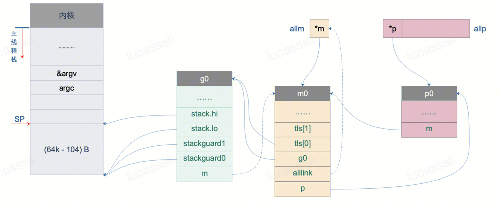
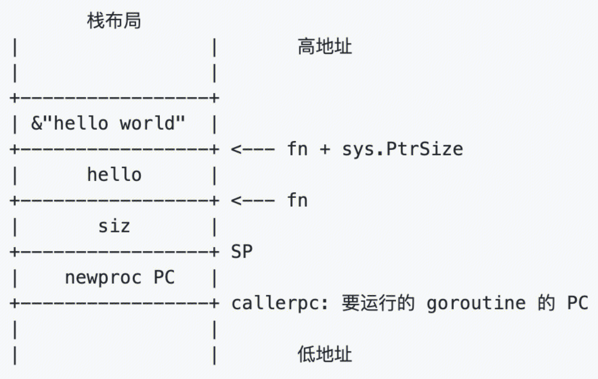
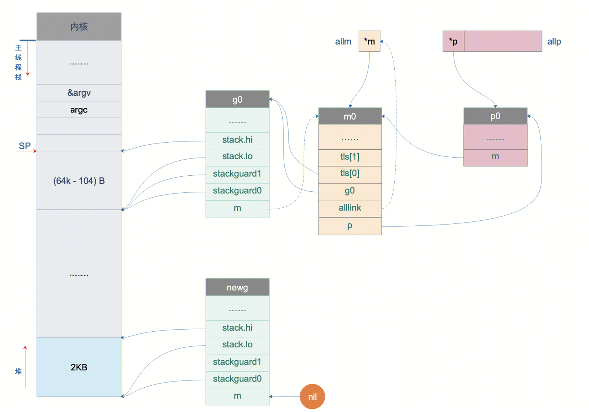
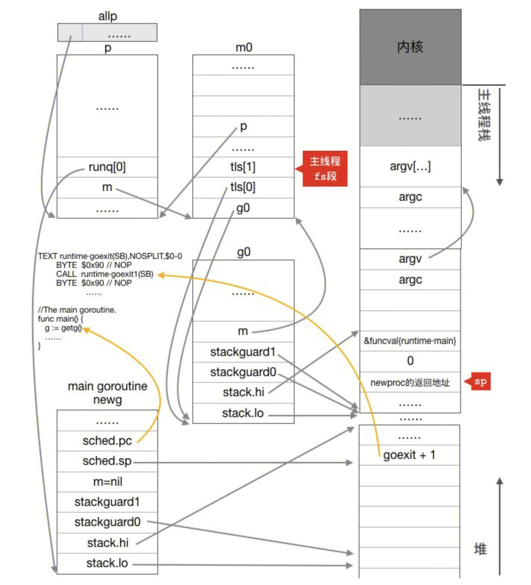

## newproc
`runtime/asm_amd64.s`
``` 
TEXT runtime·rt0_go(SB),NOSPLIT|TOPFRAME,$0
	MOVQ	$runtime·mainPC(SB), AX		// entry
	PUSHQ	AX //将函数入口放入栈（此时SP位于g0的栈）
	CALL	runtime·newproc(SB) //调用newproc
	POPQ	AX
```
newproc函数用于创建新的协程。go 关键字最终被转换为runtime.newproc。

- **将mainPC放入栈是放入当前g0的栈空间。为什么要放到g0的栈空间呢？**（并非特指g0，也可以指当前正在运行的g，下文g0同理）
因为g0要执行runtime.newproc函数，该函数原型为：
``` 
func newproc(siz int32, fn *funcval) 
```
newproc需要fn和siz参数。所以fn先入栈，再siz入栈。
siz是fn的参数的大小。实际上，真正的参数在fn和siz之前已经入g0栈了。例如：
``` 
package main
func hello(msg string) {
    println(msg)
}
func main() {
    go hello("hello world") // “hello world”是最先入栈的
	//go 创建协程会调用 `runtime.newproc(11, hello)` 11是“hello world”的大小
}
```

- **为什么这里没有把参数放入到g0栈呢？**
mainPC指向了runtime.main() `runtime/proc.go`
函数原型 func main() ， 不需要参数就可以运行。

- **为什么调用runtime.newproc函数，参数是siz？**（
因为开启一个新的g，会为该g分配一个新的栈空间去运行fn。为了让新g能够运行fn，需要将fn和fn需要的参数拷贝到新g的栈空间上。而newproc函数本身并不知道需要拷贝多少数据到新创建的goroutine的栈上去，所以需要用siz指定拷贝多少数据。参数数据的开始位置如图所示，就在fn+sys.PtrSIze处。

```
// 此处的newproc 随着go版本差异，此处参数已经和上面的内容有出入了。等后续再研究
func newproc(fn *funcval) {
    gp := getg() // g0
    pc := getcallerpc() //runtime.newproc调用的下一行pc，这里是POPQ	AX
    systemstack(func() { //systemstack指切换到g0栈执行函数，但是现在就在g0上，无需切换。
        newg := newproc1(fn, gp, pc) //创建一个g
        pp := getg().m.p.ptr()
        runqput(pp, newg, true) //将g 加入到m绑定的p的本地队列
    })
}
```
## newproc1
```
// 创建一个g，并加入加入全局队列

// 首先看一下g有哪些成员
type stack struct {
    lo uintptr
    hi uintptr
}

type gobuf struct {
    sp   uintptr // stack point
    pc   uintptr // 程序计数
    g    guintptr // g
    ctxt unsafe.Pointer
    ret  uintptr
    lr   uintptr
    bp   uintptr // for framepointer-enabled architectures
}

type g struct {
	stack       stack   // offset known to runtime/cgo
	stackguard0 uintptr // offset known to liblink
    stackguard1 uintptr // offset known to liblink
	sched       gobuf
	
	m           *m      // current m; offset known to arm liblink
	gopc        uintptr         // pc of go statement that created this goroutine
	startpc     uintptr         // pc of goroutine function
}


func newproc1(fn *funcval, callergp *g, callerpc uintptr) *g {
	mp := acquirem() //获取m (getg.m)
    pp := mp.p.ptr() //获取p
    newg := gfget(pp) //从p本地队列获取一个未使用过的g
    if newg == nil { //初始化的时候，p本地队列没有这样的g
        newg = malg(_StackMin)
        casgstatus(newg, _Gidle, _Gdead) // g status -> dead
        allgadd(newg) //加入全局队列 allgs = append(allgs, newg)
    }
	
	//在栈的高地址处保留一些空间
	//extra space in case of reads slightly beyond frame
	totalSize := uintptr(4*goarch.PtrSize + sys.MinFrameSize) 
    totalSize = alignUp(totalSize, sys.StackAlign)
    sp := newg.stack.hi - totalSize 
	
	
	// 初始化g.sched
	newg.sched.sp = sp
	newg.sched.pc = abi.FuncPCABI0(goexit) + sys.PCQuantum // 初始化为goexit函数
	newg.sched.g = guintptr(unsafe.Pointer(newg))
	gostartcallfn(&newg.sched, fn) //将fn压入栈，并将newg.sched.pc修改为fn。表现为fn执行完之后，继续执行goexit
	
	// 追踪信息track back
	newg.gopc = callerpc //创建这个newg的g，要执行的下一行pc。这里是g0的POPQ	AX
	newg.ancestors = saveAncestors(callergp) //创建这个newg的g
	
	// 函数入口
	newg.startpc = fn.fn
	// dead ---> runnable
	casgstatus(newg, _Gdead, _Grunnable)
	...
	return newg
}

```
## malg
```
真正的创建一个g，并且为其在堆上分配一个栈空间
func malg(stacksize int32) *g {
    newg := new(g) //g结构体
    if stacksize >= 0 {
        stacksize = round2(_StackSystem + stacksize)
        systemstack(func() {
            newg.stack = stackalloc(uint32(stacksize)) //分配栈空间
			//栈的高地址是newg.stack.high
			//栈的低地址是newg.stack.low
        })
        newg.stackguard0 = newg.stack.lo + _StackGuard
        newg.stackguard1 = ^uintptr(0)
        // Clear the bottom word of the stack. We record g
        // there on gsignal stack during VDSO on ARM and ARM64.
        *(*uintptr)(unsafe.Pointer(newg.stack.lo)) = 0
    }
    return newg
}
```
- **为什么创建g，要在堆上分配栈空间？** 很重要
因为g的stack是变长的，而且可以grow up到很大。所以无法在线性的栈上去为多个g分配stack空间。但是为什么多线程的stack，在栈空间呢？因为系统线程的栈空间大小是固定的，超过这个栈空间就会栈溢出（stack overflow）。多个线程的stack在栈空间上相互对立，互不影响。

概览：


细节：
newg在p0的runq队列中，是runq[0]
newg还没有m与之绑定

newg的sp指向goexit
newg的pc指向runtime.main()
表现为newg正要执行runtime.main()，执行完runtime.main()之后继续执行goexit
