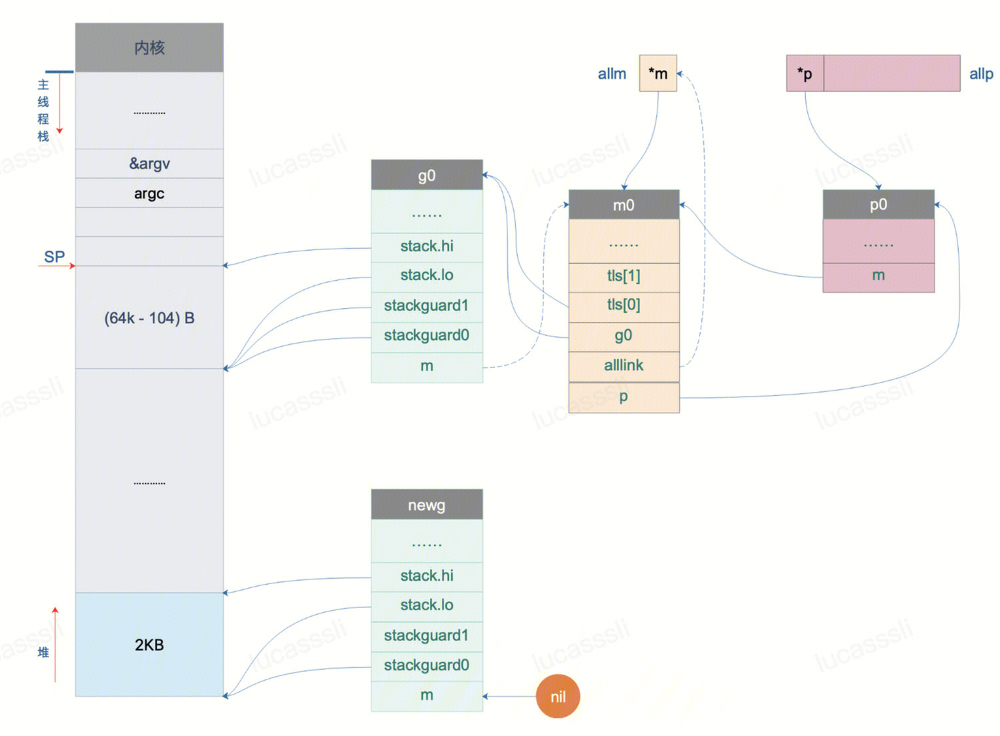
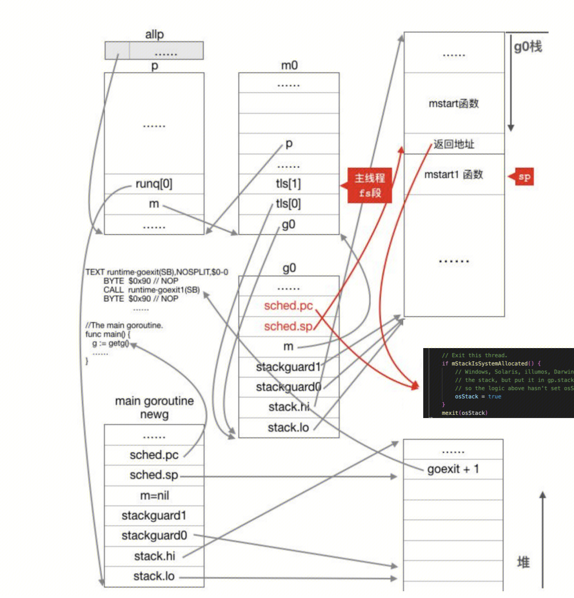

## call mstart
```
TEXT runtime·rt0_go(SB),NOSPLIT|TOPFRAME,$0
	// start this M
	CALL	runtime·mstart(SB)
```

## mstart
`mstart()` call `mstart0()` call `mstart1()`
``` 
func mstart1() {
	gp := getg() //g0
	gp.sched.g = guintptr(unsafe.Pointer(gp))
    gp.sched.pc = getcallerpc() // 获取mstart1执行完的返回地址
    gp.sched.sp = getcallersp() // 获取调用mstart1时的栈顶
	
	// 信号等初始化
    asminit() 
    minit()
    if gp.m == &m0 {
        mstartm0()
    }
    if fn := gp.m.mstartfn; fn != nil {
        fn()
    }
	
	// m0已经绑定了allp[0]，不是m0的话还没有p，所以需要获取一个p`
    if gp.m != &m0 { //初始化的时候，gp.m == m0
        acquirep(gp.m.nextp.ptr()) //非初始化的时候，需要给m找一个p
        gp.m.nextp = 0
    }
	
	// 开始调度 ！！！！ 
    schedule() //schedule函数永远不会返回
}
```
细节图：


- **为什么g0.sched.pc和sp要进行指定？**

## schedule
```
func schedule(){
top:
		...
	// 找寻一个runnalbe的g
	gp, inheritTime, tryWakeP := findRunnable()
		...
	// 执行这个g
	execute(gp, inheritTime)
}
```
```
// findRunnable 
找一个是runnable的groutine来execute
Tries to steal from other P's, get g from local or global queue, poll network.
从全局运行队列和当前工作线程的本地运行队列中选取下一个需要运行的goroutine，如果这两个队列都没有需要运行的goroutine则从其它p的运行队列中盗取goroutine，一旦找到下一个需要运行的goroutine，则调用excute函数从g0切换到该goroutine去运行

```

```
// 调度g到CPU上运行
func execute(gp *g, inheritTime bool) {
	// 绑定m.curg和g
	mp := getg().m // cpu的sp目前都还在g0栈上
	mp.curg = gp
    gp.m = mp 
	
	casgstatus(gp, _Grunnable, _Grunning) //g status runnable-->running
	gogo(&gp.sched) // 从g0到gp真正的切换
}
```
## gogo
execute调用gogo函数完成从g0到gp的的切换：**CPU执行权的转让以及栈的切换**。
`runtime/asm_amd64.s`
```
// func gogo(buf *gobuf)
//入参gp.sched 是gp的调度信息，数据结构为 gobuf
type gobuf struct {
    sp   uintptr
    pc   uintptr
    g    guintptr //关联的g 
    ctxt unsafe.Pointer
    ret  uintptr
    lr   uintptr
    bp   uintptr // for framepointer-enabled architectures
}

TEXT runtime·gogo(SB), NOSPLIT, $0-8
	MOVQ	buf+0(FP), BX		// 将gobuf放入BX寄存器
	MOVQ	gobuf_g(BX), DX		// 将gobuf.g放入DX寄存器
	MOVQ	0(DX), CX			// make sure g != nil 如果g == nil 那么会程序异常
	JMP	gogo<>(SB)

TEXT gogo<>(SB), NOSPLIT, $0
	get_tls(CX)					// 获取线程本地存储，放入CX寄存器。此时线程本地存储存放的是g0的地址
	// 把要运行的g的指针放入线程本地存储。可以通过线程本地存储，获取到当前正在执行的goroutine
	MOVQ	DX, g(CX)			// 将DX寄存器的内容（gobuf.g）放入CX寄存器偏移（TLS.g）
	
	MOVQ	DX, R14				// set the g register
	MOVQ	gobuf_sp(BX), SP	// 将gobuf.sp 放入CPU SP寄存器。完成gorouinte栈空间切换
	MOVQ	gobuf_ret(BX), AX	// 恢复调度上下文到CPU相关寄存器
	MOVQ	gobuf_ctxt(BX), DX 	// 恢复调度上下文到CPU相关寄存器
	MOVQ	gobuf_bp(BX), BP	// 恢复调度上下文到CPU相关寄存器

	// clear to help garbage collector
	MOVQ	$0, gobuf_sp(BX)	
	MOVQ	$0, gobuf_ret(BX)
	MOVQ	$0, gobuf_ctxt(BX)
	MOVQ	$0, gobuf_bp(BX)

	// 上面的MOVQ将，需要执行goroutine的CPU上下文都放入了对应的寄存器。
	// 接下来开始设置PC寄存器，放cpu开始执行goroutine的指令。
	MOVQ	gobuf_pc(BX), BX //将gobuf.pc放入BX寄存器
	JMP	BX	//JMP把BX寄存器的包含的地址值放入CPU的IP(PC)寄存器，于是，CPU跳转到该地址继续执行指令。

```
- **gogo函数也是通过汇编语言编写的，为什么使用汇编来编写呢？**
goroutine的调度涉及不同执行流之间的切换，执行流的切换从本质上来说就是CPU寄存器。例如程序计数器pc、函数调用栈sp的切换，然而不管是go还是c这种高级语言都无法精确控制CPU寄存器的修改，因而高级语言在这里也就无能为力了，只能依靠汇编指令来达成目的。


## mainPC
**回顾：** 
1. 在 https://iwiki.woa.com/pages/viewpage.action?pageId=4007643701 中介绍道：
``` 
	MOVQ	$runtime·mainPC(SB), AX		// entry
	PUSHQ	AX
	CALL	runtime·newproc(SB)
	POPQ	AX
```
上述的四条汇编指令。创建了一个newG，加入了m0对应的p的本地队列。并且newG的sched.pc指向runtime·mainPC。

2. 在本文中介绍道：
``` 
	CALL	runtime·mstart(SB)
```
上述汇编指令。将CPU的SP、PC等寄存器已经切换为newG的上下文。准备开始按照PC寄存器执行runtime.mainPC函数。

**mainPC：**
我们将newG成为main gorotine。因为这个newG要执行main.main函数

`runtime/proc.go/main()`
``` 
// The main goroutine. newG执行如下函数
// mainPC指向的地址
func main() {
    mp := getg().m //newG.m ---> 也是m0
	
	
	// Allow newproc to start new Ms.
    mainStarted = true // !!!标识已经通过m0完成了main函数的调用。其他的协程可以择机开启新的m了。
	
	if GOARCH != "wasm" { // no threads on wasm yet, so no sysmon
        systemstack(func() { //切换到g0栈
            newm(sysmon, nil, -1) //执行newm函数
			//该函数会创建一个sysmon内核线程。
			//该线程称为监控线程，该线程独立于调度器，不需要跟p关联即可运行
        })
    }
	
	//调用runtime包的初始化函数  
	doInit(&runtime_inittask)
	//调用main包的初始化函数
	doInit(&main_inittask)
	
	
	// 通过linkname方式 main_main指向了main包的main函数
	fn := main_main 
	// 开始执行main包的main函数
    fn()
	
	// main包的main函数执行完之后就退出进程。 
	// 通过系统调用，退出进程
	exit(0)
}
```

- **newG（执行runtime.main 函数的 main goroutine）执行完main.main函数之后，发生了什么事情？**
从上面的代码可以看出，main g在执行完main.main()之后，就进入了系统调用，并且是调用的exit(0)。而非在执行完runtime.main()之后，继续执行goexit函数。
exit(0)系统调用会退出整个golang进程。具体表现为：如果main g在执行main.main()过程中创建了新的g，此时main g和其他g并行（多m）或者并发（单m）执行。 如果main g执行完，其他g没执行完。同样也会退出进程。如果要等所有g都执行完再退出，需要用到协程间同步机制，例如waitgroup、chan、context。


- **创建G的时候，newproc函数为每一个新创建g都伪造了栈调用。表现为goexit函数调用了newg的函数。为什么main G没有等到执行goexit，就直接调用exit退出了呢？**
因为goexit是为非main goroutine准备的，非main goroutine执行完成后就会返回到goexit继续执行。goexit中包含了让m继续调度其他g的逻辑。
而main goroutine执行完main.main()后整个进程就结束了，因为main函数执行完之后，就没必要再调度了。这是main goroutine与其它goroutine的一个区别。


