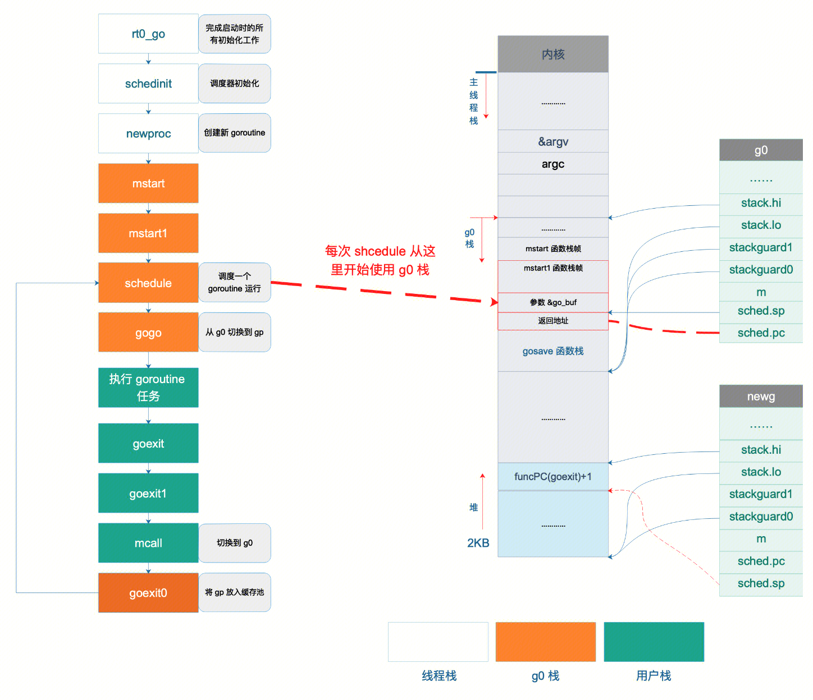
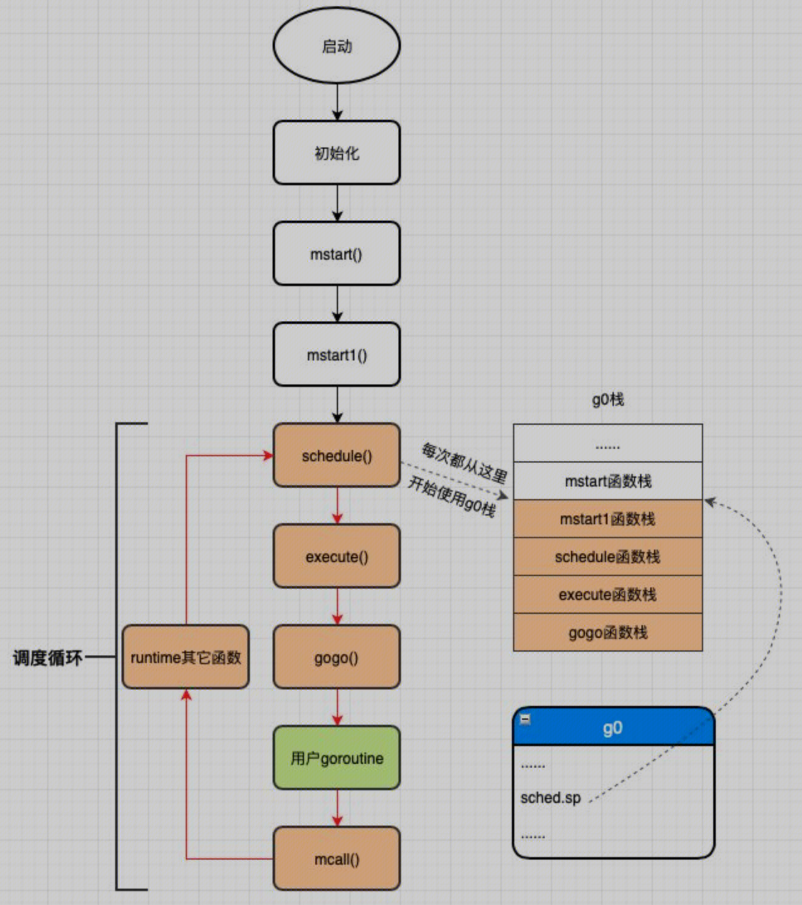

## 开启一个g
``` 
package main
import (
    "fmt"
)
func g2(n int, ch chan int) {
    ch <- n * n
}
func main() {
    ch := make(chan int)

    go g2(100, ch)

    fmt.Println(<-ch)
}
```
运行上面的代码，会经过

1. m0,g0 初始化
2. main g创建
3. main g运行 ，调用runtime.main() 调用main.main()
4. main.main()调用 go g2 编译器编译为 ： newproc()

## newproc
```
func newproc(fn *funcval) {
    gp := getg()
    pc := getcallerpc()
    systemstack(func() {
        newg := newproc1(fn, gp, pc)

        pp := getg().m.p.ptr()
        runqput(pp, newg, true)

        if mainStarted {
            wakep()
        }
    })
}
```
newproc接受g2 func，创建出一个new G （normal G）一个普通的G。并放入P的本地队列或者全局，等待调度。

## schedule 调度循环


当调度函数`schedule()` 通过`findrunnable()`，找到这个normal G时。通过`exectue`调用`gogo`，切换到这个normal G执行。当normal G执行完之后，会执行`goexit`函数。goexit函数中会重新调用调度函数`schedule()`。通过该方式，构造了schedule调度循环。

## goexit
等normal G执行完函数之后，会继续执行goexit。
``` 
TEXT runtime·goexit(SB),NOSPLIT|TOPFRAME,$0-0
	BYTE	$0x90	// NOP
	CALL	runtime·goexit1(SB)	// does not return
	// traceback from goexit1 must hit code range of goexit
	BYTE	$0x90	// NOP
```
```
func goexit1() {
    mcall(goexit0) //mcall 切换到m对应的g0，去执行goexit0函数。并且不再切回。
}
```
```
// mcall 会切换到g0
func goexit0(gp *g) {
	mp := getg().m // 获取m
    pp := mp.p.ptr()

    casgstatus(gp, _Grunning, _Gdead) //将gp的statau 从running切换为dead
	
	// 将gp的数据置为空
	gp.m = nil
	...
    gp.timer = nil
	
	// 设置 m.curg --> nil   g.m --> nil
	dropg()
	
	// 把g放入p的freeg队列，方便下次重用，免得再去申请内存，提高效率
	gfput(pp, gp)
	
	// 再次调用schedule
	schedule()

}
```

## schedule
https://iwiki.woa.com/pages/viewpage.action?pageId=4007647013#schedule


## 调度算法 
**待补充 ： 如何将新创建的new G从P的本地队列或者全局队列中取出，或者如果创建新的m来运行这些新创建m。**


