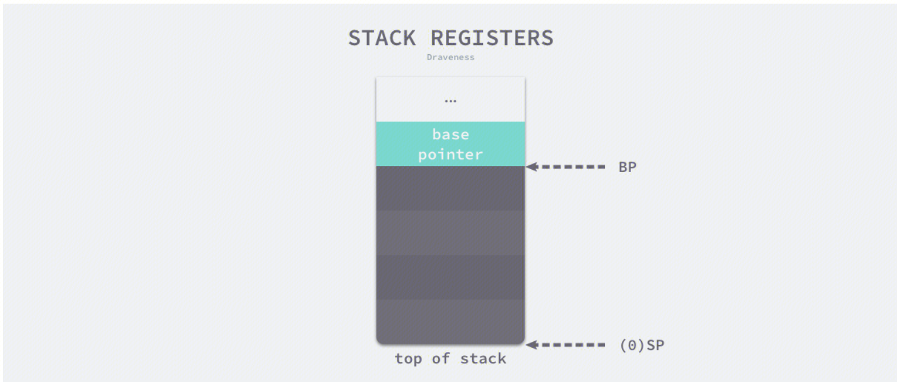
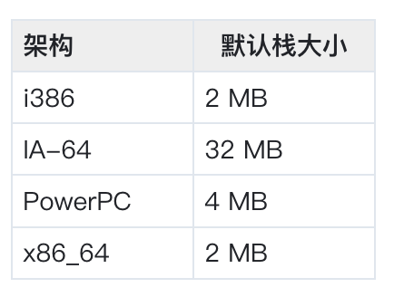
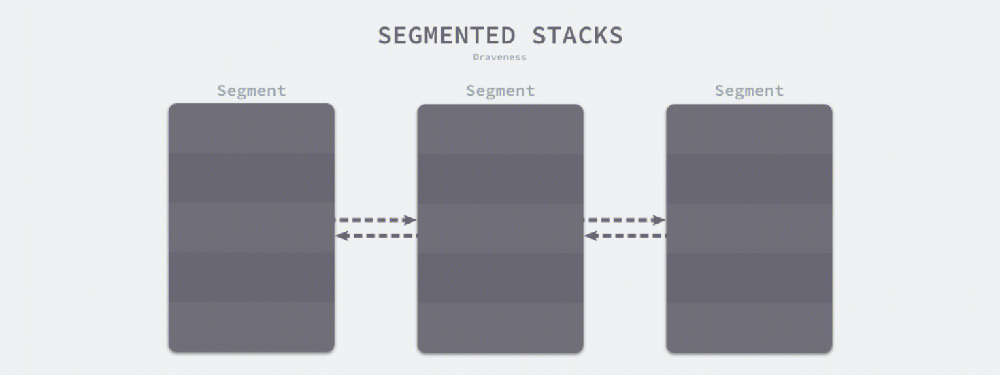
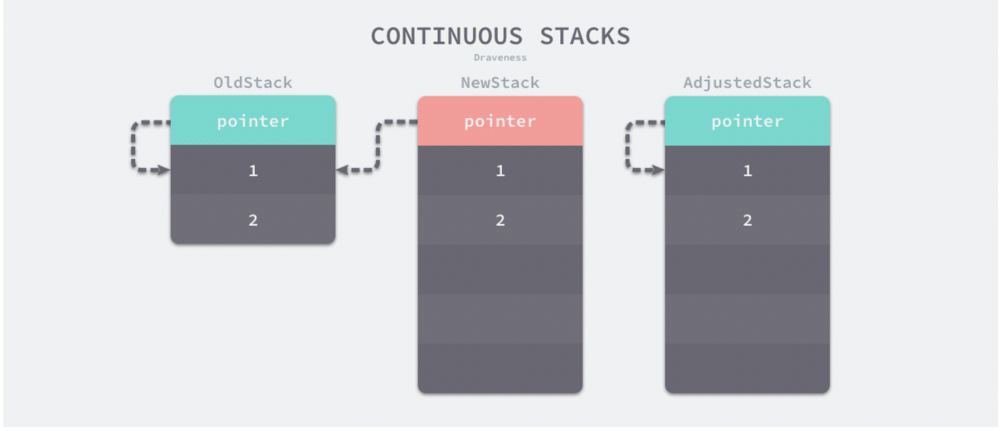

## 栈内存管理
### 引子

1.因为栈比堆更高效，不需要 GC，因此 Go 会尽可能的将内存分配到栈上。

2.当分配到栈上可能引起非法内存访问等问题后，会使用堆，主要场景有：

-  当一个值可能在函数被调用后访问，这个值极有可能被分配到堆上。（函数返回变量的指针）
-  当编译器检测到某个值过大，这个值会被分配到堆上。
-  当编译时，编译器不知道这个值的大小（slice、map、channel、interface...）这个值会被分配到堆上。
...

3.goroutine的切换，只是需要对PC，SP，BP等少量寄存器进行修改。其中PC是程序计数器，SP是TOP栈指针，BP是Base栈指针。BP和SP之间的内存就是调用栈。


4.因为历史原因，栈区内存都是从高地址向低地址扩展的，当应用程序申请或者释放栈内存时只需要修改 SP 寄存器的值，这种线性的内存分配方式（连续）与堆内存（多级，链式）相比更加快速，仅会带来极少的额外开销。

## 栈设计思路
栈区的内存一般由编译器自动分配和释放，其中存储着函数的入参以及局部变量，这些参数会随着函数的创建而创建，函数的返回而消亡，一般不会在程序中长期存在，这种线性的内存分配策略有着极高地效率，但是工程师也往往不能控制栈内存的分配，这部分工作基本都是由编译器完成的。
### 栈寄存器
寄存器是CPU上的稀缺资源，它的存储能力非常有限，但是能提供最快的读写速度。充分利用寄存器的速度可以构建高性能的应用程序。栈的操作会使用到两个栈寄存器，栈寄存器的主要作用是跟踪函数的调用栈。Go 语言的汇编代码包含 BP 和 SP 两个栈寄存器，它们分别存储了栈的基址指针和栈顶的地址。

### 内核线程栈
如果我们在 Linux 操作系统中执行  `pthread_create`  系统调用，进程会启动一个新的线程，如果用户没有通过软资源限制  `RLIMIT_STACK`  指定线程栈的大小，那么操作系统会根据架构选择不同的默认栈大小。


多数架构上默认栈大小都在 2 ~ 4 MB 左右，极少数架构会使用 32 MB 的栈。
然而这个固定的栈大小在某些场景下不是合适的值。一方面，如果程序需要同时运行几百个甚至上千个线程，这些线程中的大部分都只会用到很少的栈空间，存在内存资源浪费。另一方面，当函数的调用栈非常深时，固定栈大小无法满足用户程序的内存需求，导致栈溢出。

### goroutine栈
goroutine作为用户态线程，每个协程自然也是具有独立的用户栈空间，因此也会有独立的BP和SP值。
#### 栈空间结构
Goroutine 的初始栈内存在最初的几个版本中多次修改，从 4KB 提升到 8KB 是临时的解决方案，其目的是为了减轻分段栈中的栈分裂对程序的性能影响；在 v1.3 版本引入连续栈之后，Goroutine 的初始栈大小降低到了 2KB，进一步减少了 Goroutine 占用的内存空间。可以看出go的栈空间结构是存在变换的。
##### 分段栈
分段栈是 Go 语言在 v1.3 版本之前的实现
所有 Goroutine 在初始化时都会调用 [`runtime.stackalloc:go1.2`](https://draveness.me/golang/tree/runtime.stackalloc:go1.2) 分配一块固定大小的内存空间。
当 Goroutine 调用的函数层级或者局部变量需要的越来越多时，运行时会调用 [`runtime.morestack:go1.2`](https://draveness.me/golang/tree/runtime.morestack:go1.2) 和 [`runtime.newstack:go1.2`](https://draveness.me/golang/tree/runtime.newstack:go1.2) 创建一些新的栈空间，这些栈空间虽然不连续，但是当前 Goroutine 的多个栈空间会以链表的形式串联起来，运行时会通过指针找到栈片段。

一旦 Goroutine 申请的栈空间不在被需要，运行时会调用 [`runtime.lessstack:go1.2`](https://draveness.me/golang/tree/runtime.lessstack:go1.2) 和 [`runtime.oldstack:go1.2`](https://draveness.me/golang/tree/runtime.oldstack:go1.2) 释放不再使用的内存空间。
分段栈机制虽然能够按需为当前 Goroutine 分配内存并且及时减少内存的占用，但是它也存在比较大的问题：
如果当前 Goroutine 的栈几乎充满，那么任意的函数调用都会触发栈扩容，当函数返回后又会触发栈的收缩，如果在一个循环中调用函数，栈的分配和释放就会造成巨大的额外开销，这被称为热分裂问题（Hot split）；
为了解决这个问题，Go 在 v1.2 版本的时候不得不将栈的初始化内存从 4KB 增大到了 8KB。再后来，改为连续栈的实现方式。

##### 连续栈
连续栈可以解决分段栈中存在的两个问题，其核心原理是每当程序的栈空间不足时，初始化一片更大的栈空间并将原栈中的所有值都迁移到新栈中，新的局部变量或者函数调用就有充足的内存空间。使用连续栈机制时，栈空间不足导致的扩容会经历以下几个步骤：

- 1.在内存空间中分配更大的栈内存空间；
- 2.将旧栈中的所有内容复制到新栈中；
- 3.**将指向旧栈对应变量的指针重新指向新栈**；
- 4.销毁并回收旧栈的内存空间；

在扩容的过程中，最重要的是调整指针的第三步，这一步能够保证指向栈的指针的正确性，因为栈中的所有变量内存都会发生变化，所以原本指向栈中变量的指针也需要调整。因为Go的逃逸分析会保证`指向栈对象的指针不能存在于堆中`，所以只需要调整栈中的所有变量就可以保证内存的安全了。
因为需要拷贝变量和调整指针，连续栈增加了栈扩容时的额外开销，但是通过合理栈缩容机制就能避免热分裂带来的性能问题。

#### 栈操作
##### 初始化
这里的初始化是指Golang程序的栈空间初始化过程。
栈空间在运行时中包含两个重要的全局变量，分别是 [`runtime.stackpool`](https://draveness.me/golang/tree/runtime.stackpool) 和 [`runtime.stackLarge`](https://draveness.me/golang/tree/runtime.stackLarge)，这两个变量分别表示全局的栈缓存和大栈缓存，前者可以分配小于 32KB 的内存，后者用来分配大于 32KB 的栈空间。
如果运行时只使用全局变量来分配内存的话，势必会造成线程之间的锁竞争进而影响程序的执行效率，栈内存由于与线程关系比较密切，所以我们在每一个线程缓存 [`runtime.mcache`](https://draveness.me/golang/tree/runtime.mcache) 中都加入了栈缓存减少锁竞争影响。
运行时使用全局的 [`runtime.stackpool`](https://draveness.me/golang/tree/runtime.stackpool) 和线程缓存中的空闲链表分配 32KB 以下的栈内存，使用全局的 [`runtime.stackLarge`](https://draveness.me/golang/tree/runtime.stackLarge) 和堆内存分配 32KB 以上的栈内存，提高本地分配栈内存的性能。
##### 分配
运行时会在 Goroutine 的初始化函数 [`runtime.malg`](https://draveness.me/golang/tree/runtime.malg) 中调用 [`runtime.stackalloc`](https://draveness.me/golang/tree/runtime.stackalloc) 分配一个大小足够栈内存空间，根据线程缓存和申请栈的大小，该函数会通过三种不同的方法分配栈空间：

1. 如果栈空间较小，使用全局栈缓存或者线程缓存上固定大小的空闲链表分配内存；
2. 如果栈空间较大，从全局的大栈缓存 [`runtime.stackLarge`](https://draveness.me/golang/tree/runtime.stackLarge) 中获取内存空间；
3. 如果栈空间较大并且 [`runtime.stackLarge`](https://draveness.me/golang/tree/runtime.stackLarge) 空间不足，在堆上申请一片大小足够内存空间；
##### 扩容
编译器会在 [`cmd/internal/obj/x86.stacksplit`](https://draveness.me/golang/tree/cmd/internal/obj/x86.stacksplit) 中为函数调用插入 [`runtime.morestack`](https://draveness.me/golang/tree/runtime.morestack) 运行时检查，它会在几乎所有的函数调用之前检查当前 Goroutine 的栈内存是否充足，如果当前栈需要扩容，我们会保存一些栈的相关信息并调用 [`runtime.newstack`](https://draveness.me/golang/tree/runtime.newstack) 创建新的栈。并调用 [`runtime.copystack`](https://draveness.me/golang/tree/runtime.copystack) 开始栈拷贝
##### 缩容
[`runtime.shrinkstack`](https://draveness.me/golang/tree/runtime.shrinkstack) 栈缩容时调用的函数。同样创建新栈并栈拷贝。只是新栈的大小会是原始栈的一半。如果新栈的大小低于程序的最低限制 2KB，那么缩容的过程就会停止。

### 逃逸分析
在引子中提到，‘当一个值可能在函数被调用后访问，这个值极有可能被分配到堆上。（函数返回变量的指针）’。举个例子就是：
``` 
int *dangling_pointer() {
    int i = 2;
    return &i;
}
```
函数返回一个指针，但是改指针指向的内容在函数结束后就被销毁了。
在函数外部使用该指针，存在内存安全性问题。
在这种情况下，在golang中，即使是函数内的局部变量，也会被分配到堆内存中。这就是逃逸分析
Go 语言的编译器使用逃逸分析决定哪些变量应该在栈上分配，哪些变量应该在堆上分配。逃逸分析由编译器完成，作用于编译阶段。Go 语言的逃逸分析遵循以下两个不变性：
1. 指向栈对象的指针不能存在于堆中；
2. 指向栈对象的指针不能在栈对象回收后存活；
常见的Go 语言的逃逸分析的情况如下：
1. 指针逃逸
2. interface逃逸
3. 大变量逃逸
4. 闭包
5. 指针引用（如果一个变量被取地址，那么它就有可能被分配到堆上。当然，还是要对该变量做逃逸分析，如果函数return之后，变量不再被引用，则将其分配到栈上。否在在堆上）因此，`我们知道传递指针可以减少底层值的拷贝，可以提高效率，但是如果拷贝的数据量小，由于指针传递会产生逃逸，可能会使用堆，也可能会增加GC的负担，所以传递指针不一定是高效的。`
https://geektutu.com/post/hpg-escape-analysis.html
https://driverzhang.github.io/post/golang%E5%86%85%E5%AD%98%E5%88%86%E9%85%8D%E9%80%83%E9%80%B8%E5%88%86%E6%9E%90/


### 用户栈和内核栈切换
操作体统在创建线程的时候，会创建有两个栈。一个是用户栈，存在于用户空间。一个内核栈，存在于内核空间。CPU栈寄存器不分内核和用户态。
当进程在用户空间运行时，cpu堆栈指针寄存器里面的内容是用户堆栈地址，使用用户栈。
当进程在内核空间时，cpu堆栈指针寄存器里面的内容是内核栈空间地址，使用内核栈。

- 当goroutine中，执行系统调用时，会发生用户栈到内核栈的切换过程。
线程执行系统调用时，陷入内核态，先把用户态栈指针（SP，BP）保存在内核栈之中，然后设置CPU栈寄存器的内容为内核栈指针，这样就完成了用户栈向内核栈的转换。
线程在内核状态执行完调用时，恢复到用户态时，将保存在内核栈里面的用户栈指针的地址恢复到CPU堆栈寄存器，这样就实现了内核栈和用户栈的互转。
- goroutine之间切换，完全发生在用户态。只是需要对PC，SP，BP等少量寄存器进行修改。修改寄存器并不会导致OS陷入内核。


## 参考资料
https://draveness.me/golang/docs/part3-runtime/ch07-memory/golang-stack-management/
https://cloud.tencent.com/developer/article/1861429