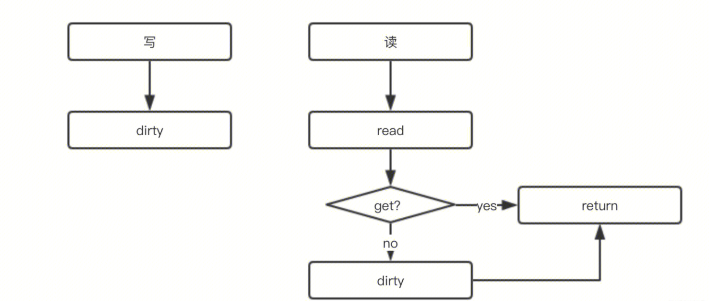

- 1.sync.map 是线程安全的，读取，插入，删除也都保持着常数级的时间复杂度。
- 2.通过读写分离，降低锁时间来提高效率，适用于读多写少的场景。
- 3.Range 操作需要提供一个函数，参数是 k,v，返回值是一个布尔值：f func(key, value interface{}) bool。
- 4.调用 Load 或 LoadOrStore 函数时，如果在 read 中没有找到 key，则会将 misses 值原子地增加 1，当 misses 增加到和 dirty 的长度相等时，会将 dirty 提升为 read。以期减少“读 miss”。
- 5.新写入的 key 会保存到 dirty 中，如果这时 dirty 为 nil，就会先新创建一个 dirty，并将 read 中未被删除的元素拷贝到 dirty。
- 6.当 dirty 为 nil 的时候，read 就代表 map 所有的数据；当 dirty 不为 nil 的时候，dirty 才代表 map 所有的数据。