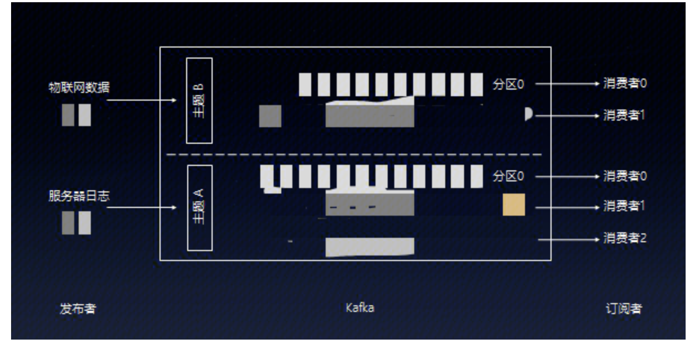
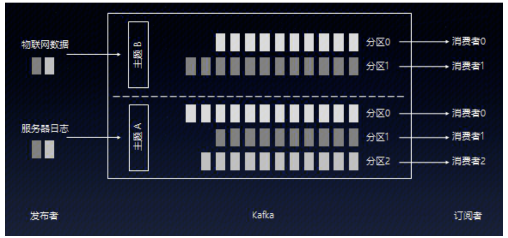
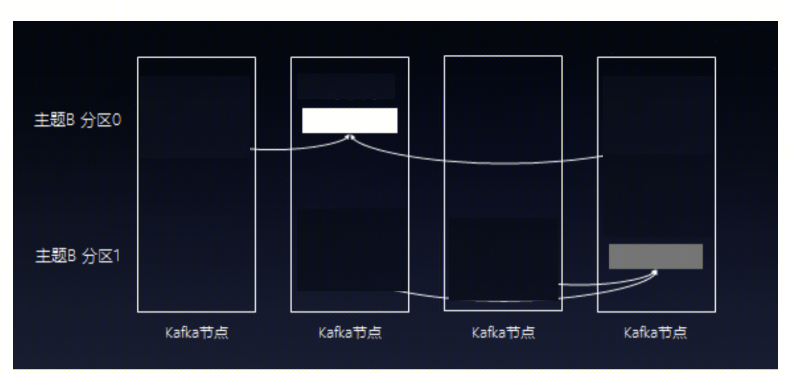
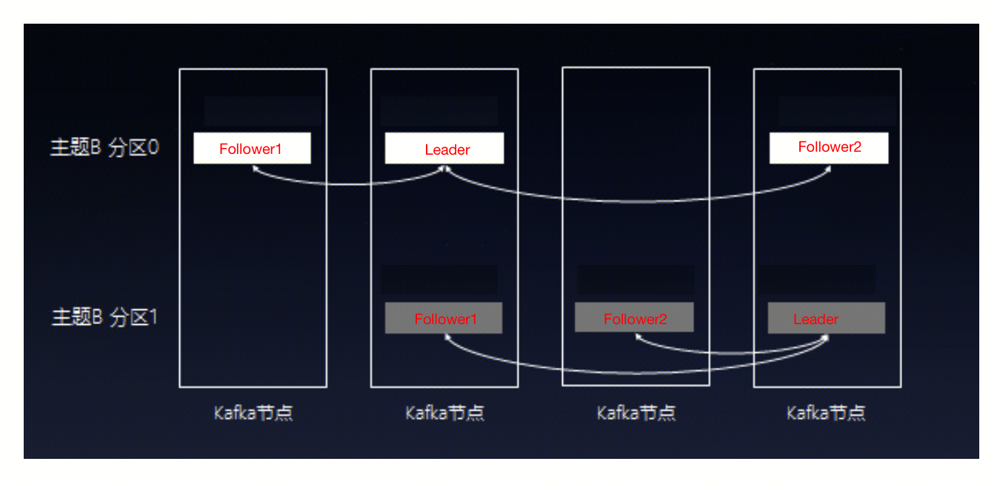

## KAFKA背景

- https://zhuanlan.zhihu.com/p/37405836
- https://www.zhihu.com/question/28925721

## kafka naive
### 背景
节藕消费者和生产者任务，服务架构更加优美。
异步任务处理，提升系统可靠性。

### 设计

- 数据结构为队列
- 消息数据格式为 topic ：msg
- 消费数据方式为
  
Kafka会对数据进行**持久化存储**数据，而不是一个消费者消费了数据之后就删掉了。
消费者过来获取消息时，每次都把队列队头的数据返回过去，然后再删除队头的那条数据？
很明显不行，因为订阅了这条消息的消费者数量，可能是0，也可能是1，还可能大于1。如果每次消费完就删除了，那么其他订阅了这条消息的消费者就获取不到这条消息了。
事实上，Kafka会对数据进行**持久化存储**（至于存放多长时间，这是可以配置的），**消费者端会记录一offset**，表明该消费者当前消费到哪条数据，所以**下次消费者想继续消费**，只需从**offset+1**的位置继续消费就好了。**消费者甚至可以通过调整offset的值，重新消费以前的数据**。

### 问题
每个topic只有一条队列。该队列在一个机器上。
kafka不会因消费而删除数据(默认保留7天)，如果持续有海量消息发送到kafka的topic下一个队列中，这个队列将变得非常之大，队列所在的机器将消耗非常大的内存。因此该队列可能会成为瓶颈。

## kafka mature
### 背景
高并发、高可用的解决方案

### 设计

- partition：
Kafka可以将主题划分为多个分区（Partition），会根据分区规则选择把消息存储到哪个分区中，只要如果分区规则设置的合理，那么所有的消息将会被均匀的分布到不同的分区中，这样就实现了负载均衡和水平扩展。

- broker：
一个kafka节点称为一个broker，多个broker组成kafka集群。
1. 一个topic的多个partition分散在多个broker中，将同个topic数据进行了横向切分，解决了队列容量成为海量数据场景下瓶颈的问题。

2. 实现了数据备份，高可用。为了保证数据的可靠性，Kafka会给每个分区找一个节点作为Leader，以及若干个节点（用户指定）当Follower。当消息写入分区时，Leader除了自己复制一份外还会复制到多个Follwer。如果Follower挂了，Kafka会再找一个Follower从Leader那里同步历史消息；如果Leader挂了，kafka从Follower中会选举出新的Leader。

	
## kafka 生产者
向topic中发送消息。用户可自己实现发送到partition的算法。

## kafka 消费者
Consumer消费者，从topic中读取消息的客户端
ConsumerGroup消费者组，每个Consumer属于一个特定的Consumer Group，一条消息可以被多个不同的Consumer Group消费，但是一个Consumer Group中只能有一个Consumer能够消费该消息。

