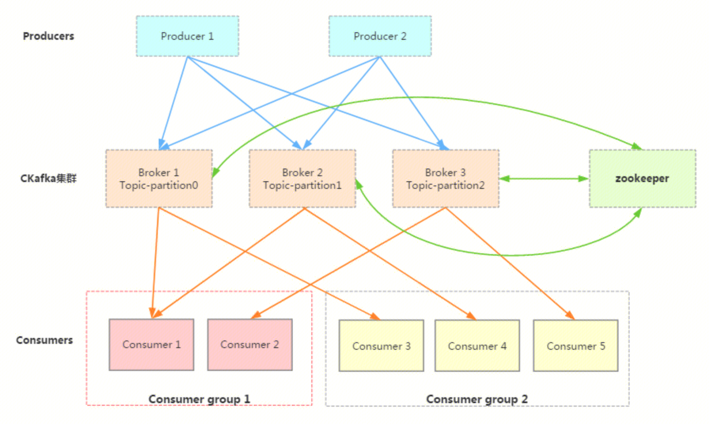
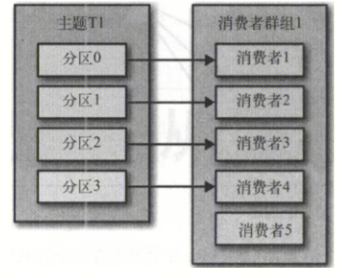
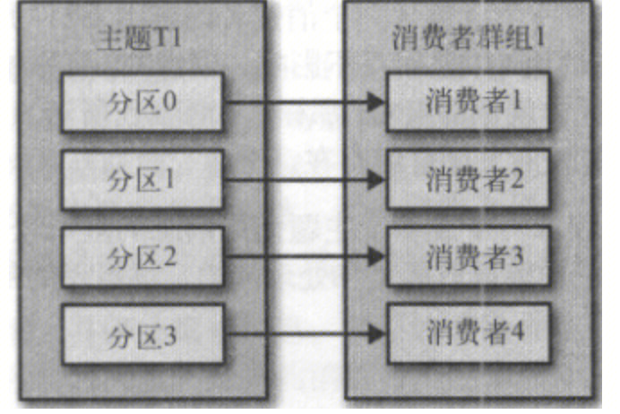
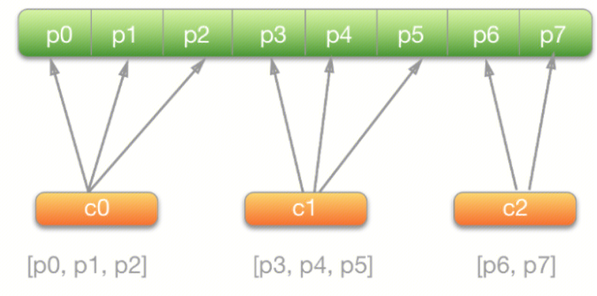
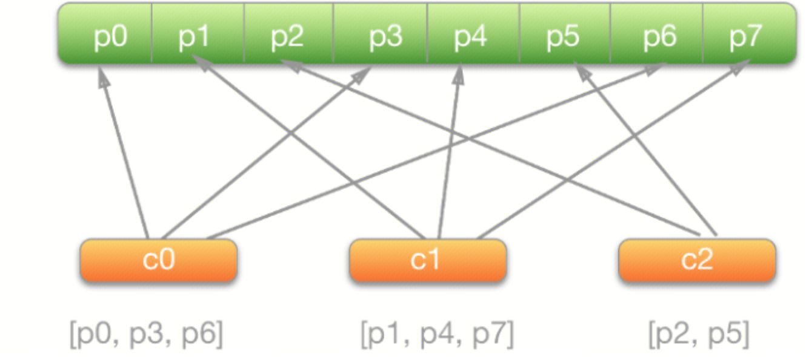
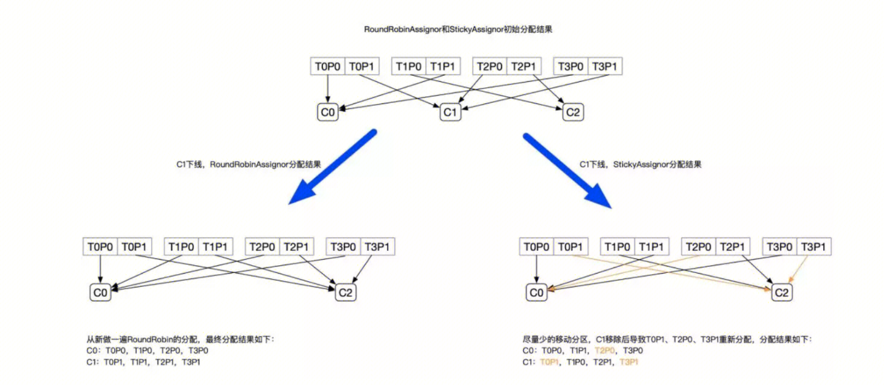
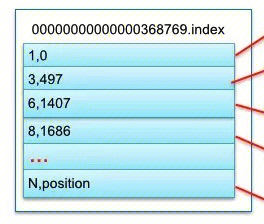
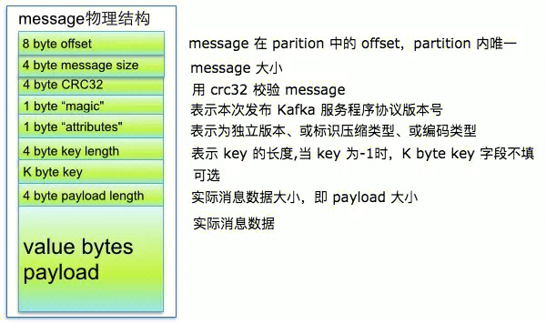

## 基本介绍
https://cloud.tencent.com/document/product/597/10067

## 功能
**收发解耦**
有效解耦生产者、消费者之间的关系。在确保同样的接口约束的前提下，`允许独立扩展或修改`生产者/消费者间的处理过程。
**削峰填谷**
消息队列 CKafka 能够`抵挡突增的访问压力`，不会因为突发的超负荷的请求而完全崩溃，有效提升系统健壮性。
**顺序读写**
消息队列 CKafka 能够`保证一个 Partition 内消息的有序性`。和大部分的消息队列一致，消息队列 CKafka 可以保证数据按照顺序进行处理，极大提升磁盘效率。
**异步通信**
在业务无需立即处理消息的场景下，消息队列 CKafka 提供了消息的`异步处理`机制，访问量高时仅将消息放入队列中，在访问量降低后再对消息进行处理，缓解系统压力。

## 应用场景
### 云函数触发器
消息队列 CKafka 可以作为云函数触发器，在消息队列中接收到消息时将触发云函数的运行，并会将消息作为事件内容传递给云函数。
### 大数据场景
在一些大数据相关的业务场景中，需要对大量并发数据进行处理和汇总，此时对集群的处理性能和扩展性都有很高的要求。消息队列 CKafka 在数据分发机制上的实现，磁盘存储空间的分配、消息格式的处理、服务器选择以及数据压缩等方面，也决定其适合处理海量的实时消息，并能汇总分布式应用的数据，方便系统运维。
在具体的大数据场景中，消息队列 CKafka 能够很好地支持离线数据、流式数据的处理，并能够方便地进行数据聚合、分析等操作。
### 日志聚合
消息队列 CKafka 的低延迟处理特性，易于支持多个数据源和分布式的数据处理（消费）。相比于中心化的日志聚合系统，消息队列 CKafka 可以在提供同样性能的条件下，实现更强的持久化保证以及更低的端到端延迟。
消息队列 CKafka 的特性决定它非常适合作为“日志收集中心”；多台主机/应用可以将操作日志“批量”“异步”地发送到消息队列 CKafka 集群，而无需保存在本地或者 DB 中；消息队列 CKafka 可以批量提交消息/压缩消息，对于生产者而言，几乎感觉不到性能的开支。此时消费者可以使用 Hadoop 等其他系统化的存储和分析系统对拉取日志进行统计分析。
### 网页追踪
消息队列 CKafka 通过实时处理网站活动（PV、搜索、用户其他活动等），并根据类型发布到 Topic 中，这些信息流可以被用于实时监控或离线统计分析等。
由于每个用户的 page view 中会生成许多活动信息，因此网站活动跟踪需要很高的吞吐量，消息队列 CKafka 可以完美满足高吞吐、离线处理等要求。

## 技术原理
生产者 Producer 通过 push 模式将消息发布到 Cloud Kafka 的 Broker 集群。
集群通过 Zookeeper 管理集群配置，进行 leader 选举，故障容错等。
消费者 Consumer 被划分为若干个 Consumer Group。消费者通过 pull 模式从 Broker 中消费消息。

## 高吞吐
https://cloud.tencent.com/developer/article/1645916
Kafka运行过程中，存在大量的网络数据持久化到磁盘和磁盘文件通过网络发送过程。

- **高效使用磁盘**：磁盘中顺序读写数据，提高磁盘利用率。
- 写 message：消息写到 page cache，由异步线程刷盘。
- 读 message：消息直接从 page cache 转入 socket 发送出去。当从 page cache 没有找到相应数据时，此时会产生磁盘 IO，从磁盘加载消息到 page cache，然后直接从 socket 发出去。
- **Broker 的零拷贝（Zero Copy）机制**：使用 sendfile 系统调用，将数据直接从页缓存发送到网络上。
- 数据压缩降低网络负载。
- 批处理机制：Producer 批量向 Broker 写数据、Consumer 批量从 Broker 拉数据。

## 生产者和Partition
https://shuyi.tech/archives/kafka-partition-strategy
Kafka生产者的分区策略在调用Send方法的时候确定。
如果 record 指定了分区策略，则指定的分区策略会被使用。如果没有指定分区策略，就使用默认的 DefaultPartitioner 分区策略。我们可以在创建 KafkaProducer 时传入 Partitioner 的实现类来实现自定义分区。
**默认分区策略：**
Kafka 的默认分区策略可以分为两种情况：消息 Key 为 null、消息 Key 不为 null。
- 如果 key 为 null，则先根据 topic 名获取上次计算分区时使用的一个整数并加一。
- 如果消息 Key 不为 null，就是根据 hash 算法 murmur2 就算出 key 的 hash 值，然后和分区数进行取模运算。

生产者和分区没有固定的关系，不会某个生产者的消息全部发向同一个partition，除非根据key计算确实全部发送到一个。

**黏性分区策略：**
在消息没有指定Key的情况下，消息队列Kafka版2.4版本之前的默认策略是循环使用主题的所有分区，将消息以轮询的方式发送到每一个分区上。但是，这种默认策略Batch的效果会比较差，在实际使用中，可能会产生大量的小Batch，从而使得实际的延迟增加。鉴于该默认策略对无Key消息的分区效率低问题，消息队列Kafka版在2.4版本引入了黏性分区策略（Sticky Partitioning Strategy）。
黏性分区策略主要解决无Key消息分散到不同分区，造成小Batch问题。其主要策略是如果一个分区的Batch完成后，就随机选择另一个分区，然后后续的消息尽可能地使用该分区。这种策略在短时间内看，会将消息发送到同一个分区，如果拉长整个运行时间，消息还是可以均匀地发布到各个分区上的。这样可以避免消息出现分区倾斜，同时还可以降低延迟，提升服务整体性能。

## 消费者和Partition
https://www.jianshu.com/p/6233d5341dfe
https://segmentfault.com/a/1190000021230209
`遵循一个partition只能被同个consumer group中的一个consumer消费原则。`保证了`每条消息只会被同一个消费组的某一个消费者消费，确保不会被同个消费组重复消费；`

- 当consumer个数多于partition时，首先每个partition分配一个consumer。多出来的consumer无法接受消息。

- 当consumer个数等于partition时，每个consumer对应一个partition。

- 当comsumer个数小于partition时，分不同的策略
range

round

stick `StickyAssignor` 是比 `RangeAssignor` 和 `RoundRobinAssignor` 更好的分配方式

主要保证在rebalance过程中，分区的分配尽可能和上次分配保持相同

## offset
Kafka中的每个partition都由一系列有序的、不可变的消息组成，这些消息被连续的追加到partition中。partition中的每个消息都有一个连续的序号，用于partition唯一标识一条消息。

**Offset记录着下一条将要发送给Consumer的消息的序号。**
Offset从语义上来看拥有两种：Current Offset和Committed Offset。

### Current Offset
Current Offset保存在Consumer客户端中，它表示Consumer希望收到的下一条消息的序号。它仅仅在poll()方法中使用。例如，Consumer第一次调用poll()方法后收到了20条消息，那么Current Offset就被设置为20。这样Consumer下一次调用poll()方法时，Kafka就知道应该从序号为21的消息开始读取。这样就能够保证每次Consumer poll消息时，都能够收到不重复的消息。

### Commit Offset
Committed Offset保存在Broker上，它表示Consumer已经确认消费过的消息的序号。主要通过[`commitSync`](https://links.jianshu.com/go?to=https%3A%2F%2Fkafka.apache.org%2F10%2Fjavadoc%2Forg%2Fapache%2Fkafka%2Fclients%2Fconsumer%2FKafkaConsumer.html%23commitSync--)和[`commitAsync`](https://links.jianshu.com/go?to=https%3A%2F%2Fkafka.apache.org%2F10%2Fjavadoc%2Forg%2Fapache%2Fkafka%2Fclients%2Fconsumer%2FKafkaConsumer.html%23commitAsync-org.apache.kafka.clients.consumer.OffsetCommitCallback-)

API来操作。举个例子，Consumer通过poll() 方法收到20条消息后，此时Current Offset就是20，经过一系列的逻辑处理后，并没有调用 `consumer.commitAsync()` 或 `consumer.commitSync()` 来提交Committed Offset，那么此时Committed Offset依旧是0。

Committed Offset主要用于Consumer Rebalance。在Consumer Rebalance的过程中，一个partition被分配给了一个Consumer，那么这个Consumer该从什么位置开始消费消息呢？答案就是Committed Offset。另外，如果一个Consumer消费了5条消息（poll并且成功commitSync）之后宕机了，重新启动之后它仍然能够从第6条消息开始消费，因为Committed Offset已经被Kafka记录为5。

### 比较
总结一下，Current Offset是针对Consumer的poll过程的，它可以保证每次poll都返回不重复的消息；而Committed Offset是用于Consumer Rebalance过程的，它能够保证新的Consumer能够从正确的位置开始消费一个partition，从而避免重复消费。

## Group Coordinate
Group Coordinator是运行在Kafka集群中每一个Broker内的一个进程。它主要负责Consumer Group的管理，Offset位移管理以及[Consumer Rebalance](https://www.jianshu.com/p/d42b7a4ac8ad)。
对于每一个Consumer Group，Group Coordinator都会存储以下信息：

- 订阅的topics列表
- Consumer Group配置信息，包括session timeout等
- 组中每个Consumer的元数据。包括主机名，consumer id
- **每个Group正在消费的topic partition的当前commit offsets**（groupid-topic-partition -> offset）
- Partition的ownership元数据，包括consumer消费的partitions映射关系

## 生产者例子
https://cloud.tencent.com/document/product/597/57572
https://help.aliyun.com/document_detail/68165.htm?spm=a2c4g.11186623.0.0.7de728c2is85Df#concept-68165-zh

## 消费者最佳实践
https://help.aliyun.com/document_detail/68166.html
- 消费实例的个数不要大于分区的数量，否则会有消费实例分配不到任何分区而处于空跑状态
### 消费位点提交
消息队列Kafka版消费者有两个相关参数：
- enable.auto.commit：是否采用自动提交位点机制。默认值为true，表示默认采用自动提交机制。
- auto.commit.interval.ms： 自动提交位点时间间隔。默认值为1000，即1s。
这两个参数组合的结果就是，每次poll数据前会先检查上次提交位点的时间，如果距离当前时间已经超过参数auto.commit.interval.ms规定的时长，则客户端会启动位点提交动作。
因此，如果将enable.auto.commit设置为true，则需要在每次poll数据时，确保前一次poll出来的数据已经消费完毕，否则可能导致位点跳跃。
如果想自己控制位点提交，请把enable.auto.commit设为false，并调用commit(offsets)函数自行控制位点提交。

####  auto.offset.reset
`auto.offset.reset` 表示如果Kafka中没有存储对应的commit offset信息的话（有可能offset信息被删除），消费者从何处开始消费消息。它拥有三个可选值：
- earliest：从最早的offset开始消费
- latest：从最后的offset开始消费
- none：直接抛出exception给consumer，让consumer

应用场景
- Consumer消费了5条消息后宕机了，重启之后它读取到对应的partition的Committed Offset为5，因此会直接从第6条消息开始读取。此时完全依赖于Committed Offset机制，和 `auto.offset.reset` 配置完全无关。

- 新建了一个新的Group，并添加了一个Consumer，它订阅了一个已经存在的Topic。此时Kafka中还没有这个Consumer相应的commit Offset信息，因此此时Kafka就会根据 `auto.offset.reset` 配置来决定这个Consumer从何处开始消费消息。如果auto.offset.reset=none这样设置，消费组在第一次消费的时候 就会报错找不到offset，第一次这时候就需要在catch里手动设置offset。

### 消费位点重置
以下两种情况，会发生消费位点重置：

- 当服务端不存在曾经提交过的位点时（例如客户端第一次上线）。
- 当从非法位点拉取消息时（例如某个分区最大位点是10，但客户端却从11开始拉取消息）。
客户端可以通过auto.offset.reset来配置重置策略，主要有三种策略：
- latest：从最大位点开始消费。
- earliest：从最小位点开始消费。
- none：不做任何操作，即不重置。
**说明**
- 建议设置成latest，而不要设置成earliest，避免因位点非法时从头开始消费，从而造成大量重复。
- 如果是您自己管理位点，可以设置成none。

### 拉取大消息
拉取大消息的核心是逐条拉取。
消费过程是由客户端主动去服务端拉取消息的，在拉取大消息时，需要注意控制拉取速度，注意修改配置：

- max.poll.records：如果单条消息超过1 MB，建议设置为1。
- fetch.max.bytes：设置比单条消息的大小略大一点。
- max.partition.fetch.bytes：设置比单条消息的大小略大一点。

### 消息重复和消费幂等
消息队列Kafka版消费的语义是at least once， 也就是至少投递一次，保证消息不丢失，但是无法保证消息不重复。在出现网络问题、客户端重启时均有可能造成少量重复消息，此时应用消费端如果对消息重复比较敏感（例如订单交易类），则应该做消息幂等。
以数据库类应用为例，常用做法是：

- 发送消息时，传入key作为唯一流水号ID。
- 消费消息时，判断key是否已经消费过，如果已经被消费，则忽略，如果没消费过，则消费一次。
如果应用本身对少量消息重复不敏感，则不需要做此类幂等检查。

### 消费失败
消息队列Kafka版是按分区逐条消息顺序向前推进消费的，如果消费端拿到某条消息后执行消费逻辑失败，例如应用服务器出现了脏数据，导致某条消息处理失败，等待人工干预，那么有以下两种处理方式：

- 失败后一直尝试再次执行消费逻辑。这种方式有可能造成消费线程阻塞在当前消息，无法向前推进，造成消息堆积。
- 消息队列Kafka版没有处理失败消息的设计，实践中通常会打印失败的消息或者存储到某个服务（例如创建一个Topic专门用来放失败的消息），然后定时检查失败消息的情况，分析失败原因，根据情况处理。

### 消费阻塞以及堆积

消费端最常见的问题就是消费堆积，最常造成堆积的原因是：

- 消费速度跟不上生产速度，此时应该提高消费速度。
- 消费端产生了阻塞。
消费端拿到消息后，执行消费逻辑，通常会执行一些远程调用，如果这个时候同步等待结果，则有可能造成一直等待，消费进程无法向前推进。
消费端应该竭力避免堵塞消费线程，如果存在等待调用结果的情况，建议设置等待的超时时间，超时后作为消费失败进行处理。
### 提高消费速度
提高消费速度有以下两个办法：

- 增加Consumer实例个数。可以在进程内直接增加（需要保证每个实例对应一个线程，否则没有太大意义），也可以部署多个消费实例进程；需要注意的是，实例个数超过分区数量后就不再能提高速度，将会有消费实例不工作。
- 增加消费线程。增加Consumer实例本质上也是增加线程的方式来提升速度，因此更加重要的性能提升方式是增加消费线程，最基本的步骤如下：
1. 定义一个线程池。
2. Poll数据。
3. 把数据提交到线程池进行并发处理。
4. 等并发结果返回成功后，再次poll数据执行。

### Rebalance问题
#### 分区Rebalance
https://juejin.cn/post/7047754682743128078
Rebalance 本质上是一种协议，规定了一个 Consumer Group 下的所有 consumer 如何达成一致，来分配订阅 Topic 的每个分区。rebalance（重平衡）其实就是重新进行 partition 的分配，从而使得 partition 的分配重新达到平衡状态。Rebalance 过程对消费者组会造成比较严重的影响。在 Rebalance 的过程中消费者组下的所有消费者实例都会停止工作，等待 Rebalance 过程完成。
#### 什么时候触发
- 订阅 Topic 的分区数发生变化（可控）。之前 topic 有 20 个分区，现在变成了 30 个，那么多出来的 10 个分区的数据就没人消费了。那么此时就需要进行重平衡，将新增的 10 个分区分给消费组内的消费者进行消费。所以在这个情况下，会发生rebalance。
- 订阅的 Topic 个数发生变化（可控）。一个消费者组如果之前只订阅了 A topic，那么其组内的消费者知会消费 A topic 的消息。而如果现在新增订阅了 B topic，那么 kafka 就需要把 B topic 的 partition 分配给组内的消费者进行消费。这个分配的过程，其实也是一个 rebalance 的过程。
- 消费组内成员个数发生变化。消费组内的消费者共同消费一个 topic 下的消息。而当消费组内成员个数发生变化，例如某个消费者离开，或者新消费者加入，都会导致消费组内成员个数发生变化，从而导致重平衡。以下三种情况都是组内成员变化的情况：
	- 新消费者加入（相对可控）自动伸缩情况下不可控
	- 消费者主动离开（相对可控）自动伸缩情况下不可控
	- 消费者崩溃（不可控）完全无法预料
#### 如何Rebalance
https://lxkaka.wang/kafka-rebalance/

#### Rebalance存在的问题
Rebalance 过程对消费者组会造成比较严重的影响。在 Rebalance 的过程中消费者组下的所有消费者实例都会停止工作，等待 Rebalance 过程完成。主要问题如下：
1、可能重复消费: Consumer被踢出消费组，可能还没有提交offset，Rebalance时会Partition重新分配其它Consumer,会造成重复消费，虽有幂等操作但耗费消费资源，亦增加集群压力
2、集群不稳定：Rebalance扩散到整个ConsumerGroup的所有消费者，因为一个消费者的退出，导致整个Group进行了Rebalance，并在一个比较慢的时间内达到稳定状态，影响面较大
3、影响消费速度：频繁的Rebalance反而降低了消息的消费速度，大部分时间都在重复消费和Rebalance

因此，应该尽量避免rebalance，触发rebalance的情况中，只有组成员崩溃完全不可控。
**rebalance问题的处理思路也就是避免消费者正常工作情况下还被判定为崩溃。**
#### 崩溃判断
可能导致故障的部分原因如下：
1、消费者心跳超时
消费者是通过心跳和Group coordinator保持通讯的，如果Group coordinator收不到心跳，那么Group coordinator认为这个消费者死亡了，从而发起 rebalance。
2.、消费者消费超时
如果消费者在一定时间内还没有再次来poll消息，Group coordinator认为消费者死亡，从而发起 rebalance。
#### 优化设置
v0.10.2之前版本的客户端：Consumer没有独立线程维持心跳，而是把心跳维持与poll接口耦合在一起。其结果就是，如果用户消费出现卡顿，就会导致Consumer心跳超时，引发Rebalance。
v0.10.2及之后版本的客户端：如果消费时间过慢，超过一定时间（max.poll.interval.ms设置的值，默认5分钟）未进行poll拉取消息，则会导致客户端主动离开队列，而引发Rebalance。
1、消费者心跳超时

- session.timeout.ms 设置了超时时间
- heartbeat.interval.ms 心跳时间间隔
这时候需要调整 session.timeout.ms 和 heartbeat.interval.ms 参数，使得消费者与协调者能保持心跳。一般来说，超时时间应该是心跳间隔的 3 倍时间。即 session.timeout.ms 如果设置为 180 秒，那么 heartbeat.interval.ms 最多设置为 60 秒。
- session.timeout.ms：v0.10.2之前的版本可适当提高该参数值，需要大于消费一批数据的时间，但不要超过30s，建议设置为25s；而v0.10.2及其之后的版本，保持默认值10s即可。

2、消费者消费超时

- max.poll.interval.ms 每次消费的处理时间
- max.poll.records 每次消费的消息数
对于这种情况，**一般来说就是增加消费者处理的时间（即提高 max.poll.interval.ms 的值），减少每次处理的消息数（即减少 max.poll.records 的值）。**

3. kafka消费者是单线程去消费消息和执行心跳的，如果线程卡在处理消息，那么这时候即使到时间要心跳了，还是没有线程可以去执行心跳操作，可能导致心跳超时。明明设置了很长的 session.timeout.ms 时间，但最终还是心跳超时了，就是因为线程卡在处理消息。

## 保证消费不丢失
https://book.itheima.net/study/1269935677353533441/1268384446134919169/1272783286749372418
### 生产者数据的不丢失
 `Producer` 端可能会丢失消息。目前 `Kafka Producer` 是异步发送消息的，也就是说如果你调用的是 `producer.send(msg)` 这个 `API` ，那么它通常会立即返回，但此时你不保证消息发送已成功完成。可能会出现：网络抖动，导致消息压根就没有发送到 `Broker` 端；或者消息本身不合规导致 `Broker` 拒绝接收（比如消息太大了，超过了 `Broker` 的限制）。
实际上，使用 `producer.send(msg, callback)` 接口就能避免这个问题，根据回调，一旦出现消息提交失败的情况，就可以有针对性地进行处理。如果是因为那些瞬时错误， `Producer` 重试就可以了；如果是消息不合规造成的，那么调整消息格式后再次发送。总之，处理发送失败的责任在 `Producer` 端而非 `Broker` 端。当然，如果此时 `broker` 宕机，那就另当别论，需要及时处理 `broker` 异常问题。

-  `producer` 端使用 `producer.send(msg, callback)` 带有回调的 `send` 方法。

- 设置 `acks = all` 。 `acks` 是 `Producer` 的一个参数，代表“已提交”消息的定义。如果设置成 `all` ，则表明所有 `Broker` 都要接收到消息，该消息才算是“已提交”。

- 设置 `retries` 为一个较大的值。同样是 `Producer` 的参数。当出现网络抖动时，消息发送可能会失败，此时配置了 `retries` 的 `Producer` 能够自动重试发送消息，尽量避免消息丢失。

### 消费者数据的不丢失
通过commit offset来保证数据的不丢失，Kafka自己记录了每次消费的offset数值，下次继续消费的时候，会接着上次的offset进行消费。
但是commit offset是由consumer提交的，如果接收到消息就自动提交autocommit，则有可能消息没处理完，consumer挂了，下个consumer将会从commit offset处消费，导致有消息没处理。如果在消息处理完后，手动提交commit，有可能消息处理完之后consumer挂掉，commit没提交成功，导致消息重复处理。

- 确保消息消费完成再提交。 `Consumer` 端有个参数 `enable.auto.commit` ，最好设置成 `false` ，并自己来处理 `offset` 的提交更新。

### Kafka集群中的broker的数据不丢失
每个broker中的partition我们一般都会设置有replication（副本）的个数，生产者写入的时候首先根据分发策略（有partition按partition，有key按key，都没有轮询）写入到leader中，follower（副本）再跟leader同步数据，这样有了备份，也可以保证消息数据的不丢失。

- 设置 `unclean.leader.election.enable = false` 。这是 `Broker` 端的参数，在 `kafka` 版本迭代中社区也多次反复修改过他的默认值，之前比较具有争议。它控制哪些 `Broker` 有资格竞选分区的 `Leader` 。如果一个 `Broker` 落后原先的 `Leader` 太多，那么它一旦成为新的 `Leader` ，将会导致消息丢失。故一般都要将该参数设置成 `false` 。

- 设置 `replication.factor >= 3` 。这也是 `Broker` 端的参数。保存多份消息冗余，不多解释了。

- 设置 `min.insync.replicas > 1` 。 `Broker` 端参数，控制消息至少要被写入到多少个副本才算是“已提交”。设置成大于 1 可以提升消息持久性。在生产环境中不要使用默认值 1。确保 `replication.factor > min.insync.replicas` 。如果两者相等，那么只要有一个副本离线，整个分区就无法正常工作了。推荐设置成 `replication.factor = min.insync.replicas + 1` 。

## 消息存储
https://shuyi.tech/archives/kafka-message-storage
### Kafka 的索引文件与数据文件

1. Kafka 有 Topic 和 Partition 两个概念，一个 Topic 可以有多个 Partition。在实际存储的时候，Topic + Partition 对应一个文件夹，这个文件夹对应的是这个 Partition 的数据。
2. 在文件夹下，Kafka 消息是采用 Segment File 的存储方式进行存储的。

### index
N 表示索引文件里的第几条消息，而 Position 则表示该条消息在数据文件（Log File）中的物理偏移地址。

每个index文件从1开始编号消息。
index采用稀疏索引的方式index。稀疏索引要保证**索引的密度**和**索引的均匀程度**
将index名字排序后，通过`二分查找`可以快速找到消息所属的index文件
**为什么使用稀疏索引**
Kafka 的消息太多了，如果把所有消息的「offset，物理偏移量」信息都存入 index 文件的话，那么这个文件太大了，无法一次性存入内存。而如果无法一次性存入内容，就会导致需要多次去读取，但每次去读磁盘又会降低读取效率。减少索引文件的大小，让内存可以全部读取进去。所有索引数据都存在内存中，减少磁盘 IO 的次数，极大地提高查找效率。这种索引存储方法叫：稀疏索引存储方式。

### log
数据文件就是所有消息的一个列表，而每条消息都有一个固定的格式

通过index记录的物理偏移地址，在对应的log中顺序查找即可找到消息。

、