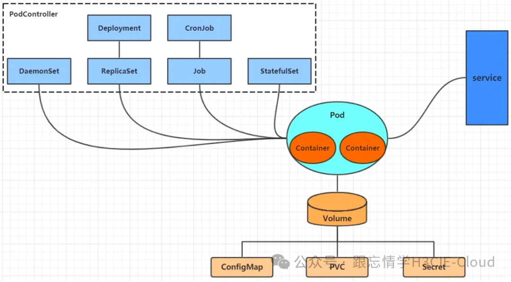

## K8s架构的组成是什么？
和大多数分布式系统一样，K8S集群将计算资源分成master和worker（node）。至少需要一个主节点（Master）和多个计算节点（Node）。

主节点主要用于暴露API，调度部署和节点的管理。

计算节点运行一个容器运行环境Docker Engine，一般是docker环境（类似docker环境的还有rkt），同时运行一个K8s的代理（kubelet）用于和master通信。计算节点也会运行一些额外的组件，像记录日志，节点监控，服务发现等等。计算节点是k8s集群中真正工作的节点。

## K8S架构细分：
1、Master节点（默认不参加实际工作）：

- Kubectl：客户端命令行工具，作为整个K8s集群的操作入口；
- Api Server：在K8s架构中承担的是“桥梁”的角色，作为资源操作的唯一入口，它提供了认证、授权、访问控制、API注册和发现等机制。客户端与k8s群集及K8s内部组件的通信，都要通过Api Server这个组件；
- Controller-manager：负责维护群集的状态，比如故障检测、自动扩展、滚动更新等；
- Scheduler：负责资源的调度，按照预定的调度策略将pod调度到相应的node节点上；
- Etcd：担任数据中心的角色，保存了整个群集的状态；

2、Node节点：
- Kubelet：负责维护容器的生命周期，同时也负责Volume和网络的管理，一般运行在所有的节点，是Node节点的代理，当Scheduler确定某个node上运行pod之后，会将pod的具体信息（image，volume）等发送给该节点的kubelet，kubelet根据这些信息创建和运行容器，并向master返回运行状态。（自动修复功能：如果某个节点中的容器宕机，它会尝试重启该容器，若重启无效，则会将该pod杀死，然后重新创建一个容器）；
- Kube-proxy：Service在逻辑上代表了后端的多个pod。负责为Service提供cluster内部的服务发现和负载均衡（外界通过Service访问pod提供的服务时，Service接收到的请求后就是通过kube-proxy来转发到pod上的）；
- container-runtime：是负责管理运行容器的软件，比如docker
- Pod：是k8s集群里面最小的单位。每个pod里边可以运行一个或多个container（容器），如果一个pod中有两个container，那么container的USR（用户）、MNT（挂载点）、PID（进程号）是相互隔离的，UTS（主机名和域名）、IPC（消息队列）、NET（网络栈）是相互共享的。一个Node节点可以运行多个Pod。

## Pod可能位于的状态

- Pending：API Server已经创建该Pod，且Pod内还有一个或多个容器的镜像没有创建，包括正在下载镜像的过程。
- Running：Pod内所有容器均已创建，且至少有一个容器处于运行状态、正在启动状态或正在重启状态。
- Succeeded：Pod内所有容器均成功执行退出，且不会重启。
- Failed：Pod内所有容器均已退出，但至少有一个容器退出为失败状态。
- Unknown：由于某种原因无法获取该Pod状态，可能由于网络通信不畅导致。

## 创建一个pod的流程是什么？

- 客户端提交Pod的配置信息（可以是yaml文件定义好的信息）到kube-apiserver；
- Apiserver收到指令后，通知给controller-manager创建一个资源对象；
- Controller-manager通过api-server将pod的配置信息存储到ETCD数据中心中；
- Kube-scheduler检测到pod信息会开始调度预选，会先过滤掉不符合Pod资源配置要求的节点，然后开始调度调优，主要是挑选出更适合运行pod的节点，然后将pod的资源配置单发送到node节点上的kubelet组件上。
- Kubelet根据scheduler发来的资源配置单运行pod，运行成功后，将pod的运行信息返回给scheduler，scheduler将返回的pod运行状况的信息存储到etcd数据中心。

## 删除一个Pod会发生什么事情？
Kube-apiserver会接受到用户的删除指令，默认有30秒时间等待优雅退出，超过30秒会被标记为死亡状态，此时Pod的状态Terminating，kubelet看到pod标记为Terminating就开始了关闭Pod的工作；

关闭流程如下：

- pod从service的endpoint列表中被移除；
- 如果该pod定义了一个停止前的钩子，其会在pod内部被调用，停止钩子一般定义了如何优雅的结束进程；
- 进程被发送TERM信号（kill -14）
- 当超过优雅退出的时间后，Pod中的所有进程都会被发送SIGKILL信号（kill -9）。

## pod重启
Pod重启策略（RestartPolicy）应用于Pod内的所有容器，并且仅在Pod所处的Node上由kubelet进行判断和重启操作。当某个容器异常退出或者健康检查失败时，kubelet将根据RestartPolicy的设置来进行相应操作。

Pod的重启策略包括Always、OnFailure和Never，默认值为Always。

- Always：当容器失效时，由kubelet自动重启该容器；
- OnFailure：当容器终止运行且退出码不为0时，由kubelet自动重启该容器；
- Never：不论容器运行状态如何，kubelet都不会重启该容器。

同时Pod的重启策略与控制方式关联，当前可用于管理Pod的控制器包括ReplicationController、Job、DaemonSet及直接管理kubelet管理（静态Pod）。

不同控制器的重启策略限制如下：

- RC和DaemonSet：必须设置为Always，需要保证该容器持续运行；
- Job：OnFailure或Never，确保容器执行完成后不再重启；
- kubelet：在Pod失效时重启，不论将RestartPolicy设置为何值，也不会对Pod进行健康检查。

## init container
init container的运行方式与应用容器不同，它们必须先于应用容器执行完成，当设置了多个init container时，将按顺序逐个运行，并且只有前一个init container运行成功后才能运行后一个init container。当所有init container都成功运行后，Kubernetes才会初始化Pod的各种信息，并开始创建和运行应用容器。

waf中使用init container来拉取程序的个性化启动配置。

## controller

这些都是controller

- Deployment
用于无状态应用的控制器，支持应用的扩缩容、滚动升级等操作。
提供了更强大的更新策略，如滚动更新、回滚等。
支持声明式的配置管理，便于跟踪和管理应用的变更历史。
- StatefulSet
用于有状态应用的控制器，确保每个 Pod 有稳定唯一的网络标识和持久化存储。
支持有序的部署、扩缩容和删除操作。
适用于需要维护数据一致性和有序性的应用，如数据库、消息队列等。
- DaemonSet
确保每个节点上运行一个指定类型的 Pod。
当有新节点加入集群时，自动在新节点上创建 Pod；当节点被删除时，自动删除该节点上的 Pod。
适用于需要在每个节点上运行的系统级服务，如日志收集、监控代理、网络插件等。
- Job
用于运行一次性任务的控制器，确保一个或多个 Pod 成功完成任务。
如果任务失败，可以根据配置重新启动 Pod 或者不再尝试。
适用于执行批处理任务、数据处理、计算任务等一次性工作。
- CronJob
用于定期执行任务的控制器，类似于 Unix 中的 cron。
根据指定的时间表自动创建 Job，并运行相应的任务。
适用于需要定时执行的任务，如备份、报告生成等。

## ipvs 和 ingress

二者都负责暴露入口。

ipvs基于linux netfilter协议栈，负责在网络层转发到后端的pod上面。

ingress基于应用层，可以实现基于url分发请求到不同的service中。

## deployment升级过程

在Deployment的定义中，可以通过spec.strategy指定Pod更新的策略，目前支持两种策略：Recreate（重建）和RollingUpdate（滚动更新），默认值为RollingUpdate。

- Recreate：设置spec.strategy.type=Recreate，表示Deployment在更新Pod时，会先杀掉所有正在运行的Pod，然后创建新的Pod。
- RollingUpdate：设置spec.strategy.type=RollingUpdate，表示Deployment会以滚动更新的方式来逐个更新Pod。同时，可以通过设置spec.strategy.rollingUpdate下的两个参数（maxUnavailable和maxSurge）来控制滚动更新的过程。maxSurge表示最大超过replicaset的比列，maxunavailable表示不可用比例。

recreate会中断业务，一般使用rollingupdate：

初始创建Deployment时，系统创建了一个ReplicaSet，并按用户的需求创建了对应数量的Pod副本。
当更新Deployment时，系统创建了一个新的ReplicaSet，并将其副本数量扩展到1，然后将旧ReplicaSet缩减为2。
之后，系统继续按照相同的更新策略对新旧两个ReplicaSet进行逐个调整。
最后，新的ReplicaSet运行了对应个新版本Pod副本，旧的ReplicaSet副本数量则缩减为0。

## Horizontal Pod Autoscaler（HPA）

HPA控制器实现基于CPU使用率进行自动Pod扩缩容的功能。HPA控制器周期性地监测目标Pod的资源性能指标，并与HPA资源对象中的扩缩容条件进行对比，在满足条件时对Pod副本数量进行调整。

Kubernetes中的某个Metrics Server（Heapster或自定义Metrics Server）持续采集所有Pod副本的指标数据。HPA控制器通过Metrics Server的API（Heapster的API或聚合API）获取这些数据，基于用户定义的扩缩容规则进行计算，得到目标Pod副本数量。

当目标Pod副本数量与当前副本数量不同时，HPA控制器就向Pod的副本控制器（Deployment、RC或ReplicaSet）发起scale操作，调整Pod的副本数量，完成扩缩容操作。

ß

## 存储

- Persistent Volume (PV)：由集群管理员配置的存储资源，可以是宿主机上的目录、网络文件系统共享的目录，或者是第三方提供的存储服务（如云存储）。PV的生命周期独立于使用它的Pod，确保了数据持久性。
- Persistent Volume Claim (PVC)：用户或应用程序对PV的请求。PVC定义了所需的存储容量、访问模式等，当PVC被创建时，Kubernetes会尝试将其与满足其要求的PV进行绑定。、
- HostPath：将宿主机的文件或目录挂载到Pod中，适用于简单的本地存储需求，但不推荐用于生产环境，因为它的可移植性和容错性较差。
- emptydir：为每个Pod创建一个临时目录，用于在同一Pod中的不同容器之间共享数据。当Pod被删除时，emptydir中的数据也会被清除，适用于需要临时文件交换的场景。
- NFS：通过网络文件系统（NFS）挂载共享存储，提供网络文件系统的访问，适用于需要网络共享存储的场景。

