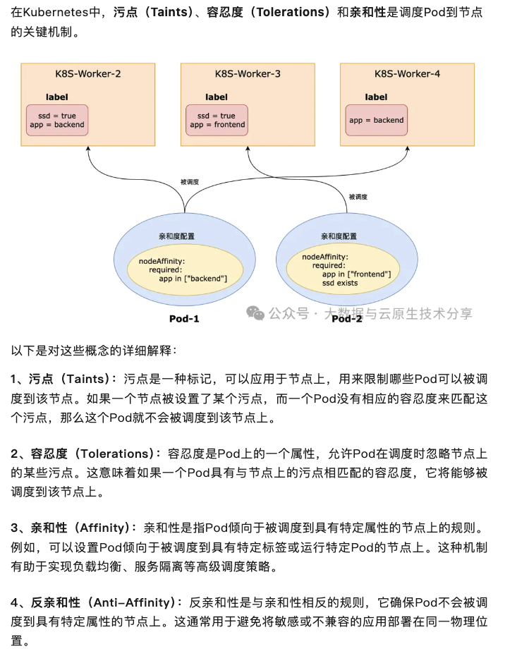

master的scheduler组建负责调度pod到node。

Kubernetes 的 Pod 调度到 Node 的过程主要基于一系列的调度策略和规则，这些规则可以分为预选（Predicate）和优选（Priority）两个阶段。以下是详细的调度规则：

### 预选阶段（Predicate）

预选阶段的目标是过滤掉不满足 Pod 资源需求的节点。例如

- 检查节点是否有足够的 CPU、内存和其他资源来满足 Pod 的请求。
- 检查 Pod 请求的端口是否与节点上已使用的端口冲突。
- 检查节点上的污点（taints）和 Pod 的容忍度（tolerations），确保 Pod 可以在节点上运行。（防止pod调度到某个节点上了）ß
- 检查节点的标签属性和 Pod 的服务亲和性规则是否匹配。（让pod调度到指定节点上）

### 优选阶段（Priority）

优选阶段的目标是对通过预选的节点进行打分，选择得分最高的节点来运行 Pod。例如

- 尽量将属于同一服务的 Pod 分散到不同的节点上。
- 选择资源利用率较低的节点。
- 根据 Pod 的节点亲和性规则给节点打分。
- 根据节点的污点和 Pod 的容忍度给节点打分。
- 优先选择已经缓存了 Pod 所需镜像的节点。

### 调度决策

master的scheduler最终会选择得分最高的节点，并将调度决策发送给 kubelet 组件，kubelet 接收到调度决策后会准备并启动 Pod。

### 污点和亲和性

在 Kubernetes 中，节点亲和性和容忍度是两种重要的调度机制，它们允许用户根据节点的属性来控制 Pod 的调度。通过这些机制，可以优化资源利用、提高应用的性能和满足特定的工作负载需求。下面将详细介绍这两个概念：

#### 亲和性

定义：节点亲和性是指通过节点标签来控制 Pod 调度的一种机制。它允许用户指定 Pod 应当调度到具有特定标签的节点上。

类型：节点亲和性有两种类型：

- 硬亲和性（RequiredDuringSchedulingIgnoredDuringExecution）：这是一个强制性的规则，要求 Pod 必须调度到满足指定条件的节点上。如果没有满足条件的节点，Pod 将不会被调度，并保持在 Pending 状态，直到找到满足条件的节点或管理员进行干预。
- 软亲和性（PreferredDuringSchedulingIgnoredDuringExecution）：这是一个非强制性的规则，用于指定 Pod 调度时的优先级。Kubernetes 会尽量将 Pod 调度到满足条件的节点上，但如果没有满足条件的节点，Pod 仍然可以被调度到其他节点上。

使用场景：例如，可以将具有特定硬件配置（如 GPU）的节点标记为特定标签，并配置 Pod 使其仅在该类节点上运行，以确保最佳性能。

#### 容忍度
定义：容忍度是分配给 Pod 的属性，表明它可以容忍节点的污点。污点是应用于节点以阻止没有相应容忍度的 Pod 被调度到该节点上的标签。

如何工作：为了使 Pod 能够在被污点的节点上运行，需要在 Pod 规范中添加对应的容忍度。容忍度的配置包括键、运算符、值和效果，其中效果决定了 Pod 如何容忍污点。

使用场景：例如，可以为一个 Pod 添加容忍度，以容忍节点上的 NoExecute 污点，这样在节点进行维护时，该 Pod 不会被驱逐，从而确保服务的连续性。

通过节点亲和性和容忍度，Kubernetes 提供了细粒度的控制能力，使得用户能够根据具体的工作负载需求和环境条件，优化 Pod 的调度策略。

