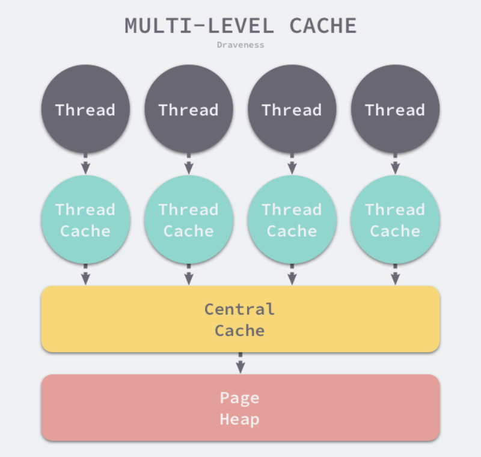
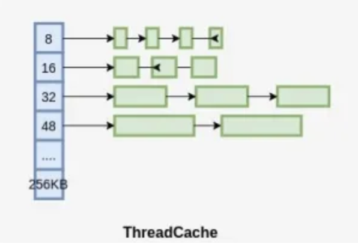

## malloc、tcmalloc、golang内存管理器的关系
malloc、tcmalloc和Golang的内存管理器都是用于分配和管理虚拟内存的库。它们的主要区别在于实现方式、性能和适用场景。

- malloc：malloc是C语言标准库中的内存分配函数，用于动态分配内存。malloc使用堆内存来分配内存，它的实现依赖于操作系统的内存管理机制。malloc的优点是通用性强，适用于各种编程语言和平台。然而，malloc在多线程环境下可能存在性能瓶颈，因为它使用互斥锁来保护内存分配和释放操作，这可能导致线程竞争和性能下降。
- tcmalloc：tcmalloc（Thread-Caching Malloc）是Google开发的一种内存分配库，旨在提高多线程程序的内存分配性能。tcmalloc使用线程本地缓存（Thread-Local Cache）来减少线程间的竞争，从而提高内存分配性能。tcmalloc在多线程环境下性能优于malloc，但可能在单线程环境下性能略逊一筹。tcmalloc主要用于C++和其他支持C风格内存分配函数的编程语言。
- Golang的内存管理器：Golang的内存管理器是Golang运行时（Runtime）的一部分，负责管理Golang程序的内存分配和回收。并且Golang的内存管理器使用垃圾回收（Garbage Collection）机制来自动回收不再使用的内存。Golang的内存管理器在多线程环境下性能优于malloc和tcmalloc，因为它使用了更高效的内存分配和回收策略。Golang的内存管理器主要用于Golang程序，它可以自动处理内存分配和回收，无需程序员手动管理。
总之，malloc、tcmalloc和Golang的内存管理器都是用于分配和管理内存的库，它们的主要区别在于实现方式、性能和适用场景。在实际编程中，应根据编程语言、平台和性能需求选择合适的内存管理库。对于Golang程序，建议使用Golang的内存管理器，因为它可以自动处理内存分配和回收，提高程序的性能和稳定性。对于C++和其他支持C风格内存分配函数的编程语言，可以考虑使用tcmalloc来提高内存分配性能。对于其他编程语言，可以使用malloc作为通用的内存分配库。

本文重点讨论malloc和tcmalloc两个c风格的虚拟内存管理库。
golang内存管理在[golang堆内存管理](../golang/heap.md)中讨论。

Nginx内存申请使用的是malloc。Nginx是一个高性能的Web服务器和反向代理服务器，它使用C语言编写。在C语言中，malloc是标准库中的内存分配函数，用于动态分配内存。

Nginx使用malloc函数来分配内存，这是因为malloc是C语言标准库中的通用内存分配函数。在大多数情况下，malloc的性能和灵活性已经足够满足Nginx的需求。然而，在某些场景下，malloc的性能可能会受到内存碎片的影响。为了避免内存碎片问题，可以考虑使用其他内存分配库，如tcmalloc。

tcmalloc（Thread-Caching Malloc）是Google开发的一种内存分配库，它提供了更高的内存分配性能和更好的内存碎片管理。tcmalloc使用线程缓存和中央空闲列表等技术来提高内存分配性能，同时减少内存碎片。在某些场景下，使用tcmalloc可以提高Nginx的性能。

## malloc
通过链式结构管理内存，每一块内存存在是否使用的标志位和指向下一块内存地址的指针。

当申请内存时，遍历内存链表，寻找第一个大于申请空间的没在使用的内存块，找到就返回给申请者。
没有找到，则调用系统调用brk或mmap申请内存，并返回给申请者。

当释放内存时，如果当前内存位于heap的brk位置，则可以释放内存。否则是标记该内存为可用。

malloc存在以下问题：

- 全局锁在高并发场景下会带来严重性能问题： 申请内存时，需要解决多线程申请同一片内存的冲突问题，因此要加全局锁。
- 内存复用每次从头遍历也存在一些性能问题
- 内存碎片问题，我们内存复用时只是简单的判断块内存是否大于需要的内存区域，如果极端情况下，我们一块空闲内存为1G，而新申请内存为1kb，那就造成严重的碎片浪费
- 内存释放存在问题，只会把末尾处的内存还给操作系统，中间的空闲部分则没有机会还给操作系统。

https://blog.csdn.net/flynetcn/article/details/127518847

## tcmalloc

### 线程本地内存缓存 + 中心内存 + 页堆

#### 线程本地内存缓存
线程通过malloc去申请内存是系统调用。 最终是通过内核线程去申请的内存。 
在多核CPU的架构下，不同核心的多个线程同时申请内存的情况是存在的。
进程是资源分配的最小单位，因此内存是按照进程进行分配的。同个进程的多个线程共享一片内存。

多个线程在竞争同个资源的时候是需要加锁防止冲突的。 为了在内存申请的时候，减少线程之间的竞争，分配内存时减少锁的过程。

因此，为每个线程都构造了本地缓存ThreadCache。线程首先去自己的ThreadCache去申请内存，因为该内存为此线程持有，该过程不需要加锁，避免了加锁消耗的性能。

每个线程各自的Cache，一个Cache包含多个空闲内存块链表，每个链表连接的都是内存块，同一个链表上内存块的大小是相同的，也可以说按内存块大小，给内存块分了个类，这样可以根据申请的内存大小，快速从合适的链表选择空闲内存块。由于每个线程有自己的ThreadCache，所以ThreadCache访问是无锁的。

TCmalloc会为线程预分配缓存，需要进行1次系统调用，后续线程申请小内存时，从缓存分配，都是在用户态执行，没有系统调用，缩短了内存总体的分配和释放时间。

#### 中心内存
是所有线程共享的缓存，也是保存的空闲内存块链表，链表的数量与ThreadCache中链表数量相同，当ThreadCache内存块不足时，可以从CentralCache取，当ThreadCache内存块多时，可以放回CentralCache。由于CentralCache是共享的，所以它的访问是要加锁的。

#### 页堆
PageHeap是堆内存的抽象，PageHeap存的也是若干链表，链表保存的是Span，当CentralCache没有内存的时，会从PageHeap取，把1个Span拆成若干内存块，添加到对应大小的链表中，当CentralCache内存多的时候，会放回PageHeap。由于PageHeap是共享的，所以它的访问是要加锁的。

### 二维链表内存管理

将内存page按照不同的大小进行切割，相同大小的内存链起来，最终形成一个二维的链表。
方便的找到最适合的内存块，进行内存分配，减少内存碎片。查找可用内存时，避免了遍历所有内存块，减少了遍历时间。
即将内存分割成多个链表，每个链表中的内存块大小相同，申请内存时先找到满足条件的链表，再从链表中选择合适的内存块；

