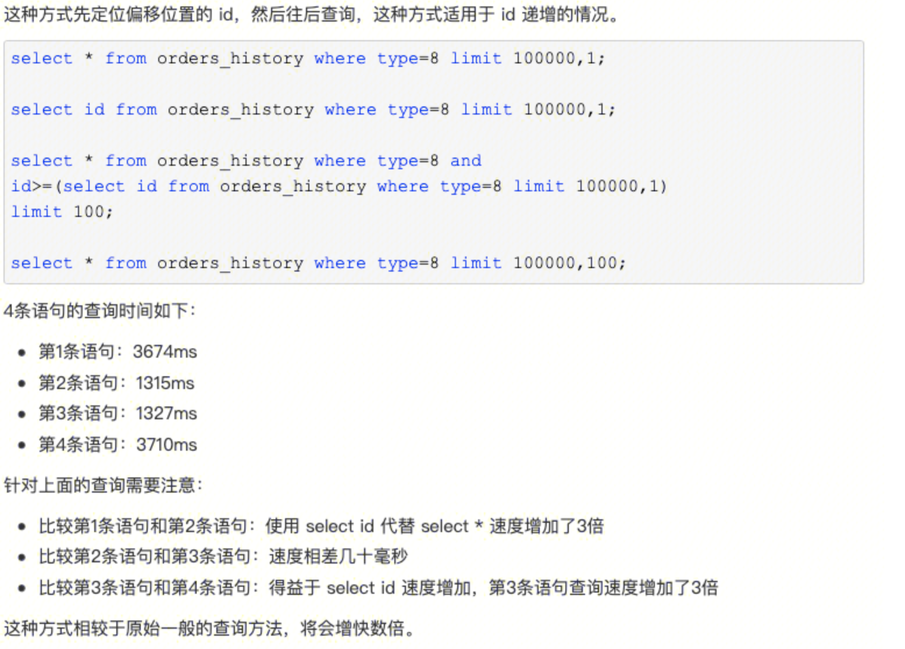

## 需求：
参数中，offset为页数，limite为一页展示的项数

### 方法一： limit m，n
**limit m，n** m为开始的标志(offset-1) x limit ，n为查询的项数目limit。
例如 select * from mytable limit 20，10 意味从第21项开始，查询到30项 （21-30）。
总页数：（totalrecord + limit -1）/ limit
该方法直接简单，但是不够优化。如果是limit 200000,200，则需要扫描200200行，如果在一个高并发的应用里，每次查询需要扫描超过20W行，效率十分低下。
因为：MySQL并不是跳过offeset行，而是取offset+N行，然后返回放弃前offset行，返回N行，那当offset特别大的时候，效率就非常的底下，要么控制返回的总页数，要么对超过特定阈值的页数进行SQL改写。

### 方法二：limit n 
将遍历条件变为筛选条件 where deptno > 10 or < 10。注意的是下一页为asc 上一页为desc。
``` 
select * from dept where deptno >10 order by deptno asc limit n;//下一页
select * from dept where deptno <60 order by deptno desc limit n//上一页
```
该方法省去多余的遍历。但是前提条件是deptno作为主键需要递增并且连续。在应对删除操作时，应该使用删除标志代替物理删除。

### 方法三：子查询优化
该方法要求主键递增


- 第一条
``` 
select * from orders_history where type=8 limit 100000,1;
```
根据type非主键非聚簇索引，找到主键值，然后前往主键聚簇索引，得到 （所有的查询值）*
经历了10000次非聚簇查询和100000次聚簇查询。

- 第二条
``` 
select id from orders_history where type=8 limit 100000,1;
```
非聚簇索引记录的是主键的值，因此只查询id不需要回表。

- 第三条
``` 
select * from orders_history where type=8 and 
id>=(select id from orders_history where type=8 limit 100000,1) 
limit 100;
```
先定位偏移位置的 id，然后往后查询。回表操作100次

- 第四条
``` 
select * from orders_history where type=8 limit 100000,100;
```
同第一条。


