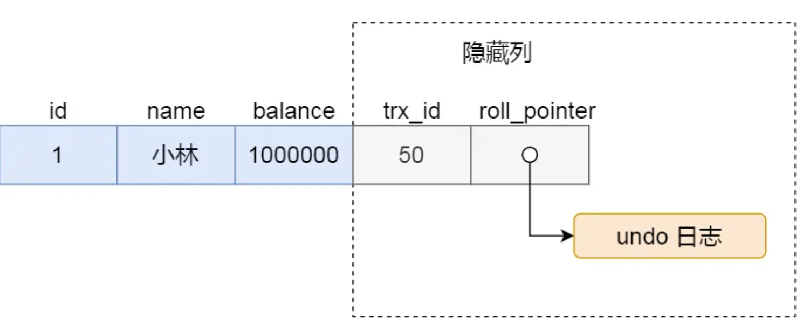

## 存储过程
一组可编程的函数，是为了完成特定功能的SQL语句集，经编译创建并保存在数据库中，用户可通过指定存储过程的名字并给定参数(需要时)来调用执行。
https://www.cnblogs.com/geaozhang/p/6797357.html

## 索引类型

主键、联合索引(最左匹配原则、区分度大的放在前面、可以做覆盖索引优化)、普通索引、唯一索引、

聚簇索引 非聚簇索引

b+树：叶子节点在同一层，组成双向链表

b+树：索引最好时自增的，防止乱序插入到b+数，导致大量页分类和自平衡。

b+数非叶子节点不存数据，相比b树可以索引查找时候的磁盘查询次数。

## 锁类型

全局锁：flush tables with read lock 库变成只读状态，主要用于数据迁移备份。

表锁（表级锁）：lock tables 限制其他线程对表读写

MDL（表级锁）：对表进行CRUD时自动加MDL读锁，当对表结构进行修改时自动加MDL写锁。关于MDL问题:[MDL死锁](./metadatalock.md)

s锁（行级锁-读写锁）：SELECT ... LOCK IN SHARE MODE 共享锁允许多个事务同时读取同一资源，但不允许修改。

x锁（行级锁-互斥锁）：SELECT ... FOR UPDATE或者update语句自动加锁。

间隙锁（行级锁）： select ... between 范围查询时，自动加。锁记录之间的空隙，阻断插入等操作。

Next-Key Lock （行级锁）：select ... between 范围查询时，自动加。锁记录之间的空隙和记录。

## 事务

ACID 原子 一致 隔离 持久。

- A通过 undolog实现，记录旧值，方便回滚
- D通过 redolog实现，REDO LOG记录了事务对数据库所做的所有修改，以便在系统崩溃或介质故障后能够重新执行这些修改，从而恢复数据的一致性
- I通过 MVCC和锁实现。

ADI -> c

### 原子性
undolog:

- 当一个事务提交时，它所创建的新数据版本会被写入数据库，并且原始数据版本会保留，直到没有其他事务引用它为止。
- 如果一个事务回滚，那么它所创建的新数据版本不会被写入数据库，原始数据版本保持不变。

Undo Log的生命周期：

事务提交前：
当一个事务开始执行时，MySQL会为该事务创建相应的Undo Log记录，用于记录事务执行过程中的数据变更。
这些Undo Log记录在事务提交前会一直保留在内存中（如果空间允许）或磁盘上。
事务提交后：

当事务成功提交后，Undo Log记录并不会立即被删除。相反，它们会被标记为“已提交”状态，并保留在数据库中一段时间。
这段时间的长度取决于MySQL的配置参数，如innodb_undo_log_truncate和innodb_max_undo_log_size等。
Undo Log的清理：

MySQL会定期检查Undo Log的使用情况，并根据配置的策略进行清理。
清理过程通常由后台线程（如InnoDB的purge线程）执行，它会删除那些已经不再需要的Undo Log记录。
例如，当某个Undo Log段中的所有记录都被标记为“已提交”且超过了保留期限时，该段就会被删除。

### 隔离性

与redis不同，mysql是多线程服务，可以并发处理请求。因此存在并发读写的问题。

按照隔离级别分类：

- 未提交读
- 提交读
- 可重复读 (MVCC + nextkey lock) 实现
- 串型（读写锁）实现

#### 串型

通过对行数据加s锁实现，读写锁。

保证读写串行。读读并行。

#### 可重复读

要求事务期间多次读取的数据都是一致的。

##### 并发写写
通过索引写单行数据会加行锁。没有通过索引写单行数据会触发全表扫描，会锁住索引（间隙和记录）

- 针对两个事务同时写一条数据，其中一个事务会因为获取不到锁（可能是行锁，也可能是索引加锁了）而阻塞。
- 针对两个事务更新不同范围的数据，锁的范围不同，可以同时进行。

##### 并发读写
针对一边有事务在写 一边有事务在读的情况，如何提高并发，防止阻塞。

MVCC版本控制：

- 1.版本链：通过版本链来控制多个事务访问同一条记录。 每条记录拥有trxid，表示修改自己的事务id。还拥有一个通过undolog建立的版本链。
- 2.readview： 记录当前活跃的事务区间。可重复读情况下，readview是事务第一条读语句时创建，整个事务都使用一个readview。
- 3.并发读写过程：写会触发把旧版本通过undolog链接起来。 可重复读会触发创建readview，读取数据行时，判断数据行trxid和readview活跃事务区间。如果（小于最小活跃事务id）或者（小于最大活跃事务ID且不在活跃事务id列表），表明修改该行的事务已经提交则可读。否则，沿着undolog继续寻找。

幻读问题：自动添加next-key lock 锁定间隙和记录。

## 分布式事务
两阶段提交

### 第一阶段：准备阶段
协调者向所有参与者发送事务内容，询问是否可以提交事务，并等待答复。
各参与者执行本地事务操作，将undo和redo信息记入事务日志中(但不提交事务)。
如参与者执行成功，给协调者反馈同意，否则反馈中止，表示事务不可以执行。

### 第二阶段：提交阶段
协调者收到各个参与者的准备消息后，根据反馈情况通知各个参与者commit提交或者rockback回滚。

当第一阶段所有参与者都反馈同意时，协调者发起正式提交事务的请求，当所有参与者都回复同意时，则意味着完成事务，具体流程如下：

如果任意一个参与者节点在第一阶段返回的消息为中止，或者协调者节点在第一阶段的询问超时之前无法获取所有参与者节点的响应消息时，那么这个事务将会回滚，具体流程如下：

https://mp.weixin.qq.com/s?__biz=Mzg3MDYzNjMwNQ==&mid=2247484451&idx=1&sn=5c0bb3334246cdc3655327374c87d1a6&chksm=cf8781f8f03cccd7e3296bd96c00abc4ca0fa5c8fd9e602daafe842e2b3b4b76990b6537db27#rd

## 日志

### undolog

undolog位于数据行的undolog指针组织。记录对数据行的旧值。

Undo Log的生命周期

事务提交前：
当一个事务开始执行时，MySQL会为该事务创建相应的Undo Log记录，用于记录事务执行过程中的数据变更。
这些Undo Log记录在事务提交前会一直保留在内存中（如果空间允许）或磁盘上。
事务提交后：

当事务成功提交后，Undo Log记录并不会立即被删除。相反，它们会被标记为“已提交”状态，并保留在数据库中一段时间。
这段时间的长度取决于MySQL的配置参数，如innodb_undo_log_truncate和innodb_max_undo_log_size等。
Undo Log的清理：

MySQL会定期检查Undo Log的使用情况，并根据配置的策略进行清理。
清理过程通常由后台线程（如InnoDB的purge线程）执行，它会删除那些已经不再需要的Undo Log记录。
例如，当某个Undo Log段中的所有记录都被标记为“已提交”且超过了保留期限时，该段就会被删除。

### redolog

mysql更新数据的时候，需要先找到数据在磁盘的位置，然后读到内存更新后写回磁盘。
如果每一次更新都需要进行读写两次磁盘I/O的话，那么效率会非常低下。

因此，一般采用读取磁盘到内存bufferpool后，更新内存。再定时批量刷新磁盘，减少I/O次数。
但是如果程序崩溃，bufferpool中还没有来得及刷磁盘的部分更新就会丢失。所以有redolog。

redolog，使用append的方式记录逻辑修改。顺序存放在磁盘中，基于磁盘顺序访问。相比直接修改磁盘数据的随机访问方式更加高效。
有了redolog之后，更新操作变为：

- 更新内存中的bufferpool
- 写redolog到磁盘文件（防止内容丢失）
- 等待后台线程刷新bufferpool到磁盘

先写redolog再刷磁盘的操作叫做write-ahead logging

与binlog的区别，binlog无法记录还有哪些脏bufferpool还没有刷新磁盘。但是redolog可以。

### binlog

与redis一样，binlog是server级别的日志，分为append更新语句的逻辑日志和append行变化结果的row日志。
主要用于数据备份和主从同步。

### update时，内存、磁盘、日志都做了什么事情？

- 通过索引找到数据行在磁盘的位置，读取磁盘内容到内存bufferpool，并缓存方便下次使用。
- 开启事务
- 修改内存数据，并记录undolog，如果事务执行失败，使用undolog回滚
- 内存记录redolog。
- 事务提交：两阶段提交（为了保证binlog和redolog都写到磁盘，分布式事务一致性）
prepare阶段：redolog刷磁盘。 commit阶段：写binlog到磁盘，并设置redolog的commit状态。

## 性能优化

### explain分析

explain时sql的执行分析，查看sql使用索引情况，执行情况等。

主要分析type指标：

- const：当查询中使用了主键或唯一索引，并且查询条件中的值可以唯一确定一行时，MySQL会使用这种类型。这种类型的查询效率非常高，因为MySQL只需要读取一行数据。
- eq_ref：当查询使用了唯一索引或主键，并且查询条件中的值可以匹配多行时，MySQL会使用这种类型。对于每个索引键值，表中只有一行与之匹配。这种类型的查询效率也很高，因为MySQL可以使用索引快速定位到每一行。
- ref：当查询使用了非唯一索引，并且查询条件中的值可以匹配多行时，MySQL会使用这种类型。对于每个索引键值，可能有多行与之匹配。这种类型的查询效率较高，但比eq_ref稍慢。
- range：当查询使用了索引，并且查询条件中的值在一个连续的范围内时，MySQL会使用这种类型。这种类型的查询效率较高，但比ref稍慢。
- index：当查询使用了索引，但没有使用覆盖索引（即查询的所有列都在索引中）时，MySQL会使用这种类型。这种类型的查询效率较低，因为MySQL需要回表操作来获取非索引列的数据。
- ALL：当查询没有使用索引，而是进行了全表扫描时，MySQL会使用这种类型。这是最慢的访问类型，因为它需要扫描整个表。

### 优化思路

- explain分析执行语句，查找慢查询原因。
- 检查索引是否失效，例如存在模糊匹配、表达式计算等。
- 创建或者优化索引，尽量优化到const、eq_ref、ref、range级别。比如，覆盖索引、联合索引。
- 减少join、order、groupby操作，使用程序内存进行数据组合、数据排序、分组。
- 分页优化: 查看explain扫描行数，避免使用limit 10000，10这样的分页操作，这会导致扫描10010行，然后只取最后10行。使用范围查询代替。

- 分表：单表数据量超过千万，会导致B+树变高，磁盘访问次数增加，效率变低。考虑水平拆分，按照主键进行hash、范围等方法进行拆分，第三方库Sharding-JDBC等。
- 分库：单点mysql负载高，考虑读写分离。
- 缓存：考虑使用redis缓存。

## 主从架构

### 主从同步

slave节点会新建专门的I/O线程，读取master节点的binlog，放在本地的relaylog。 

在其线程对relaylog进行回放。达到主从同步的目的。

延迟无法避免，非必要情况下不使用读写分离时，直接读写主节点，从节点用于备份和故障切换。

### 解决问题
因为更新主节点的表时，发生了metadatalock，进而导致主节点cpu 100%，变为不可用状态。可优化操作

- 故障切换到从节点
- 从节点更新后替换为主节点。
- 读写分离，写主节点，读从节点。

