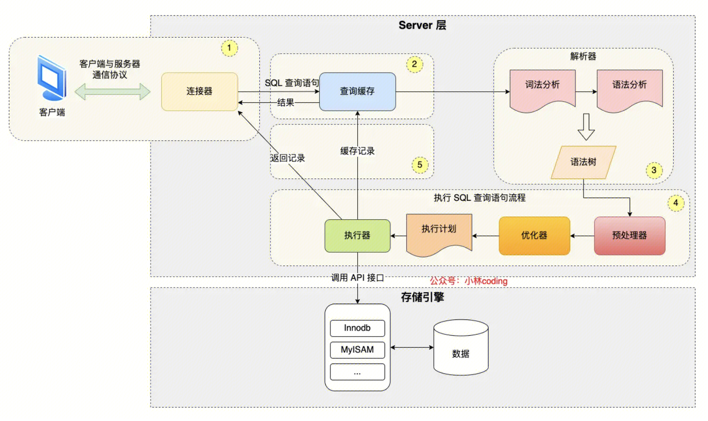

## 执行一条Mysql期间发生了什么？
https://xiaolincoding.com/mysql/base/how_select.html#mysql-%E6%89%A7%E8%A1%8C%E6%B5%81%E7%A8%8B%E6%98%AF%E6%80%8E%E6%A0%B7%E7%9A%84
client --> 连接器 --> 缓存 --> 词法分析器 --> 语法分析器 --> （生成语法树）--> 预处理器 --> 优化器 -->（执行计划）--> 执行器 --> 存储引擎

### 连接器
用于鉴权和管理用户连接。
存在单机最大连接数问题。
也存在连接断开空闲时间。

#### 长连接、短连接、连接池对性能的影响
https://cloud.tencent.com/developer/article/1778879

- 短链接：慢 + 客户端端口耗尽问题（端口回收需要timewait）。
- 长链接：大量长链接管理会消耗大量内存
- 链接池：可以设置维护的最大数量的长链接和最大数量的链接数等，从而控制连接的性能的影响。

#### 实现一个简单的链接池：
https://yusank.space/posts/conn-pool/

初始化时，新建max_idle个链接，放入链接池。
需要链接的时候，现从链接池中拿取，链接池中没有空闲链接时，新建链接，最大链接数为max_open。
不需要链接时，如果链接池中链接数量小于maxidle，则将该链接放回链接池。大于，则考虑释放链接。

连接池比较重要的几个参数：

- max_idle: 20 # 最大空闲连接数
- max_open: 100 # 最大在线连接数 
- idle_timeout: 180000 # 连接最大空闲等待时间(单位：毫秒)
- max_lifetime: 180000 # 连接最大生命周期(单位：毫秒)

### 缓存查询
缓存sql和对应的查询结果。命中概率比较低
查询缓存是以 key-value 形式保存在内存中的，key 为 SQL 查询语句，value 为 SQL 语句查询的结果。
对于更新比较频繁的表，查询缓存的命中率很低的，因为只要一个表有更新操作，那么这个表的查询缓存就会被清空。

### 词法分析
将sql按照关键字进行分割

### 语法分析
分析sql的语法是否正确
生成语法树

### 预处理器
进行一些预处理

- 检查 SQL 查询语句中的表或者字段是否存在；
- 将  `select *`  中的  `*`  符号，扩展为表上的所有列；

### 优化器
生存执行计划
**优化器主要负责将 SQL 查询语句的执行方案确定下来**，比如在表里面有多个索引的时候，优化器会基于查询成本的考虑，来决定是否使用索引，和选择使用哪个索引。explain  https://www.cnblogs.com/xxoome/p/14434061.html

index 遍历索引 https://juejin.cn/post/6844903967365791752
all 全表扫描（没用索引）
range 索引范围扫描, 常见于 '<', '<=', '>', '>=', 'between' 等操作符
ref 使用非唯一性索引或者唯一索引的前缀扫描, 返回匹配某个单独值的记录行

Using index 覆盖索引
Using index condition 索引下推

### 执行器
通过优化器确定的执行计划，执行器调用不同的存储引擎接口，获取数据。判断数据是否符合条件。每有一条符合条件就发送回客户端。

全表扫描： 执行器循环调用read_first_record接口，存储引擎返回一条数据，然后执行器比对where里面的条件是否满足。满足则发送给客户端。

主键索引：存储引擎根据主键索引，获取数据返回到执行器。执行器比对where里面的条件是否满足。满足则发送给客户端。

二级索引：存储引擎根据二级索引，获取主键。然后回表，根据主键索引获取数据。

索引下推：索引下推能够减少**二级索引**在查询时的回表操作，提高查询的效率，因为它将 Server 层部分负责的事情，交给存储引擎层去处理了。减少使用二级索引时的回表操作。把部分判断条件，交给存储引擎。https://xiaolincoding.com/mysql/base/how_select.html#%E6%89%A7%E8%A1%8C%E5%99%A8

### 存储引擎
innodb
myisam
