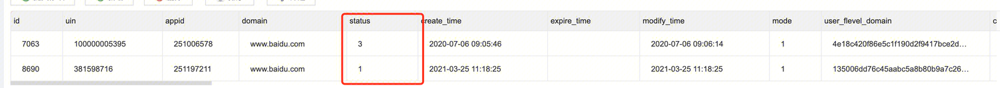

## 问题背景
`现象`：
用户访问日志记录中断
`原因`：

- 1. 是否记录访问日志依赖表tb_waf_cls_domain中，对应域名是否存在记录
 *waf-log-syncer* 
``` 
func (s *AccessCLSServer) buildLog(log *Log) *clsproto.Log {
	 /* 
	 	检查当前域名是否在s.domains中，不在则不记录入职
		domains表，通过定时遍历tb_waf_cls_domain生成
	 */
    clsDomainCfg, ok := s.domains[log.Domain]
    if !ok {
        return nil
    }
	...
```

- 2. tb_sparta_host_list存在触发器
After Update
BEGIN IF NEW.`status` = 3 THEN DELETE FROM tb_waf_cls_domain WHERE domain=NEW.domain; END IF; END
意味，更新tb_sparta_host_list表中数据后，如果当前行，域名status=3则删除tb_waf_cls_domain中的记录。


- 3. tb_sparta_host_list 假删
`多实例`场景，当用户在一个实例下删除域名，另一个实例下添加该域名。
将导致该域名在tb_sparta_host_list中存在两条数据，一条status=3，一条status=1：



- 4. tb_sparta_host_list增加列
新功能为tb_sparta_host_list增加列时，导致全表更新。
更新tb_sparta_host_list的status=3域名，将触发删除tb_waf_cls_domain数据的触发器。


## 修复方案

- 1. 删除tb_sparta_host_list关于tb_waf_cls_domain的触发器。(lucasssli)
- 2. 在trpc组件删除域名接口中，加上校验多实例域名逻辑后再删除tb_waf_cls_domain的数据。(lucasssli)


## 关于触发器补充

### 触发器（trigger）
是MySQL提供给程序员和数据分析员来保证数据完整性的一种方法，它是与表事件相关的特殊的存储过程，它的执行不是由程序调用，也不是手工启动，而是由事件来触发，比如当对一个表进行操作（insert，delete， update）时就会激活它执行。简单理解为：你执行一条sql语句，这条sql语句的执行会自动去触发执行其他的sql语句。

### 触发器的触发时机和作用主要
- BEFORE INSERT ： 在插入数据前，检测插入数据是否符合业务逻辑，如不符合返回错误信息。
- AFTER INSERT ： 在表 A 创建新账户后，将创建成功信息自动写入表 B 中。
- BEFORE UPDATE ：在更新数据前，检测更新数据是否符合业务逻辑，如不符合返回错误信息。
- AFTER UPDATE ：在更新数据后，将操作行为记录在 log 中。
- BEFORE DELETE ：在删除数据前，检查是否有关联数据，如有，停止删除操作。
- AFTER DELETE ：删除表 A 信息后，自动删除表 B 中与表 A 相关联的信息。

### 创建触发器
```
CREATE TRIGGER 触发器名
BEFORE|AFTER DELETE|INSERT|UPDATE
ON 表名 FOR EACH ROW
BEGIN
触发SQL代码块;
END;
```

### 查看触发器
show triggers

### 删除触发器
drop trigger 触发器名称

### 修改触发器
修改触发器就是删掉重新再创建

### 行变量
- 在触发目标上执行insert操作后会有一个新行，如果在触发事件中需要用到这个新行的变量，可以用new关键字表示
- 在触发目标上执行delete操作后会有一个旧行，如果在触发事件中需要用到这个旧行的变量，可以用old关键字表示
- 在触发目标上执行update操作后原纪录是旧行，新记录是新行，可以使用new和old关键字来分别操作


https://zhuanlan.zhihu.com/p/147736116