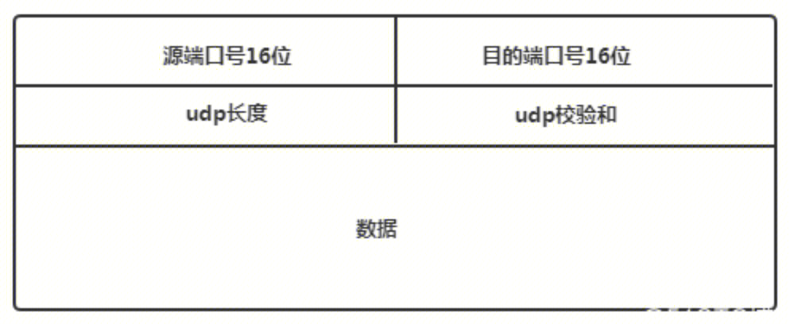
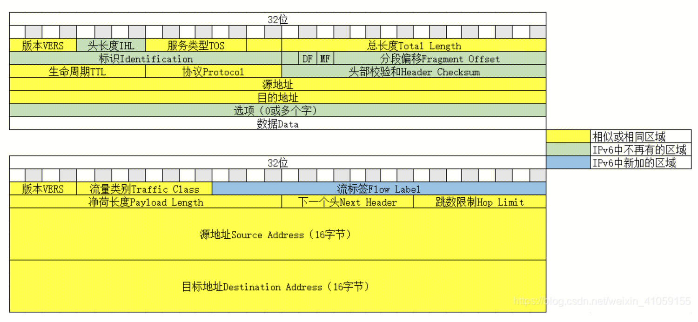

## 摘要
本文主要研究linux操作系统，将交给socket send的应用层数据转化成链路层帧的过程。
重点在于tcp报文和udp报文格式，以及ipv4报文格式和ipv6报文格式。

参考文章

- Linux 报文生成过程
  
https://codeantenna.com/a/txdfeAAK5F

https://blog.csdn.net/vipshop_fin_dev/article/details/103931691

https://www.yipwinghong.com/2021/04/05/OS_linux-network-monitoring/#/TCP

- linux 网络报文收发过程 网卡交互

https://segmentfault.com/a/1190000038374889

## linux 网络栈程序
调用send网络传输后，应用层数据包会按照`linux网络协议栈`对数据进行逐层处理，在每一层中封装该层的协议数据（在原有的负载前后增加固定格式的元数据）到从上层接受到的数据之后，再发送给下一层。
Linux 内核中的网络协议栈也类似 TCP/IP 的四层结构
```
+--------------------+
|      应用程序       |
+---------↓----------+
|      系统调用       |
+------------+---↓---+
       ↓     |  VFS  |
+------------+---↓---+   
|      套接字         |
+-----+-----+--------+
| TCP | UDP |      +-↓----+
+--↓--+--↓--+------+ ICMP |
|        IP        +------+
+--------↓---------↓ ARP  |
|      链路层       ↓------+ 
+--↓--+--↓---+--↓--+
| igb | ...  | bnx |
+--↓--+--↓---+--↓--+
| 网卡 | 网卡 | 网卡 | 
+-----+------+-----+
```


## tcp报文


## udp报文


## ipv4 && ipv6报文


## 链路层报文
ipv4需要调用ARP获取目的MAC地址 ipv6使用邻居子系统发现MAC地址


## 最终报文
socket（AF_INET， STREAM， 0） ipv4 ip层+ TCP传输层 协议栈


## 网卡交互

- 网络数据到来，网卡中断通知cpu
- cpu通知内核协议栈处理网络数据，得到应用层数据
- 将应用层数据交给socket


