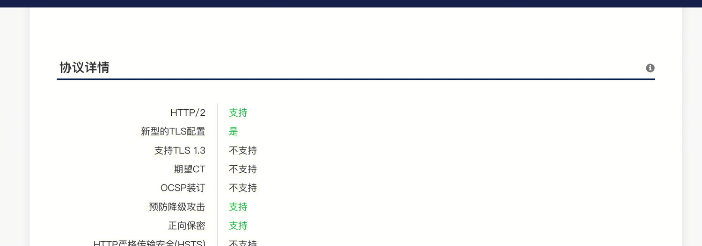

## 基于HTTP的功能追加协议
### 基于HTTP的协议
HTTP设计之初仅仅用于传输HTML文本，但是随着在线购物等高级应用发展起来。
HTTP协议的功能和性能上都需要一些扩展。
因此，诞生了一些新的协议规则，他们基于HTTP，并在此基础上增加了新的功能。

### 消除HTT瓶颈的SPDY
#### HTTP的瓶颈
HTTP缺陷：

- 1.客户端只能主动发起请求，服务端只能被动提供服务。无法进行全双工通信服务。
- 2.每次互相通信都会发送大量同样的首部。首部越多，实际内容传输效率越低。
- 3.压缩并非强制选择，可能不压缩数据就发送。

Ajax的解决方法：基于XMLHTTPRequest API，通过JavaScript可以实现和服务器进行通信。
- 发起大量的请求，获取服务器更新的内容。
- 局部Web页面替换加载的异步通信技术。

Comet的解决方法：服务器延迟应答，当服务器没有更新的时候，将连接保持。在有更新的时候，返回给客户端更新内容。

Ajax和Comet都没有解决缺陷2，3
#### SPDY的设计和功能
SPDY位于SSL和HTTP之间。HTTP应用层，SPDY会话层，SSL表示层。

- 提供了服务端推送功能
- 提供了首部压缩功能
- 一个TCP连接上可以无限处理多个HTTP请求
- 并发的HTTP请求之间可以定义优先级
- 提供服务端提示相关资源的功能，避免客户端发起多余的请求。

#### SPDY消除Web瓶颈了吗
实践证明，效果不佳。

### 使用浏览器进行全双工通信的WebSocket
#### WebSocket的设计和功能
实现客户端和服务端的全双工通信
#### WebSocket协议
支持服务端向客户端推送功能
使用WebSocket时，需要先建立HTTP连接。
握手 ： 客户端，使用Upgrade：websocket首部。服务端响应101 Switching Protocols。
握手后，不在使用HTTP数据帧而使用websocket数据帧。
#### 示例
WebSocket服务示例：
```go
package main

import (
	"fmt"
	"net/http"

	"github.com/gorilla/websocket"
)

var upgrader = websocket.Upgrader{
	ReadBufferSize:  1024,
	WriteBufferSize: 1024,
	CheckOrigin: func(r *http.Request) bool {
		return true
	},
}

func main() {
	http.HandleFunc("/ws", func(w http.ResponseWriter, r *http.Request) {
		conn, err := upgrader.Upgrade(w, r, nil) //定义了一个`upgrader`变量，用于将HTTP连接升级为WebSocket连接。
		if err != nil {
			fmt.Println("Upgrade error:", err)
			return
		}
		defer conn.Close()

		for {
        err = conn.WriteMessage(messageType, message) //推送消息
        if err != nil {
            fmt.Println("Write error:", err)
            break
        }
	})

	http.ListenAndServe(":8080", nil)
}
```
WebSocket客户端示例：
```go
package main

import (
	"fmt"
	"github.com/gorilla/websocket"
	"time"
)

func main() {
	dialer := websocket.Dialer{
		Proxy:            nil,
		HandshakeTimeout: 45 * time.Second,
	}

	conn, _, err := dialer.Dial("ws://localhost:8080/ws", nil)
	if err != nil {
		fmt.Println("Dial error:", err)
		return
	}
	defer conn.Close()

	for i := 0; i < 5; i++ {

		messageType, message, err := conn.ReadMessage() // 读取
		if err != nil {
			fmt.Println("Read error:", err)
			break
		}

		fmt.Println("Received message:", string(message))
		time.Sleep(1 * time.Second)
	}
}
```


### 期待已久的HTTP2.0
HTTP2.0基于SPDY websocket等协议，在以下方面提升性能：

## HTTP2.0
https://juejin.cn/post/6844903984524705800
### 是什么
http2.0是一种安全高效的下一代http传输协议。
### 优势
安全是因为http2.0建立在https协议的基础上。
高效是因为它是通过二进制分帧来进行数据传输。
HTTP2.0兼容HTTP1.1协议，并且提供了更加高效的传输。
### 原理
#### 二进制分帧
新增二进制分帧层，在传输层之前，将HTTP报文进一步封装为二进制帧。
HTTP HEAD被封装在HEAD帧， BODY被封装在BODY帧。可以对请求或者响应切分后，封装到多个帧中。
帧(frame)：类型Type, 长度Length, 标记Flags, 流标识Stream和帧payload有效载荷。
消息(message)：一个完整的请求或者响应，比如请求、响应等，由一个或多个 Frame 组成。
每个二进制帧有流标识来表示改二进制帧所属的流。
流是HTTP2.0连接中的一个虚拟信道，可以承载双向消息传输。每个流有唯一整数标识符。每个流中的二进制帧具有同样的标识。             
#### 多路复用/并发连接
在http1.1中，想要实现并发请求只能通过浏览器在同一时间和服务端建立多个http1.0连接。但是浏览器针对同一域名下的连接是有一定数量的限制，超过限制数目的连接请求会被阻塞。这也是为何一些站点会有多个静态资源 CDN 域名的原因之一。
而一个HTTP2.0连接上可以并发的承载多个流。客户端与服务器之间只需要一个连接（每个域名一个连接）即可完成高并发请求。
http2连接可以承载数十或数百个流的复用，多路复用意味着来自很多流的数据包能够混合在一起通过同样连接传输。当到达终点时，再根据不同帧首部的流标识符重新连接将不同的数据流进行组装。
#### head压缩
http1.x的头带有大量信息，而且每次都要重复发送。http/2使用encoder来减少需要传输的header大小，通讯双方各自缓存一份头部字段表，既避免了重复header的传输，又减小了需要传输的大小。
对于相同的数据，不再通过每次请求和响应发送，通信期间几乎不会改变通用键-值对(用户代理、可接受的媒体类型，等等)只需发送一次。
#### 服务端推送
服务器可以对一个客户端请求发送多个响应，服务器向客户端推送资源无需客户端明确地请求。并且，服务端推送能把客户端所需要的资源伴随着index.html一起发送到客户端，省去了客户端重复请求的步骤。
#### 流优先级
把http消息分为很多独立帧之后，就可以通过优化这些帧的交错和传输顺序进一步优化性能。
每个流都可以带有一个31比特的优先值：0 表示最高优先级；2的31次方-1 表示最低优先级。
服务器可以根据流的优先级，控制资源分配（CPU、内存、带宽），而在响应数据准备好之后，优先将最高优先级的帧发送给客户端。

## NGINX HTTP2.0
编译模块 --with-http_ssl_module 跟 --with-http_v2_module
### 对上游提供HTTP2.0
``` 
listen 443 ssl http2.0;
listen [::]:443 ssl http2.0;
```
### 对下游发起HTTP2.0
没有找到资料

## 搭建HTTP2.0服务
## HTTP2.0 TRPC服务
``` 
server:                                            #服务端配置
  service:                                         #业务服务提供的service，可以有多个
    - name: trpc.test.hello.stdhttp                #service的路由名称
      ip: 127.0.0.1                                #服务监听ip地址 可使用占位符 ${ip},ip和nic二选一，优先ip
      port: 8000                                   #服务监听端口 可使用占位符 ${port}
      network: tcp                                 #网络监听类型tcp udp
      protocol: http2                              #应用层协议 
      timeout: 1000                                #请求最长处理时间 单位 毫秒
      tls_key: ./license.key                       #私钥路径
      tls_cert: ./license.crt                      #证书路径
```

## 检测HTTP2.0
myssl



## HTTP/1.0与HTTP/1.1的区别

- 长连接：HTTP/1.0需要使用Connection: keep-alive参数来告知服务器端要建立一个长连接，而HTTP/1.1默认支持长连接
- Host域：HTTP/1.0不支持虚拟主机，而HTTP/1.1引入了Host头域，支持在一台服务器上使用多个虚拟主机


## HTTP/1.1与HTTP/2.0的区别

- 多路复用：HTTP/2.0允许同时通过单一的HTTP/2连接发起多重的请求-响应消息，解决了HTTP/1.1中的队头阻塞问题。
- 二进制分帧：HTTP/2.0使用二进制分帧层，将HTTP消息拆分为多个帧，并对每个帧进行二进制编码和解码，提高了传输效率
- 头部压缩：HTTP/2.0使用HPACK算法对请求和响应头部进行压缩，减少了传输的数据量
- 服务器推送：HTTP/2.0支持服务器推送，服务器可以主动将与请求相关的资源推送给客户端，减少了额外的请求延迟。