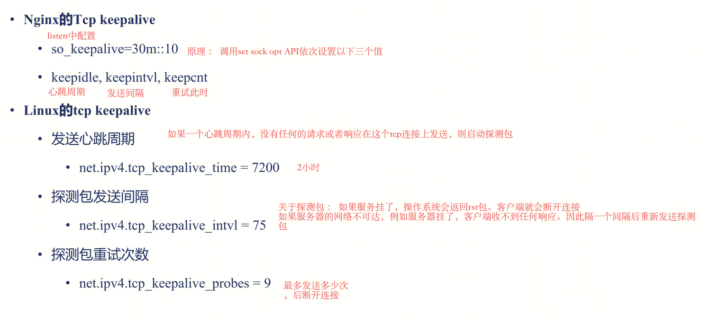
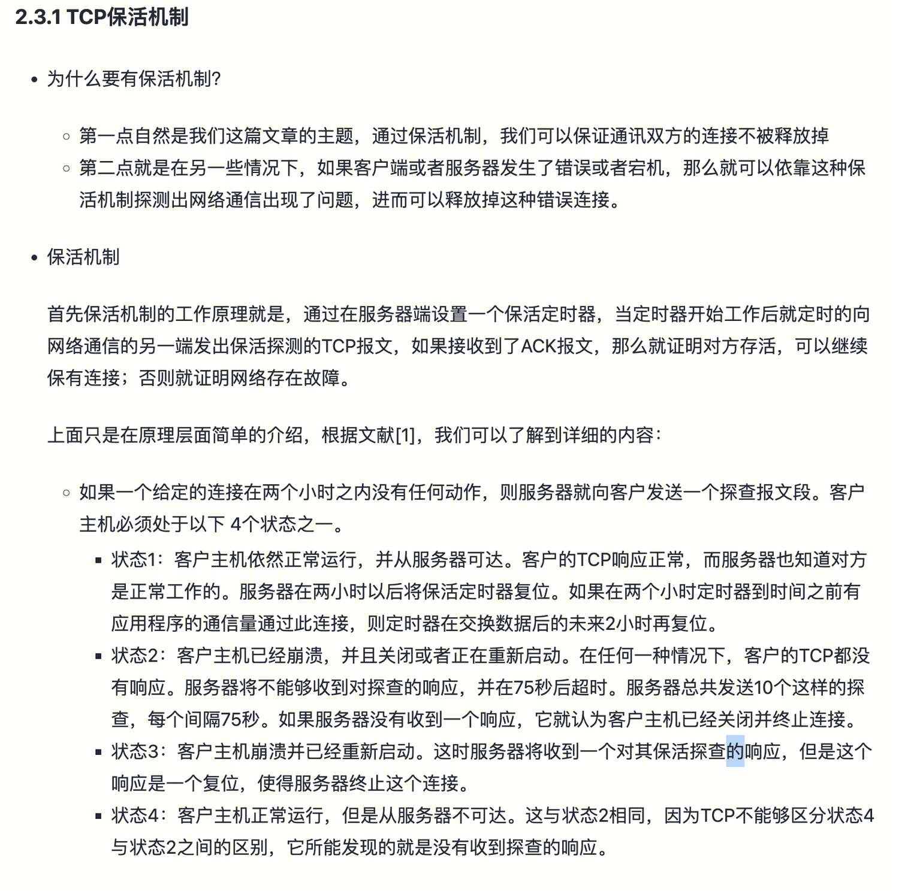
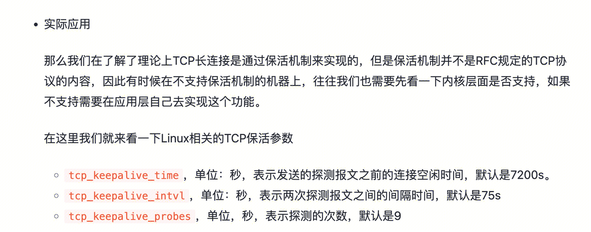

## Mysql长连接、短连接、连接池对性能的影响
https://cloud.tencent.com/developer/article/1778879 

- 短链接：慢 + 客户端端口耗尽问题（端口回收需要timewait）。
- 长链接：大量长链接管理会消耗大量内存
- 链接池：可以设置维护的最大数量的长链接和最大数量的链接数等，从而控制连接的性能的影响。

## tcp长链接
TCP 本身并没有长短连接的区别，长短与否，完全取决于我们怎么用它。

- **短连接**：每次通信时，创建 Socket;一次通信结束，调用 socket.close()。这就是一般意义上的短连接，短连接的好处是管理起来比较简单，存在的连接都是可用的连接，不需要额外的控制手段。
- **长连接：**每次通信完毕后，不会关闭连接，这样就可以做到连接的复用。长连接的好处便是省去了创建连接的耗时。
短连接和长连接的优势，分别是对方的劣势。
想要图简单，不追求高性能，使用短连接合适，这样我们就不需要操心连接状态的管理;
想要追求性能，使用长连接，我们就需要担心各种问题：比如端对端连接的维护，连接的保活。

## tcp长连接保活/回收：

tcp保活需要内核层面支持。如果内核层面不支持，那么通常需要在应用层框架层面支持。

## http长链接

服务端一般场景下，不会主动断开和客户端的链接。除非，服务端设置了链接最大生命周期、链接最大空闲时间。
HTTP1.1默认使用长链接。因此客户端通过设置`http_version 1.1;` 和 `header Connection "";`来显示的设置HTTP长链接。 客户端还可以设置长链接上运行的最大请求次数和最长空闲时间，在超过之后，断开链接。

## golang 长短链接：
https://studygolang.com/articles/31094

## nginx http 长链接：
https://lanjingling.github.io/2016/06/11/nginx-https-keepalived-youhua/

## mysql长链接
### 实现一个MYSQL简单的链接池：
https://yusank.space/posts/conn-pool/ 
初始化时，新建max_idle个链接，放入链接池。
需要链接的时候，现从链接池中拿取，链接池中没有空闲链接时，新建链接，最大链接数为max_open。
不需要链接时，如果链接池中链接数量小于maxidle，则将该链接放回链接池。大于，则直接释放链接。
 
连接池比较重要的几个参数：

- max_idle: 20 # 最大空闲连接数
- max_open: 100 # 最大在线连接数
- idle_timeout: 180000 # 连接最大空闲等待时间(单位：毫秒)
- max_lifetime: 180000 # 连接最大生命周期(单位：毫秒)

### 长链接下的负载不均衡问题
背景 :
vip 到 rs 的负载均衡策略是加权最小链接数。
客户的总链接数是固定的。

事件：
当前集群负载较高，
此时新增一个rs去承载流量。

客户新建的链接将按照链接数越多权重越小的策略进行分配。

但是总链接的大部分仍然还在老的rs上，没有断掉。

所以只有reload老的rs，才能够让更多的链接建立到新的rs，使得链接数均匀。