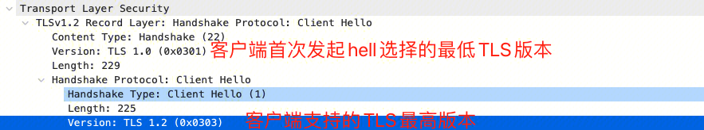

## HTTPS/TLS讲解：

### overviwe:


wirshark包


### 1.c->s client hello 
发送random number client + TLSversion(最高版本和当前使用的版本 + 客户端支持的加密套件)


### 2.s->c server hello
发送random number server + TLSversion(选择的版本和最高的版本) + 选定的加密套件 

### 3.s->c certificate
证书（域名证书和中间证书）

证书中主要包含：

- 信息：
```
证书颁发机构：用于寻找链中的下一个验证节点
证书的有效期：比如浏览器要根据这个值来判断证书是否已过期
证书申请信息：比如浏览器要判断改证书是否可用于当前访问的域名
公钥：用于后续和服务端通信的秘钥，这个公钥和当初生成 CSR 时的公钥是一个东西，因为只有它是和服务器的私钥是一对的
```

- 签名：签发者对信息使用签名算法（例如hash）进行签名，得到HASH VALUE后使用CA私钥加密。该内容用于验证证书内容没有被篡改。


证书生成过程：
```
首先 CA 会把持有者的公钥、用途、颁发者、有效时间等信息打成一个包，然后对这些信息进行 Hash 计算，得到一个 Hash 值；
然后 CA 会使用自己的私钥将该 Hash 值加密，生成 Certificate Signature，也就是 CA 对证书做了签名；
最后将 Certificate Signature 添加在文件证书上，形成数字证书；
```

客户端证书验证过程：
```
从域名证书一直查找到根证书后，检查根证书是否在自己的信任列表（操作系统内置）中。
首先客户端会使用签名算法（证书中的信息）对域名证书信息进行签名，一般是HASH算法得到 Hash 值 HASH VALUE 1。
然后，使用本地的根证书公钥解密域名证书的签名得到HASH VALUE2。最后比较H1和H2是否相等来验证域名证书是否可信赖（未被篡改且是CA签发）。
```

### 4.s->c Server Key Exchange
对于加密套件中使用DHE/ECDHE非对称密钥协商算法的SSL握手，将发送该类型握手。RSA算法不会进行该握手流程。此消息用于将服务器的临时 ECDH 公钥（以及相应的椭圆曲线域参数）传送给客户端。
### 5.s->c Server Hello Done
表示server hello阶段完成。

### 6.c->s Client Key Exchange
根据不同的密钥交换算法（RSA/ECDH..）交换premaster secret。

- RSA：客户端生成随机数，利用密钥交换算法生成premaster secret。使用域名证书信息中的公钥加密后传给服务端。服务端使用私钥解密premaster sercet。客户端和服务端生成用于对称加密的master secret。
```
master_secret = PRF(pre_master_secret, 
                    "master secret", 
                    ClientHello.random + ServerHello.random)
```
- ECDH：通过传输 Diffie-Hellman 参数（public key）来设置premaster secret。

### 7.c->s Change Cipher Spec
SSL修改密文协议的设计目的是为了保障SSL传输过程的安全性，因为[SSL协议](https://wiki.mbalib.com/wiki/SSL%E5%8D%8F%E8%AE%AE)要求[客户端](https://wiki.mbalib.com/wiki/%E5%AE%A2%E6%88%B7%E7%AB%AF)或服务器端每隔一段时间必须改变其加解密参数。当某一方要改变其加解密参数时，就发送一个简单的消息通知对方下一个要传送的数据将采用新的加解密参数，也就是要求对方改变原来的安全参数。
### 8.s->c server cipher Spec
server端对加解密参数的确认
### 9.c->s Encryted Handshake Message
报文的目的就是告诉对端自己在整个握手过程中收到了什么数据，发送了什么数据。来保证中间没人篡改报文。其次，这个报文作用就是确认秘钥的正确性。因为Encrypted handshake message是使用对称秘钥进行加密的第一个报文，如果这个报文加解密校验成功，那么就说明对称秘钥是正确的。


### 密钥交换协议
#### RSA密钥交换
TLS握手的目的之一是基于非对称加密以及证书机制协商一个对称密钥。
对称密钥的生成是`master_secret = PRF(pre_master_secret, "master secret", ClientHello.random + ServerHello.random)`。
其中Client随机生成46字节+2字节的client_version，作为premaster secret。再通过RSA非对称加密算法和服务器公钥加密后，传递给Server，Server只需要用私钥解密即可。
在私钥不泄漏的情况下，第三方无法知道pre_master_secret内容。
但如果私钥泄漏了呢？一旦私钥泄漏，之前的转输内容将全部被解密，这是由于私钥参与了密钥交换，不满足[前向安全性(Forward Secrecy)](https://zh.wikipedia.org/wiki/%E5%89%8D%E5%90%91%E4%BF%9D%E5%AF%86)。
#### DH密钥交换
为了解决这个问题，产生了DH密钥交换协议(Diffie–Hellman key exchange)，其流程如下：
1. 客户端发起请求；
2. 服务端生成一个私钥a，并选定p，g，计算$ A=g^a mod  p $，通过`Server Key Exchange`发送p,g A 到客户端；
3. 客户端生成一个私钥b, 计算$B=g^bmodp$，通过`Client Key Exchange`发送B到服务器。并计算premaster_key $K=A^b mod p$
4. 服务端生成premaster key $K=B^a mod p$；
这样双方即协商生成了premaster key K。

**DHE**：DH协商中服务端私钥a可以使用证书中的私钥，也可以使用临时生成一个私钥。
第一种由于证书私钥参与了密钥的生成，所以一旦证书的私钥泄漏，之前的传输就有可能被破解，所以是非前向安全性。而使用临时生成的私钥可以解决这个问题，临时生成私钥的DH密钥交换算法称之为DHE(Diffie–Hellman ephemeral)。

**ECDH**：DH过程中，如果将计算过程替换成椭圆曲线的方式，就产生了ECDH（Elliptic-curve Diffie–Hellman）。但是由于DH的非前向安全性，ECDH也具有非前向安全性，目前已经废弃。

**ECDHE**：DHE过程中，如果将计算过程替换成椭圆曲线的方式，就产生了ECDHE(Elliptic-curve Diffie–Hellman ephemeral)。

在DHE/ECDHE算法中，证书的公私钥不再参与密钥交换，只是做为服务端的身份认证。
承载协商消息变为Server Key Exchange、Client Key Exchange，所以RSA过程并没有这个两次握手。
	


## SSL/TLS背景
### SSLv2、SSLv3、TLSv1
SSLv1.0，1994年提出，该方案第一次解决了安全传输的问题。
SSLv2.0，1995年发布，于2011年被弃用。
SSLv3.0，1996年发布，被大规模应用，于2015年弃用。

1999年改名叫TLSv1，和SSLv3.0相比几乎没有做什么改动。

TLS v1.1， 2006年发布，修复了一些bug，支持更多参数。
TLS v1.2， 2008年发布，做了更多的扩展和算法改进，是目前几乎所有设备的标配。
TLS v1.3，2014年提出，改善了握手流程，减少了时延，并采用完全前向安全的密钥交换算法。

#### 为什么TLS版本一直在迭代？
通过新的版本迭代来提供新特性和更好的安全性。
例如：一些关于TLS/SSL协议中的漏洞，

- POODLE（Padding Oracle On Downgraded Legacy Encryption）,(CVE-2014-3566)
- BEAST（Browser Exploit Against SSL/TLS ）(CVE-2011-3389)
- CRIME (Compression Ratio Info-leak Made Easy) (CVE-2012-4929)
- BREACH（Browser Reconnaissance and Exfiltration via Adaptive Compression of Hypertext） (CVE-2013-3587.)
- Heartbleed (CVE-2014-0160.)

都能在版本迭代中得以解决。


#### 为什么TLS1.2或TLS1.3存在不向前兼容的加密套件

- 一方面安全性较弱的加密套件容易被攻击，因此加入了安全性更高的加密套件。
- 另一方面TLS版本迭代，对加密套件也有了要求。部分老旧的加密套件无法满足当前版本的加密需求。
比如：TLS 1.3移除了已经过时的对称加密算法，剩余的都是带有关联数据的认证加密(AEAD)型算法。移除静态RSA和DH加密套件，所有基于公钥的密钥交换机制都提供前向安全保证。

WAF-NGINX使用的OPENSSL1.1.1g版本中，TLS1.2比TLS1.1和1.0多了部分特定的加密套件，TLS1.3加密套件不向前兼容.


#### 加密套件
加密套件分为四个部分

Kx = Key Exchange 密钥交换算法（非对称）：用于利用服务器公钥加密premaster key。并且不同的密钥交换算法，有不同的premaster key生产方式。

Au = Authentication 身份认证算法（非对称）：用于利用CA公钥加密HASH VALUE后与证书签名对比，从而验证证书的有效性。

Enc = Encrypt：对称加密

Mac = Message Authentication Code 摘要算法
非对称算法是RSA的时候，可以省略


### SSL/TLS握手流程
#### TLS1.2及以下
https://iwiki.woa.com/pages/viewpage.action?pageId=1467769161
#### TLS1.3
https://blog.csdn.net/qq_31442743/article/details/111666786
- TLS1.3舍弃了RSA的密钥交换过程，基于ECDH的算法优化了整个过程。
并且基于key_share扩展，减少了密钥协商次数。从2RTT减少为1RTT。
- TLS1.3在会话恢复上，直接发送加密的earlydata。做到0RTT。