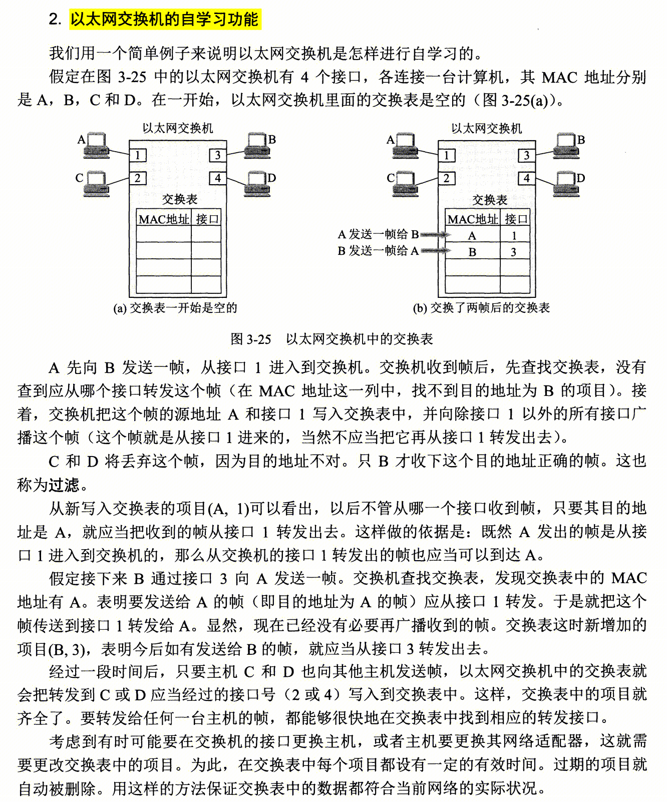

## 引子
交换机路由器的网络，如何通信？
https://www.zhihu.com/question/486647118

- rs和路由器之间的通信不要先找交换机的mac。
而是直接通过arp找路由器的mac地址，交换机会从所有端口转发这个arp报文。

## 交换机的工作原理
交换机收到帧之后，按照帧的目的MAC地址进行路由匹配。
存在匹配项，则转发到对应的接口。
不存在匹配项，则广播帧。

## 交换机路由表
通过帧通信，自动积累交换机路由表

## 路由表构建
### 内部网关协议 OSPF
#### 协议
OSPF用于构建本AS的路由策略

#### Dijkstra
用于求解最短路径的算法
#### 区域划分

### 外部网关协议BGP
BGP用于构建AS之间的路由策略

## 单线IP和BGP IP
BGP IP 独立于 三网单线IP。
BGP IP需要有自己的AS号。

## 路由器路由表数据结构

## ARP协议
ARP请求帧是广播
ARP响应帧是单播

