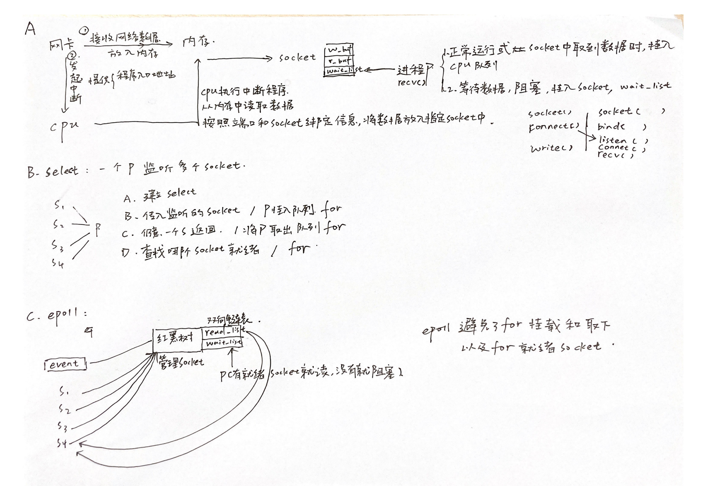

## 图解


## socket是什么
socket是操作系统提供的一个系统调用
是网络通信的基本操作单元，包含了进行网络通信的五种基本信息（五元组）：连接使用的协议，本地IP地址和本级端口，远程主机IP地址和远程主机端口。
同时，socket不仅可以提供不同主机间的网络通信，还可以提供本机上的多个应用程序通信。
## 创建一个socket
系统调用：
``` 
int socket(int domain, int type, int protocol)
```
### 域（domain）:
域指定套接字通信中使用的网络介质。最常见的套接字域是 AF_INET（IPv4）或者AF_INET6(IPV6)，
### 类型（type）:
1. 流套接字（SOCK_STREAM）：流套接字用于提供面向连接、可靠的数据传输服务。该服务将保证数据能够实现无差错、无重复发送，并按顺序接收。流套接字之所以能够实现可靠的数据服务，原因在于其使用了TCP（The Transmission Control Protocol）协议。

2. 数据报套接字（SOCK_DGRAM）：数据报套接字提供了一种无连接的服务。该服务并不能保证数据传输的可靠性，数据有可能在传输过程中丢失或出现数据重复，且无法保证顺序地接收到数据。数据报套接字使用UDP（User Datagram Protocol）协议进行数据的传输。由于数据报套接字不能保证数据传输的可靠性，对于有可能出现的数据丢失情况，需要在程序中做相应的处理。

3. 原始套接字（SOCK_RAW）：原始套接字与标准套接字（标准套接字指的是前面介绍的流套接字和数据报套接字）的区别在于：原始套接字可以读写内核没有处理的IP数据包，而流套接字只能读取TCP协议的数据，数据报套接字只能读取UDP协议的数据。因此，如果要访问其他协议发送数据必须使用原始套接字。
### 协议（protocol）：
协议字段已经由domain和type的组合决定了，不符合会创建socket失败。
```
0：使用默认协议；
IPPROTO_TCP：使用TCP协议；
IPPROTO_UDP：使用UDP协议
```

### 创建了什么资源？

- 创建了socket数据结构：
```
struct socket {
	socket_statestate;         //套接字所用的流类型 -- 通过参数可以获得
	shorttype;                 //套接字所处状态
	unsigned longflags;        //标识字段
	struct socket_wq *wq;      //包含了等待该套接字的进程队列。进程等待该socket的事件时，会将进程pid等信息挂在队列上。当数据到来时，可以唤醒队列中的进程。该成员可以用于关联进程和socket。
	struct file *file;         //指向了和套接字相关联的file 结构 --- 需要打开一个文件，用于读取和写入网络通信数据
	struct sock *sk;		   //sock数据结构，该结构的成员包含了内核写缓冲区和读缓冲区，以及缓冲区中内容的长度。
	const struct proto_ops*ops;// socket结构的操作集，socket操作函数集：bind, connect, accept等
};
```
其中比较重要的成员是

1.file。打开了文件，用于读取和写入网络通信数据。并返回了一个文件句柄作为套接字描述符。

2.sock。在内核分配了一个读缓冲区和写缓冲区，缓冲区是sk_buff队列（sk_buff:  分段数据报队列，每个队列元素为长度为MSS的报文+报文首部。MSS：每一个报文段所能承载的最大数据长度）。例如，利用写缓冲区发送tcp数据报时，当收到该数据报的ACK时，可以从写缓冲区队列中删除该sk_buff。	`滑动窗口?`

3.socket_wq。维护等待该套接字的进程队列。进程等待该socket的事件时，会将进程pid等信息挂在队列上。当数据到来时，可以唤醒队列头的进程

- 为什么创建了缓冲区还需要创建文件？
在linux系统中，任何事物都以文件的形式存在。一个socket对应一个文件。每个文件打开可以获得文件描述符fd。该文件描述符提供了大量关于这个socket本身的信息。
例如可以查看一个进程打开的文件fd，通过fd定位其使用的socket。
lsof命令可以查看文件和进程的关系。

lsof - i :80查看到使用80端口的进程。

lsof -p pid查看某个进程打开的文件。


## 使用socket建立链接

- 通过socket(创建socket) , bind(绑定端口), listen(开启监听) 可以创建一个监听socket。
对该监听socket循环调用accept()[阻塞调用]。每当accept返回时，可以创建连接socket。
通过对该连接socket调用read和write方法进行网络通信。

- 监听socket存在一个监听缓冲区，缓冲区的大小由listen的第二个参数backlog决定。该缓冲区将缓冲来不及accept()连接请求。缓冲区内的连接请求将等待accept，超出缓冲区的连接请求将被丢弃。https://cloud.tencent.com/developer/article/1666211


## 使用socket进行通信
### 网络数据到来

- `网络接口到内核`：当一个新的数据包进入网络接口，通过网络接口发起中断信号到内核或通过内核轮询网络接口，来告知内核数据包到来。内核获取数据包后对包进行解码（IP协议栈）得到源IP、源端口、目标IP和目标端口，进而关联socket数据结构(socket五元祖唯一)。

- `内核到socket缓冲区`：内核将数据包复制到socket关联的内核缓冲区sk_buff。并唤醒例如read，select，epoll_wait等等待数据的阻塞函数。并唤醒挂在在该socket wq上的进程。

### 读内核缓冲区 
当用户态的进程被唤醒，开始实际调用socket的read方法时，OS内核将内核缓冲区中的数据复制到此用户进程调用read方法所提供的缓冲区中，并从其内核接收缓冲区中删除数据。

- 如果读缓冲区为不可读状态，并且用户调用read，则系统调用将被阻塞，直到变为可读状态。
- 如果读缓冲区是可读的，并且用户调用 read ，系统调用将立即返回这些可用的数据。如果内核读缓冲区中准备好的数据量小于用户提供的缓冲区的大小，则可能发生部分读取。调用方可以通过检查 read的返回值来检测。
- 如果内核读缓冲区已满，而TCP连接的另一端尝试发送更多的数据，内核将拒绝对数据包进行ACK。另一端将超时，这是常规的TCP拥塞控制。
### 写内核缓冲区
当应用程序调用 write 时，它将数据从用户提供的缓冲区复制到内核写缓冲区中。随后，内核将把数据写缓冲区复制到网络接口中，并实际发送数据。

- 写缓冲区可写，并且用户调用write，则系统调用将成功。如果写缓冲区有足够的空间，则将复制所有数据。如果写缓冲区只有部分数据的空间，那么将发生部分写入，并且只有部分数据将被复制到缓冲区。调用方通过检查 write的返回值来检查这一点。
- 写缓冲区不可写，并且用户调用 write，则系统调用将被阻塞。

### 什么叫缓冲区可读可写
每个socket有接收缓存区低水位标记（用于读）和发送缓存区低水位标记（用于写）。
接收低水位标记是返回"可读"时套接字接收缓冲区中所需的数据量。对于TCP, 其默认值为1（sk_buff中至少有1个TCP报文）。**【已用空间超过低水平位，可读】** 
发送低水位标记是返回"可写"时套接字发送缓冲区中所需的可用空间。对于TCP，其默认值常为2048。 **【剩余空间的大小超过低水平位，可写】** 


## 多路复用SOCKET ： 并发连接时，如何处理众多socket连接？
Web服务器响应和处理Web请求的过程，大多是基于事件驱动模型的。
事件驱动模型包含了事件收集器、事件发送器和事件处理器等三部分基本单元。
当一个服务器需要同时处理多个并发socket连接时，基于事件驱动模型编写的服务器处理模型可以有以下几种实现办法：
### 一个socket连接对应一个进程
“事件发送器”每传递过来一个请求，“目标对象”就创建一个新的进程，调用“事件处理器”来处理该请求。由于创建和切换进程的开销比较大，会导致服务器性能比较差，但其实现相对来说比较简单；
### 一个socket连接对应一个线程
“事件发送器”每传递过来一个请求，“目标对象”就创建一个新的线程，调用“事件处理器”来处理该请求。涉及到线程的同步，故可能会面临死锁、同步等一系列问题，编码比较复杂；
### 一个socket连接对应一个事件（协程处理）
“事件发送器”每传递过来一个请求，“目标对象”就将其放入一个待处理事件的列表，“事件处理器”使用非阻塞I/O方式循环处理事件。相当于用户态线程切换，编程逻辑比前面两种都复杂。但是由于性能高，大多数网络服务器采用了第三种方式。由于该方式一个进程需要处理多个大量的socket事件，因此逐渐形成了所谓的“事件驱动处理库”。事件驱动处理库又被称为多路IO复用方法，最常见的包括以下三种：select模型、poll模型和epoll模型。常见服务器，例如Nginx服务器还支持rtsig模型、kqueue模型、dev/poll模型和eventport模型等。通过Nginx配置可以使得Nginx服务器支持这几种事件驱动处理模型。

下面是一个socket连接对应一个进程的例子：
```
----- 多进程处理并发连接 -----
//1. 创建**监听**socket = socket（domain， type ， protocol）
serv_sock=socket(AF_INET, SOCK_STREAM, 0);
//2. 绑定端口
//2.1 创建addr数据结构
serv_addr.sin_family = AF_INET;    //IPV4协议族
serv_addr.sin_addr.s_addr = htonl(INADDR_ANY);    //主机字节序（host）转换成网络字节序（net）（大端序）
serv_addr.sin_port = htons(atoi(argv[1]));    //端口号
//2.2 绑定ip和端口 bind（socket， addr ，sizeof（addr））
bind(serv_sock, (struct sockaddr*) &serv_addr, sizeof(serv_addr)）
//2.3 监听socket listen（socket， backlog）
listen(serv_sock, 5)

//多进程处理多个**连接**socket
while(1)
  {
    clnt_addr_size = sizeof(clnt_addr);
	//对监听socket进程accept，创建链接socket
    clnt_sock = accept(serv_sock, (struct sockaddr*) &clnt_addr, &clnt_addr_size);
    if(clnt_sock == -1)
      continue;
    else
      puts("new client connected...");
  
    pid=fork();    //创建新进程
    if(pid==-1)
    {
      close(clnt_sock);
      continue;
    }
    if(pid==0)    //子进程运行区域
    {
      close(serv_sock);    //在子进程中要关闭服务器套接字文件描述符
      while((str_len=read(clnt_sock, buf, BUF_SIZE))!=0) //while解决部分读问题
	  		//todo 处理buf里面的数据
      close(clnt_sock);//执行完关闭自己的文件描述符
      puts("client disconnected...");
      return 0;
    }
    else    //父进程运行区域
    {
      //调用fork函数后，要将无关的套接字文件描述符关闭掉
      close(clnt_sock);
    }
  }
```
第三种方式，在编写程序代码时，逻辑比前面两种都复杂。大多数网络服务器采用了第三种方式，逐渐形成了所谓的“事件驱动处理库”。事件驱动处理库又被称为多路IO复用方法，最常见的包括以下三种：select模型、poll模型和epoll模型。Nginx服务器还支持rtsig模型、kqueue模型、dev/poll模型和eventport模型等。通过Nginx配置可以使得Nginx服务器支持这几种事件驱动处理模型。
``` 
events {
    use epoll;    // --- epoll模型
    multi_accept on;
    accept_mutex off;
    worker_connections  65535;
}
```

## epoll工作模式
epoll 有两种工作模式：LT（水平触发）模式和 ET（边缘触发）模式。
ET 和 LT 模式的区别在于：
当一个新的事件到来时，ET 模式下当然可以从 epoll_wait调用中获取这个事件，可是如果这次没有把这个事件对应的套接字缓冲区处理完，在这个套接字没有新的事件再次到来时，在 ET 模式下是无法再次从epoll_wait 调用中获取这个事件的；
而 LT 模式则相反，只要一个事件对应的套接字缓冲区还有数据，就总能从 epoll_wait中获取这个事件。因此，LT 模式相对简单，而在 ET 模式下事件发生时，如果没有彻底地将缓冲区数据处理完，则会导致缓冲区中的用户请求得不到响应。
默认情况下，epoll 采用 LT 模式工作。
默认情况下，Nginx 是通过 ET 模式使用 epoll 的。`待补充`

``` 
int epfd = epoll_crete(1000);

//将 listen_fd 添加进 epoll 中
epoll_ctl(epfd, EPOLL_CTL_ADD, listen_fd,&listen_event);

while (1) {
    //阻塞等待 epoll 中 的fd 触发
    int active_cnt = epoll_wait(epfd, events, 1000, -1);

    for (i = 0 ; i < active_cnt; i++) {
        if (evnets[i].data.fd == listen_fd) {
            //accept. 并且将新accept 的fd 加进epoll中.
        }
        else if (events[i].events & EPOLLIN) {
            //对此fd 进行读操作
        }
        else if (events[i].events & EPOLLOUT) {
            //对此fd 进行写操作
        }
    }
}

```

## 补充资料 

- socket可读可写的状态判断： https://www.cnblogs.com/my_life/articles/10910375.html
- epoll模型 c++的实战 ： https://learnku.com/articles/41814
- Nginx配置： https://segmentfault.com/a/1190000018359026
- nginx事件驱动模型 ： https://www.cnblogs.com/crazymakercircle/p/15411888.html