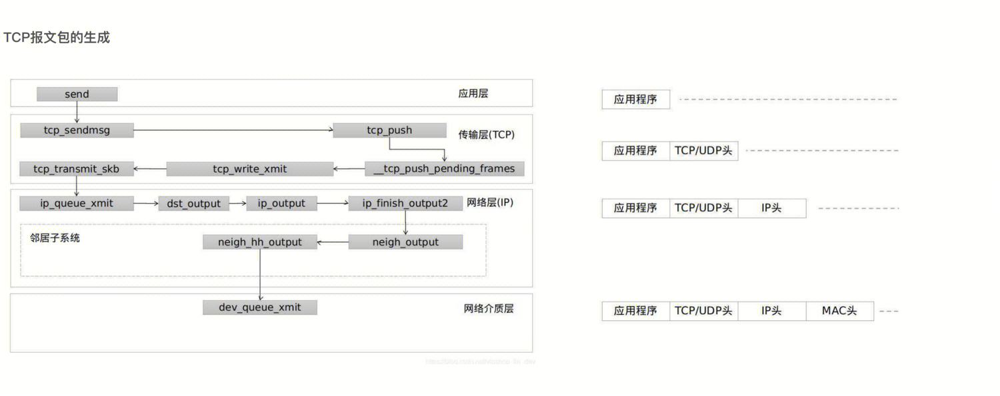
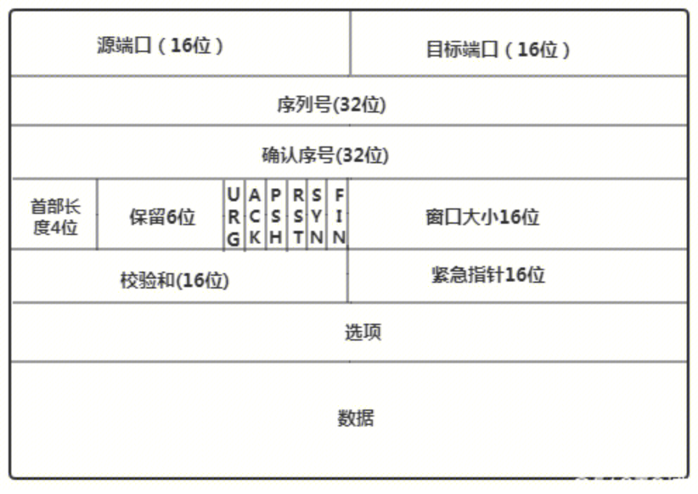

## HTTPS/TLS讲解：

### overviwe:


wirshark包


### 1.c->s client hello 
发送random number client + TLSversion(最高版本和当前使用的版本 + 客户端支持的加密套件)


### 2.s->c server hello
发送random number server + TLSversion(选择的版本和最高的版本) + 选定的加密套件 

### 3.s->c certificate
证书（域名证书和中间证书）

证书中主要包含：

- 信息：
```
证书颁发机构：用于寻找链中的下一个验证节点
证书的有效期：比如浏览器要根据这个值来判断证书是否已过期
证书申请信息：比如浏览器要判断改证书是否可用于当前访问的域名
公钥：用于后续和服务端通信的秘钥，这个公钥和当初生成 CSR 时的公钥是一个东西，因为只有它是和服务器的私钥是一对的
```

- 签名：签发者对信息使用签名算法（例如hash）进行签名，得到HASH VALUE后使用CA私钥加密。该内容用于验证证书内容没有被篡改。


证书生成过程：
```
首先 CA 会把持有者的公钥、用途、颁发者、有效时间等信息打成一个包，然后对这些信息进行 Hash 计算，得到一个 Hash 值；
然后 CA 会使用自己的私钥将该 Hash 值加密，生成 Certificate Signature，也就是 CA 对证书做了签名；
最后将 Certificate Signature 添加在文件证书上，形成数字证书；
```

客户端证书验证过程：
```
从域名证书一直查找到根证书后，检查根证书是否在自己的信任列表（操作系统内置）中。
首先客户端会使用签名算法（证书中的信息）对域名证书信息进行签名，一般是HASH算法得到 Hash 值 HASH VALUE 1。
然后，使用本地的根证书公钥解密域名证书的签名得到HASH VALUE2。最后比较H1和H2是否相等来验证域名证书是否可信赖（未被篡改且是CA签发）。
```

### 4.s->c Server Key Exchange
对于加密套件中使用DHE/ECDHE非对称密钥协商算法的SSL握手，将发送该类型握手。RSA算法不会进行该握手流程。此消息用于将服务器的临时 ECDH 公钥（以及相应的椭圆曲线域参数）传送给客户端。
### 5.s->c Server Hello Done
表示server hello阶段完成。

### 6.c->s Client Key Exchange
根据不同的密钥交换算法（RSA/ECDH..）交换premaster secret。

- RSA：客户端生成随机数，利用密钥交换算法生成premaster secret。使用域名证书信息中的公钥加密后传给服务端。服务端使用私钥解密premaster sercet。客户端和服务端生成用于对称加密的master secret。
```
master_secret = PRF(pre_master_secret, 
                    "master secret", 
                    ClientHello.random + ServerHello.random)
```
- ECDH：通过传输 Diffie-Hellman 参数（public key）来设置premaster secret。

### 7.c->s Change Cipher Spec
SSL修改密文协议的设计目的是为了保障SSL传输过程的安全性，因为[SSL协议](https://wiki.mbalib.com/wiki/SSL%E5%8D%8F%E8%AE%AE)要求[客户端](https://wiki.mbalib.com/wiki/%E5%AE%A2%E6%88%B7%E7%AB%AF)或服务器端每隔一段时间必须改变其加解密参数。当某一方要改变其加解密参数时，就发送一个简单的消息通知对方下一个要传送的数据将采用新的加解密参数，也就是要求对方改变原来的安全参数。
### 8.s->c server cipher Spec
server端对加解密参数的确认
### 9.c->s Encryted Handshake Message
报文的目的就是告诉对端自己在整个握手过程中收到了什么数据，发送了什么数据。来保证中间没人篡改报文。其次，这个报文作用就是确认秘钥的正确性。因为Encrypted handshake message是使用对称秘钥进行加密的第一个报文，如果这个报文加解密校验成功，那么就说明对称秘钥是正确的。