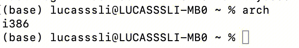
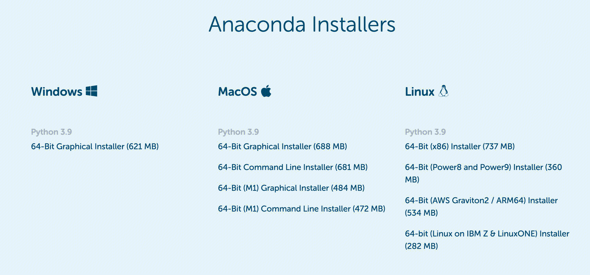

## 现象

上传在mac上go build产生的二进制文件到linux系统上，通过./main的方式运行。出现错误
``` 
./main: cannot execute binary file: Exec format error
```
即使linux系统上没有golang的环境，也应该可以运行go build 出的二进制文件。
因为二进制文件已经是机器码了，是计算机硬件可以执行的文件。
但是为什么会出现这个错误呢？

## 原因
编译成二进制过程是：
程序语言 ---> 汇编指令 ----> 二进制可执行文件。

通过arch查看
mac机器的cpu架构：

linux机器的cpu架构：

二者cpu架构是不一样的，不同的cpu架构会使用不同的指令集。
因此在程序语言到汇编指令这个编译过程，mac和linux是执行的不一样的逻辑。在mac上编译出的汇编指令是适配i386架构的，在linux上编译出的汇编指令是适配x86_64架构的。
二者无法在对方的环境下执行。

## 解决方案
混合编译
https://blog.devgenius.io/how-to-handle-cannot-execute-binary-file-exec-format-error-when-running-golang-executable-b5b77110b820

## 思考
因此下载程序可执行文件的时候，都提供了不同cpu芯片架构的包。


## 扩展
### 芯片公司
芯片公司有 intel amd arm...
早期时Intel率先实现了基于x86指令集的cpu芯片，然后amd拿到了x86的授权也自己做x86 cpu。
接着intel向64位过渡的时候自己搞了个ia64（x64架构）但是因为和x86架构不兼容市场反应极差
amd率先搞了x86的64位兼容（32和64的混合架构）也就是后来的x86-64
后来Intel也拿到了x86-64的授权，也搞了x86-64 cpu，因为amd先搞出来的所以x86-64也叫amd64。
所以目前 x86-64完全兼容x86

总结： x86-32是intel的，称为x86。 x86-64是amd的，也叫做amd64。

目前amd和Intel是世界上最大的两家x86和x86-64的cpu厂家。除了这两家还有几家小的公司也有x86的授权，比如via，不过技术水平一般。

### 芯片架构
不同的CPU可能使用不同的指令集，主要流行指令集类别有：精简指令集和复杂指令集。
复杂指令集支持多种指令，指令复杂。特点是高效，但复杂昂贵
精简指令集支持少量指令，通过指令组合来满足复杂的逻辑。特点是便宜简单低功耗，但效率较低。
使用复杂指令集有x86(寄存器32bit),x86_64(64bit)
使用精简指令集有mips，arm。
arm的主要专利技术在arm公司手中。