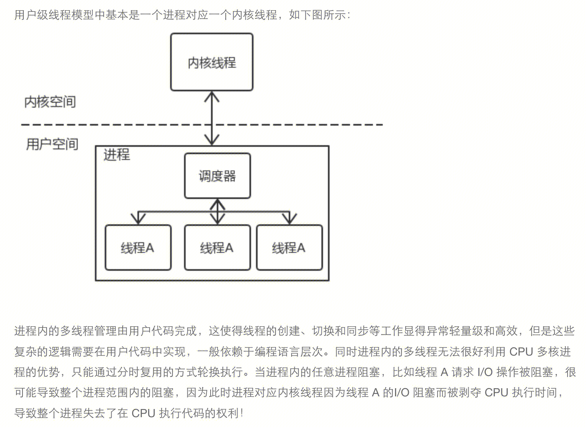

## 进程 线程 协程

- 进程：是计算机程序关于某数据集上的一次运行活动。是操作系统进行资源分配的最小单位。
- 线程：是进程中的实际运作的单位，是进程中一个单一顺序的控制流。一个进程中可以并发多个线程，每条线程并行执行不同的任务。线程是操作系统调度的最小单位。 线程分为内核级线程和用户级线程。内核级线程的生命周期由操作系统管理。
- 协程：是用户级线程，比内核线程更加轻量。协程的生命周期完全由用户管理。需要将用户级线程映射到内核级线程，进行执行。不同的映射方式代表了不同的协程调度模型。

### 资源差异

- 进程：进程作为操作系统资源分配的最小单位。每个进程拥有的独立虚拟地址空间、IO资源、文件描述符、信号处理等。
- 线程：同一进程中的多条线程将共享该进程中的全部系统资源，如虚拟地址空间、文件描述符和信号处理等等。但需要独自拥有自己运行的必要资源。线程的**栈区、程序计数器、栈指针以及函数运行使用的寄存器，线程局部存储TLS**是线程私有的。
以上这些信息有一个统一的名字，就是**线程上下文**，thread context。

- 协程：与内核线程类似，只拥有必要的运行资源，即协程上下文。独立拥有栈区，栈指针，程序计数器，运行寄存器。但是部分协程实现时，协程没有唯一的ID，因此该类协程不拥有协程局部存储。
https://cloud.tencent.com/developer/article/1768025

### 切换差异

- 进程： 进程切换分两步
1.切换新的页表，然后使用新的虚拟地址空间。
2.陷入内核，切换运行上下文。
注意：进程的切换需要设计到用户态到内核态的切换，因为进程的调度只有拥有最高权限的内核空间才可以完成。
`切换新的页表`
当前进程的上下文需要被新的进程上下文所替换，所以当前上下文的物理地址也会被占用，此时就需要切换新的页表，使用新的虚拟地址空间。
**为什么虚拟地址空间切换会比较耗时呢？**
每个进程都有自己的虚拟地址空间，每个进程都有把虚拟地址转换为物理地址的页表。

页表查找是一个很慢的过程，因此通常使用Cache来缓存常用的地址映射，这样可以加速页表查找，这个cache就是TLB。

cache是唯一的，当进程切换后切换后TLB就失效了，cache失效导致命中率降低，那么虚拟地址转换为物理地址就会变慢。线程切换则不会导致TLB失效，因为线程线程无需切换地址空间，因此我们通常说线程切换要比较进程切换块，原因就在这里。

- 线程：**线程的切换就只包括线程上下文的切换，就是替换线程放在处理器寄存器中的相关数据，但是同样需要从用户态转向内核态**。**线程的调度只有拥有最高权限的内核空间才可以完成**，所以线程的切换涉及到**用户空间和内核空间的切换**，也就是特权模式切换，然后需要操作系统调度模块完成**线程调度（task***struct），

- 协程：协程切换只涉及基本的CPU上下文切换，所谓的 CPU 上下文，就是一堆寄存器，里面保存了 CPU运行任务所需要的信息：从哪里开始运行（%rip：指令指针寄存器，标识 CPU 运行的下一条指令），栈顶的位置（%rsp： 是堆栈指针寄存器，通常会指向栈顶位置），当前栈帧在哪（%rbp 是栈帧指针，用于标识当前栈帧的起始位置）以及其它的CPU的中间状态或者结果（%rbx，%r12，%r13，%14，%15 等等）。协程切换非常简单，就是把当前协程的 CPU 寄存器状态保存起来，然后将需要切换进来的协程的 CPU 寄存器状态加载的 CPU 寄存器上就 ok 了。而且完全在用户态进行。（cpu寄存器切换不需要陷入内核）

总结： 

- 线程快于进程：因为进程需要更换虚拟地址空间。
- 协程快于线程：因为协程1.只需要切换CPU上下文。2.不需要陷入内核。

### 通信方式差异
- 进程： IPC（管道、共享内存、信号）
- 线程：共享内存
- 协程：channel

### 占用空间差异
- 线程：创建线程时，线程栈空间大小固定。
- 协程：栈空间可以调节，例如Golang 栈空间可以Grow。

### 其他
- 线程：拥有唯一ID标识。
- 协程：可能没有唯一ID标识。

## 服务器常见的并发模型
这里仅仅是作为服务器的情况下的并发模型。
既然是服务器，那么并发是指能够同时处理多少客户端的请求。
指标通常是c10k c100k等。
每个客户端通常对应一个socket连接。在处理socket连接的方式上，存在不同的策略。
就分为了不同的服务器并发模型：阻塞与否，是看是否会挂起线程或进程。同步异步是指程序是否等待返回后继续往下执行。

- 阻塞I/O + 多进程
- 阻塞I/O + 多线程
- I/O多路复用 + 协程（同步非阻塞）
- I/O多路复用 + 回调（异步非阻塞） 
https://zhuanlan.zhihu.com/p/288017699

### **多进程 / 多线程模型** 阻塞I/O + 多进程
apach服务器。

该模型在创建进程或者线程的时机是，监听socket有事件到来时，就新建一个连接socket并开启一个进程或线程来处理这个连接socket。因此，一个客户端连接对应一个进程/线程。当前请求进行网络或者磁盘I/O等阻塞操作时，会阻塞当前进程或者线程，切换到另外的进程或线程占用cpu。

但是，进程（线程）在操作系统中，占有一定的资源。由于硬件的限制，进程（线程）的创建是有瓶颈的。另外进程（线程）的上下文切换也有成本：每次调度器调度线程，操作系统都要把线程的各种必要的信息，如程序计数器、堆栈、寄存器、状态等保存起来。

导致并发上不去。能够通过少量的进程或者线程来处理大量的socket连接呢？

### 一个进程或者线程对应多个socket连接
**网络I/O多路复用模型**
利用epoll 、select 、 poll等多路复用模型。一个进程或者线程可以维护多个客户端连接socket。
当前线程（内核线程）处理多个客户端连接。

#### NGINX并发机制 非阻塞I/O（异步非阻塞） + I/O多路复用
nginx是多进程单线程的运行模式。基于网络I/O多路复用模型，一个内核线程对应多个客户端连接。
nginx是基于事件驱动的，且没有用户级线程（协程）的说法。单线程不断的处理事件循环中到来的事件。
每当有事件到来，就会触发相应的事件处理逻辑。
事件包括：tcp事件，磁盘读写事件，定时器事件等
事件处理逻辑包括：tcp处理逻辑，异步磁盘io，定时器处理等

由于网络或磁盘等IO等操作是会阻塞线程的，而nginx是单线程模型。
因此nginx的IO等操作必须是异步非阻塞的。
每个事件消费者都不能有阻塞内核线程行为（阻塞IO）或者同步轮训任务（同步非阻塞IO）状态，否则将导致内核线程挂起（阻塞IO）（阻塞其他的事件消费者）或者会由于长时间占用线程而导致其他事件得不到及时响应（同步非阻塞IO）。Nginx 的非阻塞特性是通过异步非阻塞的IO模型实现的，并且要求它所有模块都是满足这一点来保证的，因此nginx第三方模块也必须是异步非阻塞的I/O编程模式。

**异步非阻塞的I/O的编程模式，需要通过回调函数来实现。**
例如设置readEvent或者writeEvent事件到来的回调方法，**例如查询mysql**，例如如下：

### lua-ngx-module并发机制 阻塞I/O（同步非阻塞） + I/O多路复用
lua是基于协程的（用户级线程），在编程语言级别实现。
协程间可以相互切换占用cpu，因此可以做到同步非阻塞的IO模式。
当前协程执行I/O时，会挂起当前协程，等待I/O完成。
挂起当前协程，会保存上下文到内存，从而在I/O完成时，从就绪队列中恢复出该协程（包括程序计数器），并继续执行I/O后的代码。因此可以实现同步非阻塞的编程。

lua-ngx-module是nginx的第三方模块，在nginx允许期间执行lua代码，但是该进程中只有一个线程。所以lua-ngx- module是，多个用户协程对一个内核线程对应方式。该模式下，绝对不能阻塞唯一的内核线程。所以lua-ngx- module中lua代码是同步非阻塞的。nginx代码是异步非阻塞的。

而nginx是完全基于事件循环的，没有协程的概念。但执行I/O的时候，不能挂起线程也不能一直轮训，更无法切换到其他的协程执行，所以只能设置当前I/O完成后的回调函数（例如socket的readEvent设置为read http line函数）并通知开始I/O后，继续处理事件循环里面的其他事件。当I/O完成之后，会触发回调函数，加入到事件循环列表中，等待执行。

总结起来，nginx因此只能通过回调函数的方式来知道执行哪里的代码。而lua有协程的概念，可以恢复出继续执行哪里的代码。这就是异步非阻塞的编程模式和同步非阻塞的编程模式。

### Golang的并发机制  非阻塞I/O（同步非阻塞） + I/O多路复用
golang编写的web服务器也可以基于I/O多路复用和协程的（用户级线程）
但是存在不同的用户级线程和内核级线程的对应方式。（一对一，多对一，多对多）

（lua-ngx-module）

（多线程模式）

#### golang是基于MPG的 用户线程和内核线程对应方式

http://dockone.io/article/10491
如果G调用阻塞I/O，M是可能会阻塞的。G会挂起，并保存上下文。但是此时golang进程中还有其他的M在占用CPU，因此MPG模式也是非阻塞的。等G的I/O就绪之后，G将再加入到P的就绪队列中，从上一个I/O的下一行继续执行。因此也是同步非阻塞。

https://zhuanlan.zhihu.com/p/288017699

注意点： 每个M都会运行一个G0，G0单纯用来调度。
`G0` 是每次启动一个M都会第一个创建的gourtine，G0仅用于负责调度的G，G0不指向任何可执行的函数, 每个M都会有一个自己的G0。在调度或系统调用时会使用G0的栈空间, 全局变量的G0是M0的G0。
G0 是用来做调度的，例如：从 G1 切换到 G2 时，会先切回到 G0，保存 G1 的栈等调度信息，然后再切换到 G2。

关于steal： P本地没有G时，先从全局队列拿取，全局队列为空时，再从其他P上steal一半G

## 并发编程模型

- Nginx是基于事件驱动的单线程+I/O多路复用并发+异步非阻塞的并发编程模型
- lua是基于共享内存的多线程（用户线程）+ lock的并发编程模型
- golang使用基于共享内存的多线程（用户线程）+ Lock 或者 CSP的并发编程模型

### CSP
关注channel，生产者消费者已经channel三者解耦

### 共享内存
关注共享内存

## Golang编程语言上的并发编写方式
多协程 共享内存 + sync.mutex
Channel （例如查询实例接口）
sync.group (更便捷的多协程执行编程方式)
context （跟踪协程调用的链路）

## 参考

- I/O以及I/O模型： https://cloud.tencent.com/developer/article/1684951
- NGINX事件驱动 ： https://juejin.cn/post/6988294138667991070
- 用户线程和内核线程：http://dockone.io/article/10491
- 网络I/O模型：https://studygolang.com/articles/25546  https://www.51cto.com/article/619131.html
- 并发编程模型： https://www.bmpi.dev/dev/deep-in-program-language/how-to-implement-concurrency/concurrency-model/