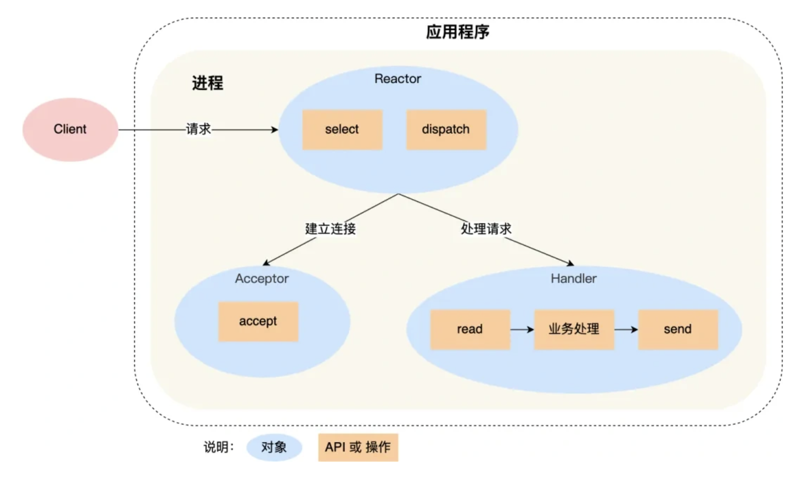
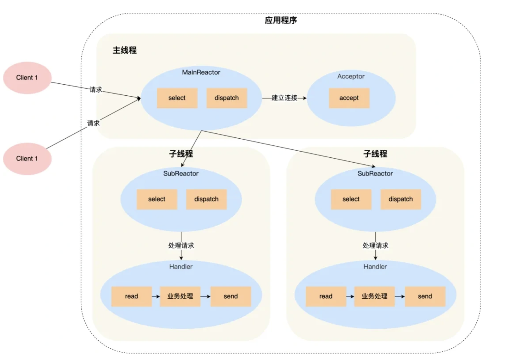
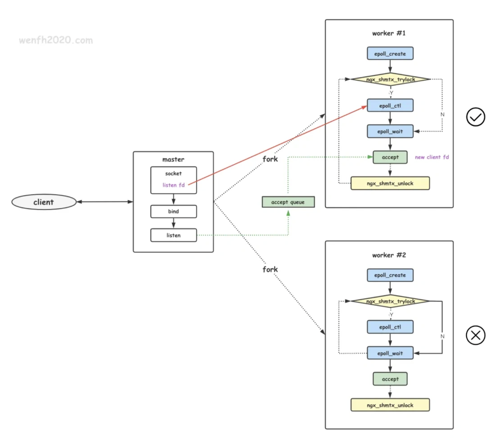
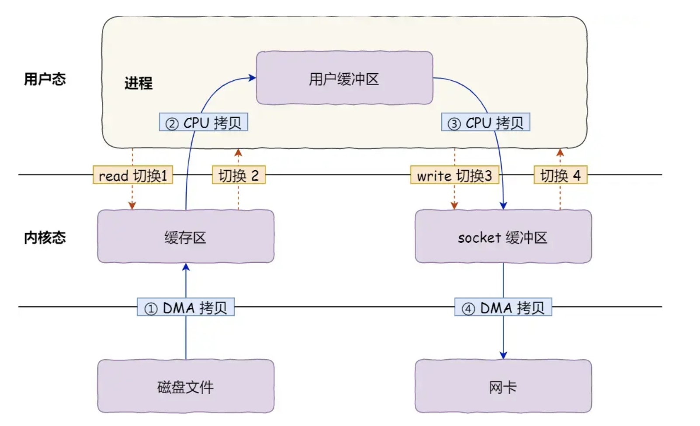
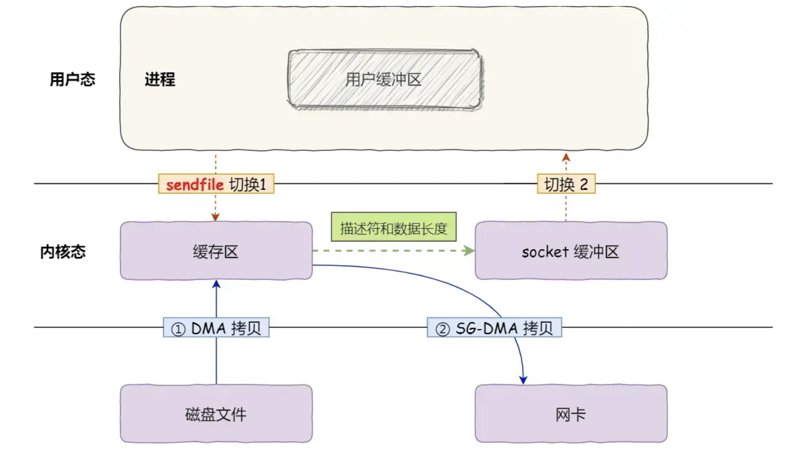

## IO

主要是指网络IO。

### IO类别

阻塞,非阻塞 是指 执行I/O的过程，是否会阻塞当前进程，cpu切换到其他进程去执行。
同步,异步 是指 代码在提交I/O之后是否需要等待返回才能继续执行下一行。

- nginx是异步非阻塞I/O
- python、golang协程是同步非阻塞I/O
- socket调用recv()、send()是同步阻塞I/O
- O_NONBLOCK 模式socket调用recv()、send()是同步非阻塞I/O。（进程不断轮训就绪，没有就绪会得到一个BlockingIOError）


### IO编程

- 多线程/多协程：一个线程监听端口，在accpet之后开启新的线程处理连接。线程数等于连接数。每当有socket就绪时，唤醒阻塞在socket上的线程进行处理。例如，某线程在发生读取阻塞的时候，会保存pc的上下文，并阻塞到socket。当socket可读时，唤醒线程恢复上下文执行。
- IO多路复用+单线程+多进程：基于epoll管理多个socket连接，通过事件循环处理socket事件，例如可读、可写、新建连接事件都有注册函数处理。master进程接受新连接并根据负载均衡分发给worker，此后由work维护该连接。例如，worker在发生读取阻塞的时候，会为该socket注册下一步调用的函数，当该socket从epoll中返回时，直接执行该函数。
- IO多路复用+多协程/多线程+单进程：epoll负责管理所有的网络连接，在连接准备好读写操作时唤醒想要的协程。比起单线程单进程模式，更加充分的利用了cpu多核的特性。


### socket
[sockte](../network/tcp/socket.md)

### IO多路复用
I/O多路复用需要操作系统支持，因为需要操作系统把用户态创建的socket，拷贝到内核空间，并维护这些socket，找到可读可写的socket后进行处理。


#### select/poll

```c++
1.准备文件描述符集合：在调用 select 之前，程序需要准备三个文件描述符集合：readfds、writefds 和 exceptfds。分别表示要监视的可读、可写和异常文件描述符集合。程序还可以通过传递空指针来忽略某个集合。

fd_set readfds, writefds, exceptfds;
FD_ZERO(&readfds);
FD_ZERO(&writefds);
FD_ZERO(&exceptfds);

2.调用
int ret = select(max_fd + 1, &readfds, &writefds, &exceptfds, &timeout);
内核监听socket缓冲区，判定socket是否准备就绪。

3.处理返回结果：
select没有准备就绪时会阻塞，准备就绪后返回ret 。
如果返回值为 -1，表示发生了错误。
如果返回值为 0，表示超时。
如果返回值大于 0，表示有一个或多个文件描述符准备好进行 I/O 操作。

程序需要遍历文件描述符集合，检查哪些文件描述符已经准备好，并执行相应的操作。

if (FD_ISSET(fd, &readfds)) {
    // 文件描述符 fd 可读
}
if (FD_ISSET(fd, &writefds)) {
    // 文件描述符 fd 可写
}
if (FD_ISSET(fd, &exceptfds)) {
    // 文件描述符 fd 发生异常
}
```


- 1.socket传递到内核需要拷贝所有socket，从用户空间拷贝到内核空间，方便内核程序检查socket。
- 2.内核遍历socket检查读写缓冲区，当检查到事件后，标记该socket可读可写。
- 3.从内核返回，把所有的socket拷贝回到用户空间。
- 4.用户空间遍历socket集合，找到被内核标记为可读可写状态的socket进行处理。

上述过程中经历了，socket从用户空间拷贝到内核空间，内核态遍历socket，socket从内核空间拷贝到用户空间，用户态遍历socket。一共两次拷贝，两次遍历。效率较低。

socket采用连续内存维护固定长度sockets，所以支持的sockets数量有限。默认为1024.
poll使用链表维护sockets，没有1024的数量限制，只有系统文件描述符上限。
但是二者本质都需要在用户空间和内核空间拷贝和遍历sockets。

#### epoll
```c++
1.创建 epoll 实例：
int epoll_fd = epoll_create1(0);

2.添加文件描述符到 epoll 实例：使用 epoll_ctl 函数将需要监视的文件描述符添加到 epoll 实例中。

struct epoll_event event;
event.events = EPOLLIN;
event.data.fd = fd;
epoll_ctl(epoll_fd, EPOLL_CTL_ADD, fd, &event);

3.等待事件发生：
使用 epoll_wait 函数等待事件发生。这个函数会阻塞，直到有文件描述符准备好进行 I/O 操作或超时。
struct epoll_event events[10];
int nfds = epoll_wait(epoll_fd, events, 10, timeout);
其中，events 数组用于存储发生的事件，nfds 是返回的事件数量，timeout 是超时时间。

4.处理事件：
遍历 events 数组，检查每个事件并执行相应的操作。例如，如果事件类型为 EPOLLIN，则表示对应的文件描述符已经准备好读取。

for (int i = 0; i < nfds; i++) {
    if (evnets[i].data.fd == listen_fd){
        //accept. 并且将新accept 的fd 加进epoll中.
    }

    if (events[i].events & EPOLLIN) {
        // 文件描述符可读
    }
    if (events[i].events & EPOLLOUT) {
        // 文件描述符可写
    }
}
```

- 1. epoll在内核采用红黑树维护sockets，一开始只需要epollctl add传入一个监听的sockets，并将accept的fd也加入epoll，就可以形成所有sockets的红黑树。
- 2. 当socket上有事件发生时，内核会触发中断调用epoll回调函数，在O(logn)时间内找到红黑树上的该socket并加入就绪链表中。
- 3. epollwait从阻塞返回就绪链表，用户态遍历就绪列表执行操作。

epoll采用树结构维护sockets，不需要遍历所有socket，减少时间复杂度。同时仅返回就绪sockets，减少拷贝。


边缘触发和水平触发：

水平触发：只要socket可读可写，就会一直从epollwait返回。不需要一次性读取全部数据，逻辑简单，但是系统调用变多，性能较差。

边缘触发：socket可读可写后，从epollwait返回一次。需要一次性读取全部数据，逻辑复杂，但是系统调用较少，性能较好。

如果你需要更高的性能，并且能够确保一次性处理所有可用数据，可以选择边缘触发模式（ET）。
如果你希望更简单的逻辑，并且不太关心性能，可以选择水平触发模式（LT）。


### redis

单进程 单线程 单reactor。

- 无法利用多核优点
- 单reactor是基于事件循环处理socket事件的，假如在hanler阶段有大量的计算等耗时操作，会导致acceptor来不及accept。容易导致半连接队列溢出，连接被丢弃。客户端表现为connection refused。可以通过内核加大accept队列或者扩容缓解。


### netty

单进程 多线程 多reactor。

- 主线程只负责accept，避免来不及accept问题。
- 子线程负责维护多路复用accept的sockets，只做handler。

### nginx

多进程 单线程 多reactor

- 主进程只监听socket，不负责accept，nginx中主进程主要用于配置读取和reload子进程。
- 子进程fork出来之后，自动继承主进程监听的socket，因此当监听socket的accept事件到来时，所有子进程都有权处理。通过锁控制，仅到一个子进程进行处理accpet。accept之后的socket放到子进程的epoll模型中维护，事件到来之后也是子进程处理。


### sendfile 零拷贝


文件拷贝过程中，实际上是不需要用户代码对文件内容做处理的。
传统的文件拷贝流程如上，用户空间代码起到一个读取磁盘文件后发送到网络的作用。这期间cpu进行了读取内核缓冲区到用户缓冲区、用户缓冲区写到内核缓冲区的过程。

通过sendfile，可以直接从内核缓冲区1 写到内核缓冲区2，避免了无效拷贝。sendfile允许直接从一个文件描述符(通常是磁盘文件)到另一个文件描述符(如网络套接字)传输数据，而无需用户空间介入。把文件传输性能提高了1倍以上


