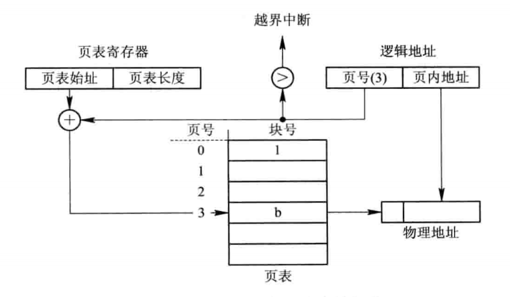
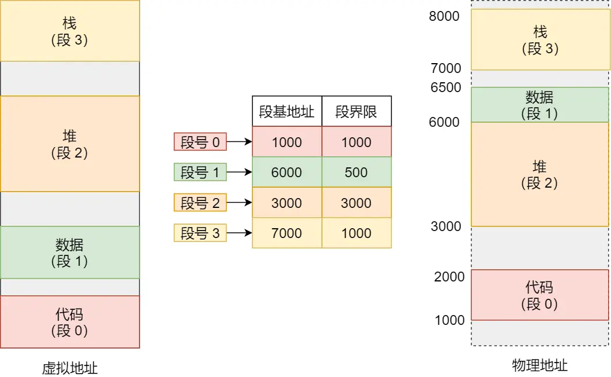

## 存储层次

越靠近cpu，存储介质价格越高，存储容量越小。

### 存储级别
可执行内存: CPU寄存器 +  主存（CPU高速缓存 + 主内存 + 磁盘缓存）。

辅助存储: 磁盘等。

二者的区别在于OS访问的方式不同，可执行内存通过load、store指令可以直接访问。而辅助存储需要通过I/O设备管理去访问，过程涉及中断、设备驱动程序运行、物理设备启动。通常，可执行内存访问消耗时间远小于辅助存储访问。


### 存储类型

- 寄存器: 访问速度与cpu执行速度一致，通常只有两位数的寄存器存储。
- 高速缓存: 位于寄存器和内存之间的物理高速缓存，真实存在，大小一般在几MB左右。
- 磁盘缓存: 在内存上暂时存储经常访问的磁盘数据，避免磁盘访问，实际上在内存上，并非单独的一块存储。


## 程序与内存

程序想要执行，必须经历编译、链接、装入的流程。


### 装入
将程序将入内存中执行的过程。

程序的每个模块的逻辑起始地址都是从0开始的。如何装入内存分为两种方式：


- 绝对装入 ： 适用于单进程场景，程序内存和实际内存保持一致。
- 可重定位装入: 在并发场景下，我们无法预知进程要使用的内存位置。因此在装入的时候，需要动态转换地址。例如，一个模块的指令为load 2500，但是被装入到了10000起始地址的内存上时，需要动态转换2500地址到12500:


### 链接
将程序各个模块和库函数链接未来一个可执行目标的过程。

链接各个模块分为两种方式：

- 静态链接： 装入内存之前，将模块和库链接为一个整体。需要修改模块之间的逻辑地址。


- 动态链接： 将模块的链接推迟到程序执行时。首先将程序开始模块装入内存，当执行到需要用到另外的模块时，如果该模块没有在内存中，此时os再去寻找该模块，并装入内存，然后链接到调用者模块上。

```
好处一：不需要用到的模块，不会被装入内存。加快程序装入和减少内存使用。
好处二：可以实现将一个模块连接到几个应用上，实现模块共享。
好处三：可以按照模块进行修改程序，不需要整体修改。 
```


## 虚拟内存

虚拟内存的提出时为了解决 一次性 和 驻留性 这两个问题。

虚拟内存是一种时间换空间的概念。不需要一次性装载程序到内存中，而是基于分页存储，按需一页一页的加载程序。当内存满时，还涉及将内存页回收的机制。

因此使用虚拟内存，可以解决一次性问题和驻留性问题

虚拟内存是一种内存管理技术，它允许操作系统使用磁盘空间作为内存的扩展

虚拟内存并不是直接存放在磁盘上的。实际上，虚拟内存是由操作系统管理的一块连续的地址空间，它被划分为固定大小的页（page）。每个页在虚拟内存中都有一个唯一的地址。操作系统会将虚拟内存中的页映射到物理内存（RAM）或磁盘上的交换空间（swap space）。

当程序访问虚拟内存中的某个地址时，操作系统会检查该地址对应的页是否已经在物理内存中。如果在物理内存中找到了对应的页，那么程序就可以直接访问这个页。如果物理内存中没有找到对应的页，那么就会触发一个缺页中断（page fault）。

缺页中断发生后，操作系统会根据需要执行以下操作之一：

如果物理内存中有空闲的页，操作系统会将这个空闲的页分配给需要的页，并将数据从磁盘加载到这个页中。

如果物理内存中没有空闲的页，操作系统会选择一个已使用的页进行替换。选择替换策略有很多种，如最近最少使用（LRU）算法、先进先出（FIFO）算法等。被替换的页会被写回到磁盘上的交换空间，以便在将来需要时重新加载。

总之，虚拟内存并不是直接存放在磁盘上的，而是由操作系统管理的一块连续的地址空间。虚拟内存中的页可以映射到物理内存或磁盘上的交换空间。当程序访问虚拟内存中的某个地址时，操作系统会根据需要将数据从磁盘加载到物理内存中。


## 分页存储

分页存储是内存管理的方式。

在分页存储之前，将模块装入内存都是采用的连续内存分配的方法。连续内存分配容易导致内存碎片。
分页存储的思想是将进程直接分散的装入到不相邻的内存分区中。

进程的逻辑内存和实际的物理内存都被按照固定的页面大小进行划分，在为进程分配内存时，以页为单位，将进程的若干页装入到内存的不相邻的页面中。


常规分页存储，地址变化方式如下：

页表寄存器： 页表放在内存中，页表寄存器保存了页表在内存中起始位置和页表长度。

具有快表的分页存储，地址变化方式如下：

由于页表是放在内存中的，所以cpu执行程序指令时，访问一次内存数据，实际上需要访问两次内存。
第一次访问页表，拿到逻辑地址对应的内存页号。第二次访问内存地址。为了提高地址变换速度，新增了一个输入寄存器，用于缓存一部分页表数据。命中缓存时，可以将访问内存次数缩减到一次。


> 内存分配和回收

内存分配是在程序需要执行时，将程序一次性分散的加载到内存页中。

内存回收是在程序执行完毕时，将程序涉及的内存页一次性回收。

即使过程中，程序因为I/O等操作阻塞，也不会回收内存资源。这将带来一些问题：

- 一次性：大型作业所需超出内存大小时，无法一次性装载。
- 驻留性：存在大量作业需要运行时，由于内存只在程序执行完之后回收，OS只能一批执行完之后换下一批执行。


### 局部性原理

> 为什么即使不一次性装载所有程序到内存中，程序仍然可以运行呢？

因为程序在执行的过程中存在局部性原理。

局部性原理是指，程序的执行局限一个部分，访问的空间也局限于一个区域。


### 虚拟存储器


虚拟存储器需要在分页内存管理的基础上，支持内存的请求和回收。因此，至少需要支持如下：

#### 页表
新增了状态位等


#### 缺页中断

cpu现场保存 -> 分析中断原因 -> 转入缺页中断处理程序

#### 地址转换


### 页面置换算法

- FIFO
- LRU


### 分段表



## linux程序内存布局


- 代码段，包括二进制可执行代码；
- 数据段，包括已初始化的静态常量和全局变量；
- BSS 段，包括未初始化的静态变量和全局变量；
- 堆段，包括动态分配的内存，从低地址开始向上增长；
- 文件映射段，包括动态库、共享内存等，从低地址开始向上增长；
- 栈段，包括局部变量和函数调用的上下文等。栈的大小是固定的，一般是 8 MB。当然系统也提供了参数，以便我们自定义大小；

注意，如上内存布局是指进程的虚拟内存，而非实际的物理内存（进程在物理内存上是，分页分散装入的）。

### 进程申请内存和操作系统管理内存的关系
如上图所示，linux的进程内存组织方式是一致的。

进程的内存地址空间是从0开始的，并且是连续的空间。
实际上，进程的内存管理都是面向的虚拟内存。进程申请内存，释放内存都是在进程的虚拟内存空间上。

> 例如，进程申请了一个1GB的堆内存，此时进程的虚拟内存空间确实是被占用了1GB的内存。
但是计算机的物理内存实际上还没有被占用。只有后续进程真正使用该1GB内存时，OS发起缺页中断从进程虚拟内存读取内存页到物理内存时，才会体现到物理内存的占用上。


#### 栈内存
进程的局部变量和函数调用上下文都是在栈空间中的，栈空间是一种线性空间。
只需要SP、BP等寄存器就可以管理栈空间。
当新建局部变量需要空间时，只需要SP向低地址移动即可。
当函数退出时，只需要回退SP和BP指针即可。

栈内存的一切回收和分配都是由操作系统自动实现的。

#### 堆内存
操作系统无法帮助进程的管理虚拟内存的堆内存。因为操作系统不知道当前这片内存空间是处于有效还是无效的状态。
只有堆内存使用者才知道什么时候应该申请内存和回收内存。
所有的编程语言都是虚拟内存堆内存的使用者。有些编程语言支持自动回收堆内存，有些编程语言需要手动回收堆内存。

> 那么虚拟内存的堆内存是如何申请和管理的呢？

这涉及到虚拟内存申请和管理库。比如 [tcmalloc](../lib/tcmalloc.md)


## fork

fork会复制父进程的除了寄存器的所有资源：页表（虚拟地址空间）、文件描述符、信号。

关于地址空间：仅复制了页表，并没有复制物理内存，所以子进程和父进程都拥有自己的独立的虚拟地址空间，但是指向同一片物理地址空间。当他们需要写的时候，才真正复制物理内存。为的是减少内存拷贝加速fork。这种方式叫做写实复制COW

### cow
fork之后，当父进程或者子进程在向这个内存发起写操作时，CPU 就会触发写保护中断。

这个写保护中断是由于违反权限导致的，然后操作系统会在「写保护中断处理函数」里进行物理内存的复制，并重新设置其内存映射关系，将父子进程的内存读写权限设置为可读写。

最后才会对内存进行写操作，这个过程被称为「写时复制(Copy On Write)」。


## 内存管理

### 操作系统虚拟内存

`虚拟内存申请和回收`: mmap/munmap()  brk/free
brk是堆顶指针，调用brk会上移堆顶，brk分配的内存是连续的。
mmap是在文件映射区分配内存,共享内存是通过mmap申请的。

当你需要分配的内存较小且连续时，可以使用brk()。brk()分配的内存是连续的，因此在某些情况下可能更适合使用brk()。
当你需要分配的内存较大或者不连续时，可以使用mmap()。mmap()可以将文件或其他对象映射到内存，因此它可以处理比brk()更大的内存区域。此外，mmap()分配的内存可以是非连续的。

程序向操作系统申请内存的时候，只是申请了虚拟内存空间。例如进程虚拟地址的堆和文件映射区。
只有在实际使用该内存页时，才会发起缺页中断，从磁盘读取数据到物理内存页并更新页表。


### 操作系统物理内存:
如果没有空闲物理内存，则会触发内存回收。内存回收后还不满足申请条件，则会触发OOM。不断kill内存占用最好的进程。

内存换出：基于lru算法将物理内存页换出到磁盘的交换空间（swap）。主要是换出文件页（映射区）和匿名页（堆区）。


### c: 

alloc()，小对象申请是调用brk，大对象申请是调用mmap。free()释放内存。需要手动管理内存。或者智能指针自动管理内存。

### python: 

python解释器调用PyMem_Malloc和PyMem_Free，底层是c的alloc。cpython内存分配器接收到内存请求后，会根据请求的内存大小和当前内存使用情况来决定如何分配内存。Python内存分配器通常会使用内存池来管理内存，以减少内存分配和释放时的系统调用次数。对于较小的内存请求，内存分配器会从内存池中分配内存。内存池是一种预先分配一大块内存的技术，然后根据需要从中分配小块内存。对于较大的内存请求，内存分配器可能会直接调用底层操作系统的内存分配器（如malloc()）来分配内存。内存回收使用引用计数+标记清除+分代回收策略。

### golang: 

自己实现了tcmalloc的内存管理机制。内存会后使用标记清除法。


