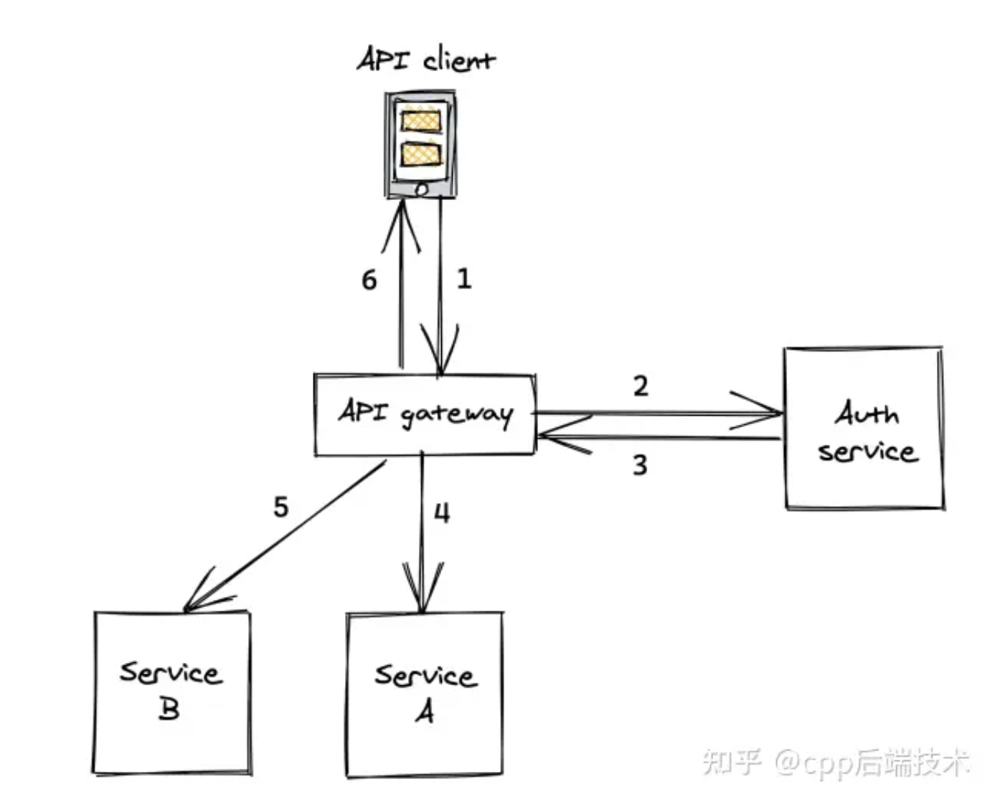
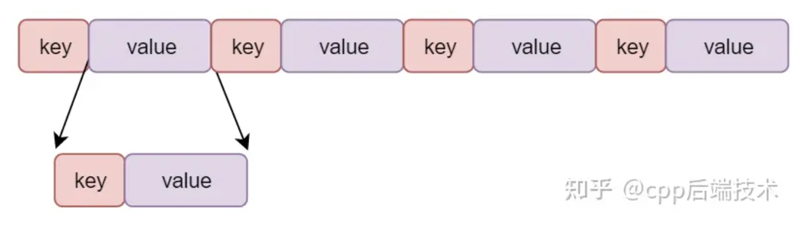

## 资料

- protobuf介绍 : https://zhuanlan.zhihu.com/p/633656133
- golang中使用protobuf : https://geektutu.com/post/quick-go-protobuf.html

## RPC中的编解码


客户端和服务端之间是通过网络传输数据，底层使用二进制数据，编码和解码（codec）是把业务数据编码成二进制数据和把二进制数据解释为业务数据的过程。

在思考怎样进行编解码之前我们必须意识到：

* client和server可能是用不同语言编写的，你的编解码方案必须通用且不能和语言绑定
* 编解码方法的性能问题，尤其是对时间要求苛刻的服务


### json
首先，我们想到的就是用json这一类文本语言来进行codec。
因为json易读，而且独立于编程语言。

- 编码：将结构体内存数据，序列化成json格式，最终将得到一个字符串，然后我们再将字符串ASC编码成二进制数据，最后发送到网络上。

- 解码：收取网络上的二进制，然后通过ASC编码为字符串，最后反序列化成结构体内存数据。

json不涉及将数据压缩，而且易读。因此当两段数据量很少的时候——就像浏览器和服务端的交互，Json可以工作的非常好。适用于上图中的1和6。

但对于后端服务之间的交互来说就不一样了，后端服务之间的RPC调用可能会传输大量数据，如果全部用纯文本的形式来表示数据那么不管是**网络带宽**还是**编解码性能**可能都会差强人意。


### protobuf
protobuf是一种轻便高效的结构化数据存储格式，与语言、平台无关，可扩展可序列化。protobuf 性能和效率大幅度优于 JSON、XML 等其他的结构化数据格式。protobuf是以二进制方式存储的，占用空间小，但也带来了可读性差的缺点。protobuf在通信协议和数据存储等领域应用广泛。特点：

* value : 不使用固定长度来表示数字，而使用变长方法来表示，目的是减少字节数
* type : 对于字段类型简单，因为字段类型就那么多，protobuf中定义了6种字段类型，只需要3bit即可全部表示。
> 1、标量类型 2、枚举 3、嵌套 4、任意类型(Any)Any 可以表示不在 .proto 中定义任意的内置类型 5、oneof 6、map

* key : 给每个字段都进行编号，无论你用多么复杂的字段名称也不会影响编码后占据的空间，字段名称根本就不会出现在编码后的信息中。（因为通信双方需要协议，那么字段其实是client和server都知道的，它们唯一不知道的就是“哪些值属于哪些字段”。
为解决这个问题，我们给每个字段都进行编号）


示例：
```
int long_long_name = 100;
----->
字段名称：2 (2对应字段“long_long_name”)
字段类型：0 (0表示varint类型)
字段值：100
```

从宏观来看，pb字节流格式如下:
每个key-value对应一个proto中的字段，字段名称和字段类型会被拼接成key，字段值是value。嵌套类型依然遵循被编码后形成一系列的key-value，只不过对于嵌套类型的key来说，其value是由子消息的key-value组成。



