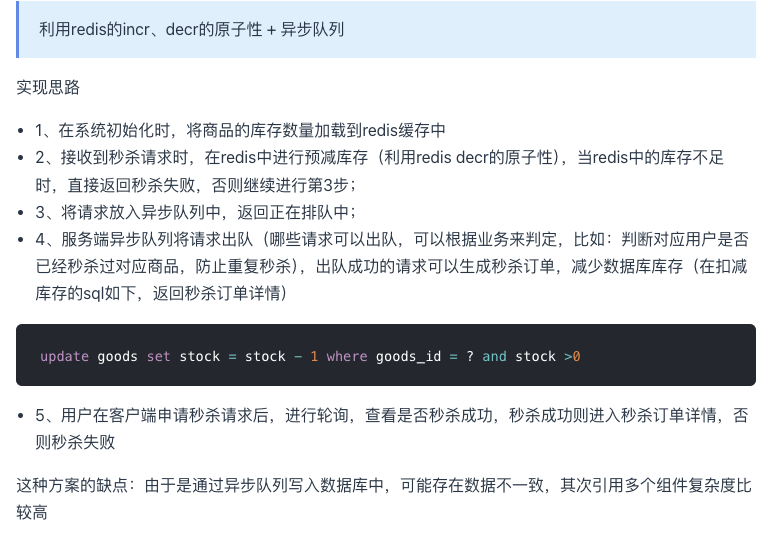

## 高并发下的数据漏洞问题（秒杀场景）

添加域名场景，需要先查询mysql数量，然后做各种耗时逻辑，再修改mysql数量。

如果同一时间多个请求查询mysql的域名数量，那么所有请求都会认为还有剩余，导致绕过域名数量限制的并发漏洞。
实际添加的域名超出数量限制。

### 解决方法 redis异步队列  + mysql事务和锁 + 状态回写

使用mysql 事务+行锁解决。

将查询+修改合并为一个事务，查询使用select for update，为数据行加互斥锁。其他的select也会被阻塞。相当于对于mysql的某一行数据，永远只有一个事务在运行，其他事务都没阻塞中。

但是，因为事务的执行过程中是比较耗时的。容易在高并发情况下，造成大量阻塞和超时现象。

需要将任务执行的过程进行异步化。

在redis中缓存mysql数量，使用DECR方法计数，计数为0时直接返回错误。计数不为0时，将任务直接加入redis队列（list）。

创建消费者，消费redis队列中的任务。如果存在多个消费者，需要使用上述的mysql事务+锁机制，只有一个消费者则天然并发安全。针对超出mysql限制的任务，需要回写状态通知客户端失败结果。

