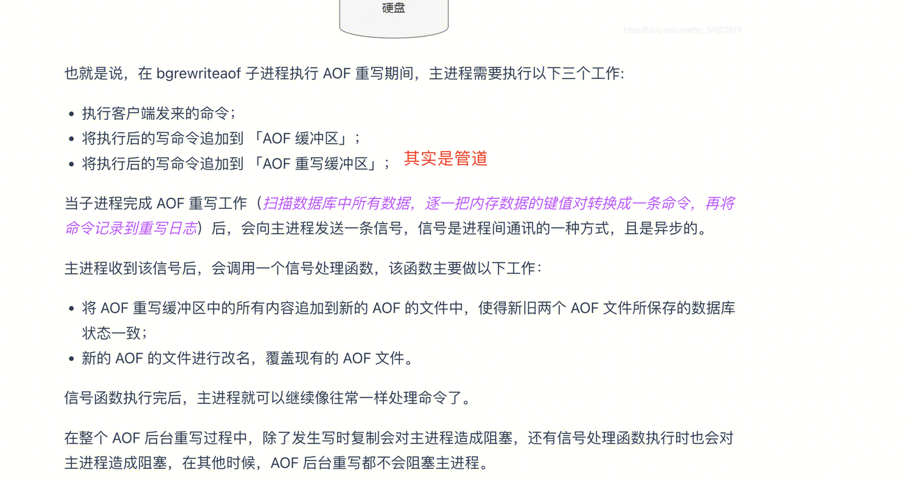

## Redis 深入
### 单机Redis
#### 运行模型
I/O多路复用 + 队列 + 事件分派器
https://www.jianshu.com/p/bc6904abc330
#### Redis VM
virtual memory ： 主要用于提高数据库容量。类似操作系统的虚拟内存技术
https://blog.csdn.net/Seky_fei/article/details/106843764
### 数据结构

### 事务

### 数据持久化
https://blog.csdn.net/weixin_44051223/article/details/105402715

#### RDB：
##### BGSAVE： **fork子进程 **+ copyonwrite
https://draveness.me/whys-the-design-redis-bgsave-fork/

#### AOF：
##### AOF重写：fork子进程（cow） + 管道通信
redis是通过fork子进程来做aofrewrite，同时为了保证aof的连续性，父进程把aofrewrite期间的写命令缓存起来，等收割完子进程之后再追加到新的aof文件。如果期间写入量较大的话收割时就要有大量的写磁盘操作，造成性能下降。
为了提高aofrewrite效率，redis通过在父子进程间建立管道，把aofrewrite期间的写命令通过管道同步给子进程，追加写盘的操作也就转交给了子进程。

http://mysql.taobao.org/monthly/2018/12/06/

##### AOF： fsync刷缓存到磁盘 （always / no / everysec）
https://xiaolincoding.com/redis/storage/aof.html#aof-%E5%90%8E%E5%8F%B0%E9%87%8D%E5%86%99
https://www.jianshu.com/p/f700dbd572a5

### AOF + RDB
本质上是AOF变体：
当开启了混合持久化时，在 AOF 重写日志时， `fork`  出来的重写子进程会先将与主线程共享的内存数据以 RDB 方式写入到 AOF 文件，然后主线程处理的操作命令会被记录在重写缓冲区里，重写缓冲区里的增量命令会以 AOF 方式写入到 AOF 文件，写入完成后通知主进程将新的含有 RDB 格式和 AOF 格式的 AOF 文件替换旧的的 AOF 文件。
也就是说，使用了混合持久化，AOF 文件的**前半部分是 RDB 格式的全量数据，后半部分是 AOF 格式的增量数据**。

### 主线程性能

- fork子进程时，会存在影响
- cow，写时，会存在影响
- 大key问题
https://xiaolincoding.com/redis/storage/bigkey_aof_rdb.html#%E6%80%BB%E7%BB%93

### 内存上限和内存回收策略
https://xiaolincoding.com/redis/module/strategy.html#%E8%BF%87%E6%9C%9F%E5%88%A0%E9%99%A4%E7%AD%96%E7%95%A5
### 过期策略
https://xiaolincoding.com/redis/module/strategy.html#%E8%BF%87%E6%9C%9F%E5%88%A0%E9%99%A4%E7%AD%96%E7%95%A5

## 主从Redis
### 数据同步

### 主从切换

## 集群Redis
