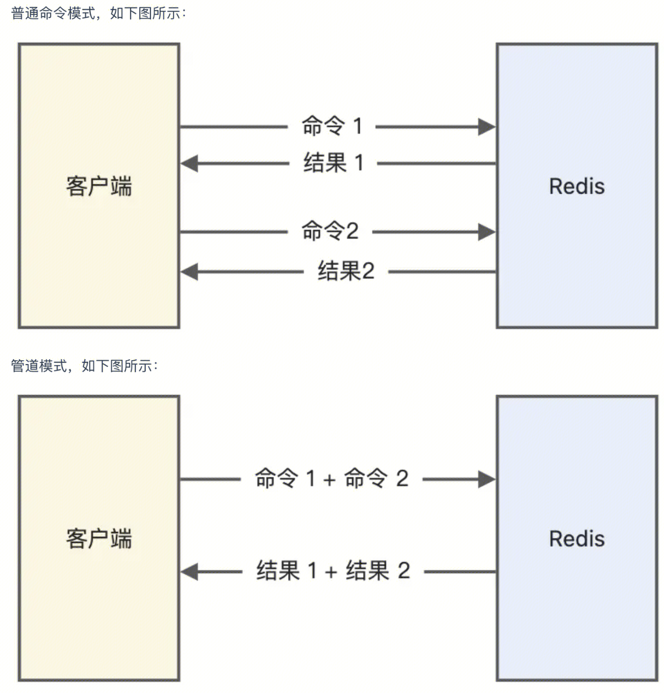

**redis pipeline ， http pipeline都是指合并请求，减少rtt时间**

## redis pipeline 和 事务
- pipeline 是客户端的行为，对于服务器来说是透明的，可以认为服务器无法区分客户端发送来的查询命令是以普通命令的形式还是以pipeline的形式发送到服务器的；

- 事务 是服务端的行为，用户执行MULTI命令时，服务器会将对应这个用户的客户端对象设置为一个特殊的状态，在这个状态下后续用户执行的查询命令不会被真的执行，而是被服务器缓存起来，直到用户执行EXEC命令为止，服务器会将这个用户对应的客户端对象中缓存的命令按照提交的顺序依次执行。

详细一些来说，我们知道在TCP连接之中，系统会在内核之中为每一条TCP连接分配属于它的输入缓冲区以及输出缓冲区。

数据的发送方可以通过write系统调用将数据发送到连接之上，而当连接上有数据到达时，会先写入内核之中的输入缓冲区里，然后想应用程序通知这个连接当前可读。此时应用程序可以调用read系统调用将输入缓冲区之中的数据读取到用户空间的内存之中，进行解析与处理。

发送方发送的数据过大，会导致数据无法一次性地被发送到网络对端，这是就需要应用层缓冲区。当发送较大数据时，其中一部分数据会通过TCP发送到网络对端，对端应用程序调用read系统调用将数据从内核缓冲区转移到应用层缓冲区。此时被清空的内核缓冲区将有足够的空间来接收发送方的剩余数据。

具体到Redis之中，服务器处理客户端的查询命令是遵从如下的逻辑进行的：
>
1. 用户的查询命令通过TCP连接发送给Redis服务器。
2. Redis服务器接收到数据时，在该连接上触发可读事件，并从事件循环之中跳出。
3. 服务器通过read系统调用将内核缓冲区之中的数据一次性地读入到该连接所对应的客户端对象的应用层缓冲区之中。
4. Redis服务器会循环解析并处理应用层缓冲区之中的数据，将其解析成Redis命令，并执行查询逻辑，知道缓冲区中剩余的数据无法被解析成完整的Redis命令或者缓冲区之中的数据已被全部解析完成。
5. 完成一个客户端对象数据的处理，Redis会继续应用步骤3、4中的逻辑处理其他客户端之中的内容。

在上面的步骤1之中，如果用户一次性地将多条查询命令发送到网络上，而不是收到一条的返回之后再发送第二条数据；那么在步骤4之中，服务器将一次性的处理这些命令，并且不会被其他用户的命令所打断。这种方式其实就是pipeline的机制，应用pipeline可以提服务器的吞吐能力，并提高Redis处理查询请求的能力。
但是这里存在一个问题，**当通过pipeline提交的查询命令数据较少，可以被内核缓冲区所容纳时，Redis可以保证这些命令执行的原子性**。**然而一旦数据量过大，超过了内核缓冲区的接收大小，那么命令的执行将会被打断，原子性也就无法得到保证。**
因此pipeline只是一种提升服务器吞吐能力的机制，如果想要命令以事务的方式原子性的被执行，那么请使用MULTI/EXEC