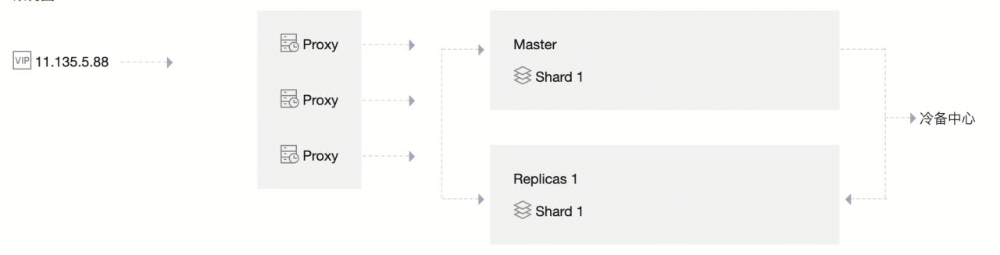
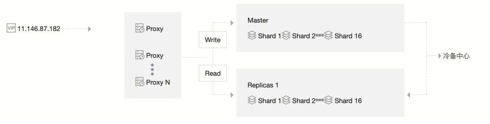

## 使用场景
### 1. 存储基础安全防护配置
``` 
pipeline, err := wafredis.Redis1.Pipeline(ctx) //redis4 master
    if err != nil {
        log.ErrorContextf(ctx, "init redis pipeline failed. %+v", err)
        return false
    }
    defer pipeline.Close()
    pipeline.Send("MULTI")
    pipeline.Send("HSET", req.Domain, "uin", req.Uin)
    pipeline.Send("HSET", req.Domain, "appid", req.AppID)
    strSrcIp := strings.Join(req.SrcList, ";")
    strSrcIp = strSrcIp + ";"
    pipeline.Send("HSET", req.Domain, "srcList", strSrcIp)
    pipeline.Send("HSET", req.Domain, "ssl_type", req.CertType)
    pipeline.Send("HSET", req.Domain, "cert", req.Cert)
    pipeline.Send("HSET", req.Domain, "privateKey", req.PrivateKey)
    pipeline.Send("HSET", req.Domain, "sslid", req.SSLId)
    pubInfo := req.Domain + "||" + req.InstanceID
    pipeline.Send("PUBLISH", "host_add", pubInfo)
    if cdnChange > 0 {
        pipeline.Send("PUBLISH", "EditProtection", pubInfo)
    }
    _, err = pipeline.Do("EXEC")
```

### 2. 消息通道
``` 
func PublishBypassRedisStream(ctx context.Context, appId uint64, domain string, module string, action string) bool {
    var ret bool = false
    log.InfoContextf(ctx, "appid %d domain %s send module %s action %s to redis.", appId, domain, module, action)

    for i := 0; i < 5; i++ {
        r, err := wafredis.Redis2.Do(ctx, "xadd", "waf-bypass-stream", "MAXLEN", "~", "10000", "*", "appid", appId, "host", domain, "action", action, "module", module)
        if mid := getMsgID(r); len(mid) != 0 {
            log.InfoContextf(ctx, "appid %d domain %s send module %s action %s to redis, result %s.", appId, domain, module, action, mid)
        } else {
            log.ErrorContextf(ctx, "appid %d domain %s send module %s action %s to redis get response error, result %+v.", appId, domain, module, action, r)
        }
        if err != nil {
            log.ErrorContextf(ctx, fmt.Sprintf("appid %d domain %s send module %s action %s error. %+v", appId, domain, module, action, err))
        } else {
            ret = true
            return ret
        }
    }
    return ret
}
```
### 3. 接入检查Zset + Hash
``` 
func AddJob(taskType string, params JobParams, nextts int64) (int64, error) {
    jobID := taskType + "_" + params.TaskID
    rval := make(map[string]interface{})
    err := mapstructure.Decode(params, &rval)
    if err != nil {
        log.Logger.With("err", err.Error()).Errorf("decode struct to map failed")
    }
    models.TaskRedisCli.HSet(jobID, rval)
    models.TaskRedisCli.Expire(jobID, 7*24*time.Hour)
    log.Logger.Infof("add job %#v, nextts:%d", rval, nextts)
    return models.TaskRedisCli.ZAdd(taskType, &redis.Z{
        Score:  float64(nextts),
        Member: jobID,
    }).Result()
}
```
### 4. cname检查域名队列

``` 
ype CnameTaskQueue struct {
    key string
    log *zap.SugaredLogger
    r   *redis.Client
}

//Push ... 尾插,优先执行
func (c *CnameTaskQueue) Push(v string) error {
    _, e := c.r.RPush(c.key, v).Result()
    if e != nil {
        c.log.Errorf("redis err %#v", e)
        return e
    }
    return nil
}

//HPush ... 头插
func (c *CnameTaskQueue) HPush(v string) error {
    _, e := c.r.LPush(c.key, v).Result()
    if e != nil {
        c.log.Errorf("redis err %#v", e)
        return e
    }
    return nil
}
```
### 5. 存储Bot Xgboost模型

将训练好的Xgboost模型序列化之后放到redis中（redis可以进行文件存储）


### 6.存储Flink生成的Feature信息
`bot-feature-exactor`
Flink提起完会话的特征信息之后，存储到redis中
``` 
kvs = scala.collection.Map[String, String](
        "acc" -> accFeatureValue.toJSONString,
        "stat" -> stateFutureValue.toJSONString
      ).asJava

val redisKey = CKVProxy.makeKey(key)
val startTime = System.currentTimeMillis()
jedis = CKVProxy.pools(index).getResource
val pipeline = jedis.pipelined()
pipeline.hmset(redisKey, kvs)
pipeline.expire(redisKey, ConfigKey.CKVDataExpireTime)
```

### 7.读取Xgboost模型
`ai-statistic-executor`
``` 
String xgboostKey = "xgboost-" + appId + "-" + gen.getVersion();
LogUtil.info("query xgboost model,key:" + xgboostKey);
byte[] modelBytes = CKV.get(CKV.getPool(xgboostKey), xgboostKey.getBytes());
```
### 8. 防篡改页面使用redis进行缓存
redis缓存了用户的防篡改页面。
当命中url时，拉取redis的页面直接返回。
`nginx lua`
``` 
local function fetch_cache(key)
    local cache_content = antitamper_shm:get(key)
    if not cache_conte_cont tent then
        local main_md5, sub_md5 = split_key_md5(key)
        if main_md5 ~= nil then
            -- 切换到redis5
            local redis = redis_access:redis5_new()   --get the content from redis
            local res,err = redis:hget(main_md5, sub_md5)
            if res then
                antitamper_shm:set(key,res,expire_time)
                cache_content = res
            else
                if err then
                    waf_logger.err("Error in fetching cache from redis with err:"..err)
                end
            end
        end
    end
end
```


### 总结
redis在waf中的作用主要集中在一下几点：
1. 使用redis的数据结构，例如Hash、Set、List等，来实现功能。
2. 使用redis stream来进行消息传递
3. 使用nginx + redis做页面缓存


## Redis相关
### 架构/基本信息

- 1分片 1副本 （读写分离 主从架构， 非集群架构）

- 多分片 1副本 （读写分离 集群架构）



### 内存和磁盘
redis是内存数据库，数据都保存在内存中。一旦程序重启，数据就会丢失。持久化是指，将内存的数据保存到磁盘。redis主要有两种持久化方式：
**RDB 持久化**：云数据库后台服务会根据备份策略周期性地为存储引擎中保存的数据创建快照，生成 RDB 文件，保存到磁盘中，实现数据的持久化。
**AOF 持久化**：追加修改操作，来进行备份
https://developer.aliyun.com/article/541097

### 常见架构
**标准架构**：指支持1个或者多个副本的版本（副本是指非主节点的节点），是最通用的 Redis 版本。
**集群架构**：是腾讯云基于社区版 Redis Cluster 打造的全新版本，采用分布式架构，支持分片和副本的扩缩容，拥有高度的灵活性、可用性，高达千万级 QPS 的高性能。
https://zhuanlan.zhihu.com/p/543953543

- 单点redis （存在性能瓶颈）
- 主从redis读写分离 + 哨兵高可用（写仍然存在性能瓶颈）
- 官方集群： 主从redis + 分片 + gossip + clientSDK路由（需要客户端升级）
- 社区方案： 主从redis + 分片 + gossip + proxy路由 


一致性hahs和hash槽的区别：
https://www.jianshu.com/p/4163916a2a8a


### 数据类型
https://juejin.cn/post/6844903936520880135
- 动态字符串
- 双向链表（不要求有序）
- 哈希表
- 跳表（有序链表）
- 整数集合（有序数组）
- ziplist
- quicklist
https://zhuanlan.zhihu.com/p/375414918


### 缓存 | 分布式锁 | stream 等redis应用场景
https://developer.aliyun.com/article/831706
https://www.modb.pro/db/172190
- 缓存: 内存数据库查询快 + 事件模型性能好
- 分布式锁：https://juejin.cn/post/7058504011602722852
- stream：https://www.modb.pro/db/172190


