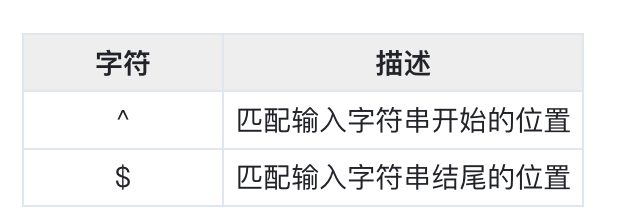
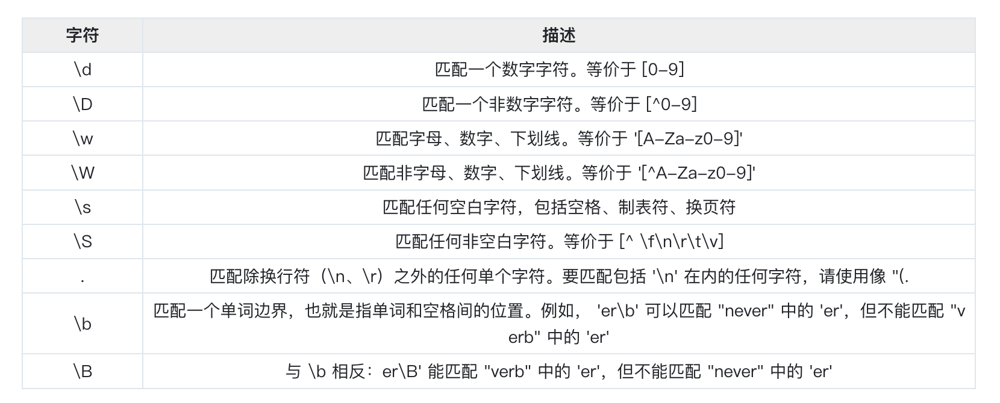
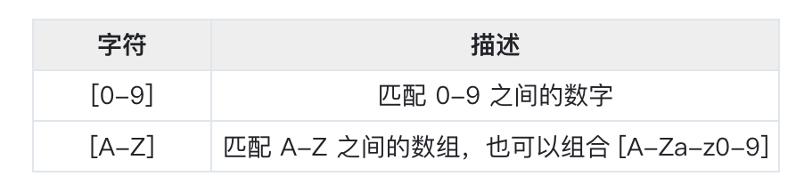
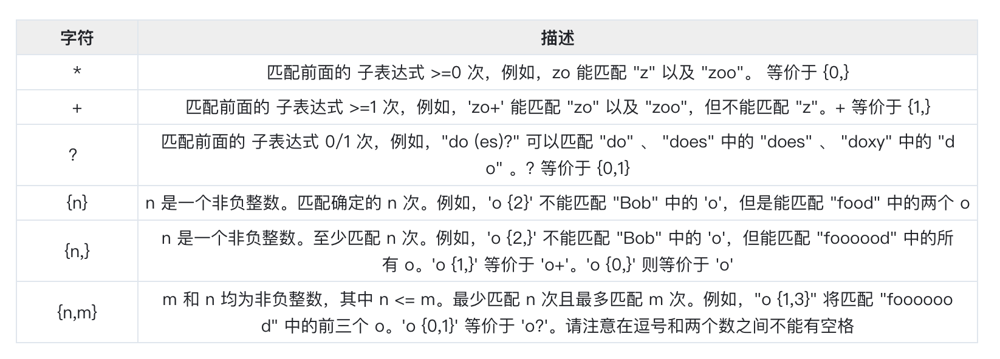

## 元字符
### 空白字符


### 表示位置的字符


### 常用


### 区间


### 限定符



### 转义
符号`/ . ( ) * \` 等等在正则是特殊字符，所以需要用转义符 \ 转义
例如
```
regexp.MatchString("^[\\*][-a-zA-Z0-9]{0,62}(\\.[a-zA-Z0-9][-a-zA-Z0-9]{0,62})+$", string)
```


## 资料

- https://www.cnblogs.com/wanghui-garcia/p/10432389.html
- https://learnku.com/articles/35121

## 实践
``` 
package main

import (
    "fmt"
    "regexp"
)

func main() {

    // 检查电话号码是否匹配正则表达式
    // regexp.Match 和 regexp.MatchString 没什么区别，只是接受的参数类型不同
    phoneNumber := "0931-87562387"
    fmt.Println(regexp.Match(`^\d{4}-\d{8}$`, []byte(phoneNumber))) // true <nil>
    fmt.Println(regexp.MatchString(`^\d{4}-\d{8}$`, phoneNumber))   // true <nil>

    text := "Hello 世界！123 Go."

    // regexp.Compile, 创建正则表达式对象, 还有一个方法与它类似，
    // regexp.MustCompile, 但在解析失败的时候回panic，常用于全局正则表达变量的安全初始化
    reg, _ := regexp.Compile(`[a-z]+`) // 查找连续的小写字母

    // regexp.Regexp.FindAll 于 FindAllString 类似
    fmt.Printf("%q\n", reg.FindAllString(text, -1)) // ["ello" "o"]

    reg, _ = regexp.Compile(`[^a-z]+`)              // 查找连续的非小写字母
    fmt.Printf("%q\n", reg.FindAllString(text, -1)) // ["H" " 世界！123 G" "."]

    reg, _ = regexp.Compile(`\w+`)                  // 查找连续的单词字母
    fmt.Printf("%q\n", reg.FindAllString(text, -1)) // ["Hello" "123" "Go"]

    reg, _ = regexp.Compile(`[[:upper:]]+`)         // 查找连续的大写字母
    fmt.Printf("%q\n", reg.FindAllString(text, -1)) // ["H" "G"]

    reg, _ = regexp.Compile(`[[:^ascii:]]+`)        // 查找连续的非ascii字符串
    fmt.Printf("%q\n", reg.FindAllString(text, -1)) // ["世界！"]

    reg, _ = regexp.Compile(`[\pP]+`)               // 查找连续的标点符号
    fmt.Printf("%q\n", reg.FindAllString(text, -1)) // ["！" "."]

    reg, _ = regexp.Compile(`[\PP]+`)               // 查找连续的非标点符号
    fmt.Printf("%q\n", reg.FindAllString(text, -1)) // ["Hello 世界" "123 Go"]

    reg, _ = regexp.Compile(`[\p{Han}]+`)           // 查找连续的汉字
    fmt.Printf("%q\n", reg.FindAllString(text, -1)) // ["世界"]

    reg, _ = regexp.Compile(`Hello|Go`)             // 查找Hello或者Go
    fmt.Printf("%q\n", reg.FindAllString(text, -1)) // ["Hello" "Go"]

    reg, _ = regexp.Compile(`(?:Hell|G)o`)          // 查找Hello或者Go
    fmt.Printf("%q\n", reg.FindAllString(text, -1)) // ["Hello" "Go"]

    reg, _ = regexp.Compile(`^H.*\s`)               // 查找行首以 H 开头，以空格结尾的字符串
    fmt.Printf("%q\n", reg.FindAllString(text, -1)) // ["Hello 世界！123 "]

    reg, _ = regexp.Compile(`(?U)^H.*\s`)           // 查找行首以 H 开头，以空格结尾的字符串 非贪婪模式
    fmt.Printf("%q\n", reg.FindAllString(text, -1)) // ["Hello "]

    reg, _ = regexp.Compile(`(?i:^hello).*Go`)      //  查找以 hello 开头（忽略大小写），以 Go 结尾的字符串
    fmt.Printf("%q\n", reg.FindAllString(text, -1)) // ["Hello 世界！123 Go"]

    reg, _ = regexp.Compile(`\QGo.\E`)              // 查找 Go.
    fmt.Printf("%q\n", reg.FindAllString(text, -1)) // ["Go."]

    reg, _ = regexp.Compile(`(?U)^.* `)             // 查找从行首开始，以空格结尾的字符串（非贪婪模式）
    fmt.Printf("%q\n", reg.FindAllString(text, -1)) // ["Hello "]

    reg, _ = regexp.Compile(` [^ ]*$`)              // 查找以空格开头，到行尾结束，中间不包含空格字符串
    fmt.Printf("%q\n", reg.FindAllString(text, -1)) // [" Go."]

    reg, _ = regexp.Compile(`(?U)\b.+\b`)           // 查找“单词边界”之间的字符串
    fmt.Printf("%q\n", reg.FindAllString(text, -1)) // ["Hello" " 世界！" "123" " " "Go"]

    reg, _ = regexp.Compile(`[^ ]{1,4}o`)           // 查找连续 1 次到 4 次的非空格字符，并以 o 结尾的字符串
    fmt.Printf("%q\n", reg.FindAllString(text, -1)) // ["Hello" "Go"]

    reg, _ = regexp.Compile(`(Hell|G)o`)                      // 查找 Hello 或 Go，替换为 Hellooo、Gooo
    fmt.Printf("%q\n", reg.ReplaceAllString(text, "${1}ooo")) // "Hellooo 世界！123 Gooo."

    reg, _ = regexp.Compile(`(Hello)(.*)(Go)`)               // 交换Hello和Ho
    fmt.Printf("%q\n", reg.ReplaceAllString(text, "$3$2$1")) // "Go 世界！123 Hello."

    reg = regexp.MustCompile(`[\f\t\n\r\v\123\x7F\x{10FFFF}\\\^\$\.\*\+\?\{\}\(\)\[\]\|]`) // 特殊字符的查找
    fmt.Printf("%q\n", reg.ReplaceAllString("\f\t\n\r\v\123\x7F\U0010FFFF\\^$.*+?{}()[]|", "-"))

}
```