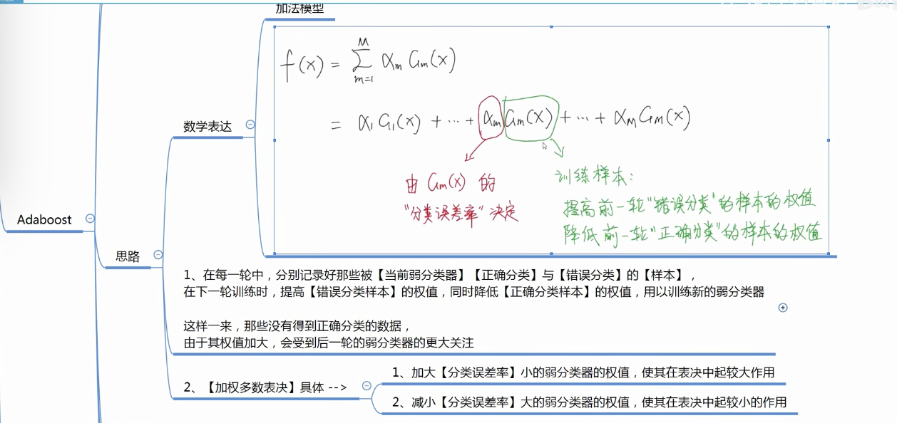

AI执行器基于集成树模型XGBOOST

## 集成学习

### 概念
学习器：模型，简单的模型称为弱学习器，复杂的模型称为强学习器

思想：集成学习通过构建并结合多个学习器来完成任务。

优势：集成学习将多个弱学习器进行结合，常可获得比单一强学习器更优秀的表现。

### 问题和分类
按照思想，集成学习需要解决两个问题：

- 1.个体学习器如何训练得到？
多个学习器要有侧重点的学习，才能达到组合起来超越单一学习器的效果。
让多个学习器有侧重点的学习，可以通过调整训练数据权值和分布的实现。

- 2.如何将个体学习器们组合？
线性相加和还是非线性组合

针对上面两个问题，存在不同的解决方法。按照方法不同，集成学习分为boosting和bagging。

#### boosting
特点：个体学习器之间存在强依赖关系，必须串行生成的【串行】化方法。
先训练好前一个学习器，再训练后一个学习器。
在后一个学习器训练的时候前一个学习器不再变化，并且后一个学习器依赖前一个学习器。

机制：

- 1.个体学习器如何训练得到？ 
串行训练模式，先训练前面的分类器，再训练后面的分类器。
【提高】在前面弱分类器【分错】的样本的权值。
【减小】在前面弱分类器【分对】的样本的权值。
侧重点：使错误分类的样本在后续的分类器中受到更多的关注。
- 2.如何将个体学习器们组合？
【加法模型】线性相加（加权求和）

代表：
adaboost GBDT XGBOOST LIGHTGBM

#### bagging
特点：个体学习器之间不存在强依赖关系，可同时生成的【并行】化方法。

机制：

- 1.个体学习器如何训练得到？ 
并行训练模式:从原始训练集中抽样出k个训练集。k个训练集分别训练，得到k个模型。

    抽取k个训练集的方法：

    a、有放回采样，抽取后有放回可以抽到重复的样本

    b、**随机森林**，除了有放回抽样之外，还会对特征空间进行采样。

- 2.如何将个体学习器们组合？

    分类问题： 投票表决 线性加权

    回归问题： 均值

代表：
RandomForest

## AdaBoost
参考资料： 李航统计学习方法

AdaBoost是Boosting类型的算法。

### 算法流程
#### 第一步 定义基分类器

每个基分类器，可以是逻辑回归也可以是决策树。
逻辑回归是线性表达，决策树是非线性表达。

#### 第二步 循环

- 1.初始化/更新当前训练数据的权值分布。
    
    初始化：样本等权重

    更新：增大错误样本权值，降低正确样本权重。

- 2.训练当前基分类器Gm(X)
    
    例如，逻辑回归是线性模型可以基于CrossEntropy LossFunc计算损失函数，基于梯度下降找到损失函数最小值。

- 3.计算当前基分类器权重am
    
    由当前基分类器的分类误差率决定。
    
    分类误差率：计算加权样本在当前基分类器上的错误分类率。

- 4.将当前基分类器更新到加法模型f(X)中
- 5.判断退出条件

    基分类器数量上限

    **集成**模型分类误差率

### 算法原理
https://zhuanlan.zhihu.com/p/39972832

预测函数:

    定义使用加法模型进行集成。

    按照任务特点选择逻辑回归或者决策树基模型。

损失函数:

    回归问题使用例如均方误差

    分类问题使用例如交叉熵损失

优化方法：

    加法模型不适合用整体梯度下降的方式优化，
    因此，整体梯度下降时，需要优化的参数量和基分类器成正比，容易造成复杂度高的问题。

    加法模型适合使用前向分步算法进行优化。
    前向分步算法就是前文讲到的迭代优化方式。
    相当于将整体梯度下降拆解成为多步。
    每一步优化的变量只和当前基分类器相关。之前的基分类器变量经过上一轮优化后就固定了。

细节：

    1.处理二分类问题，label为 -1，1
    2.损失函数: 指数损失函数 exp[-yf(x)]
    3.激活函数: sign(f(x)) f(x)>0为1 <0为-1
    4.样本权值: 直接使用损失函数作为当前轮次训练结束后，样本的权重。Wi = exp[-yi-1(xi)]
    5.基分类器权值: am = 1/2log((1-em)/em)
    6.分类错误率: em = 所有分类错误样本（Wi）求和
