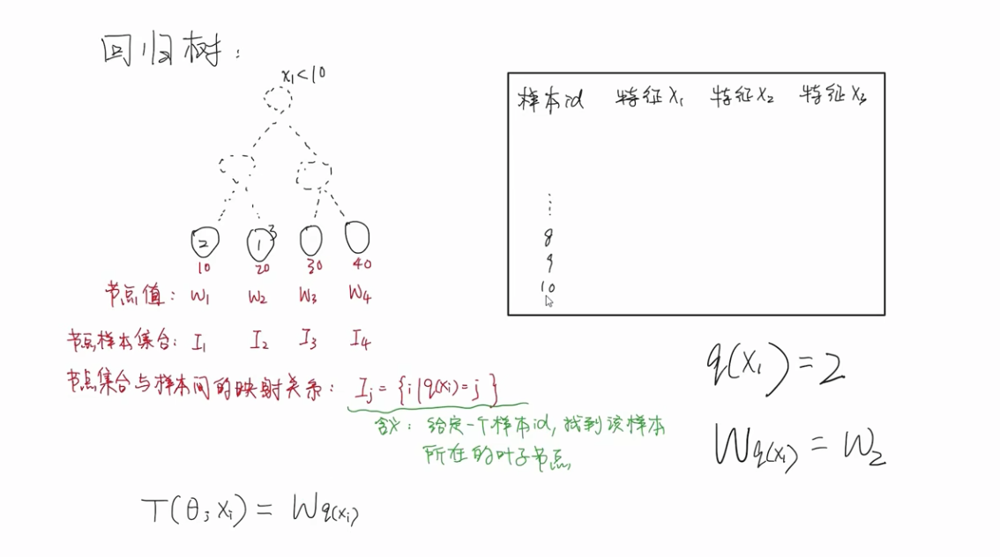

AI执行器基于集成树模型XGBOOST

## 集成学习

### 概念
学习器：模型，简单的模型称为弱学习器，复杂的模型称为强学习器

思想：集成学习通过构建并结合多个学习器来完成任务。

优势：集成学习将多个弱学习器进行结合，常可获得比单一强学习器更优秀的表现。

### 问题和分类
按照思想，集成学习需要解决两个问题：

- 1.个体学习器如何训练得到？
多个学习器要有侧重点的学习，才能达到组合起来超越单一学习器的效果。
让多个学习器有侧重点的学习，可以通过调整训练数据权值和分布的实现。

- 2.如何将个体学习器们组合？
线性相加和还是非线性组合

针对上面两个问题，存在不同的解决方法。按照方法不同，集成学习分为boosting和bagging。

#### boosting
特点：个体学习器之间存在强依赖关系，必须串行生成的【串行】化方法。
先训练好前一个学习器，再训练后一个学习器。
在后一个学习器训练的时候前一个学习器不再变化，并且后一个学习器依赖前一个学习器。

机制：

- 1.个体学习器如何训练得到？ 
串行训练模式，先训练前面的分类器，再训练后面的分类器。
【提高】在前面弱分类器【分错】的样本的权值。
【减小】在前面弱分类器【分对】的样本的权值。
侧重点：使错误分类的样本在后续的分类器中受到更多的关注。
- 2.如何将个体学习器们组合？
【加法模型】线性相加（加权求和）

代表：
adaboost GBDT XGBOOST LIGHTGBM

#### bagging
特点：个体学习器之间不存在强依赖关系，可同时生成的【并行】化方法。

机制：

- 1.个体学习器如何训练得到？ 
并行训练模式:从原始训练集中抽样出k个训练集。k个训练集分别训练，得到k个模型。

    抽取k个训练集的方法：

    a、有放回采样，抽取后有放回可以抽到重复的样本

    b、**随机森林**，除了有放回抽样之外，还会对特征空间进行采样。

- 2.如何将个体学习器们组合？

    分类问题： 投票表决 线性加权

    回归问题： 均值

代表：
RandomForest

## AdaBoost
参考资料： 李航统计学习方法

AdaBoost是Boosting类型的算法。

### 算法流程
#### 第一步 定义基分类器

每个基分类器，可以是逻辑回归也可以是决策树。
逻辑回归是线性表达，决策树是非线性表达。

#### 第二步 循环

- 1.初始化/更新当前训练数据的权值分布。
    
    初始化：样本等权重

    更新：增大错误样本权值，降低正确样本权重。

- 2.训练当前基分类器Gm(X)
    
    例如，逻辑回归是线性模型可以基于CrossEntropy LossFunc计算损失函数，基于梯度下降找到损失函数最小值。

- 3.计算当前基分类器权重am
    
    由当前基分类器的分类误差率决定。
    
    分类误差率：计算加权样本在当前基分类器上的错误分类率。

- 4.将当前基分类器更新到加法模型f(X)中
- 5.判断退出条件

    基分类器数量上限

    **集成**模型分类误差率

### 算法原理
https://zhuanlan.zhihu.com/p/39972832

预测函数:
    
    基分类器可以使用任何弱分类器，只要按照损失函数最低去优化参数即可。

    定义使用加法模型进行集成。

    按照任务特点选择逻辑回归或者决策树基模型。

损失函数:

    回归问题使用例如均方误差

    分类问题使用例如交叉熵损失

优化方法：

    加法模型不适合用整体梯度下降的方式优化，
    因此，整体梯度下降时，需要优化的参数量和基分类器成正比，容易造成复杂度高的问题。

    加法模型适合使用前向分步算法进行优化。
    前向分步算法就是前文讲到的迭代优化方式。
    相当于将整体梯度下降拆解成为多步。
    每一步优化的变量只和当前基分类器相关。之前的基分类器变量经过上一轮优化后就固定了。

细节：

    1.处理二分类问题，label为 -1，1
    2.损失函数: 指数损失函数 exp[-yf(x)]
    3.激活函数: sign(f(x)) f(x)>0为1 <0为-1
    4.样本权值: 直接使用损失函数作为当前轮次训练结束后，样本的权重。Wi = exp[-yi-1(xi)]
    5.基分类器权值: am = 1/2log((1-em)/em)
    6.分类错误率: em = 所有分类错误样本（Wi）求和

## Cart算法
分类树和回归树都是二叉树，二者主要的区别在于特征划分的依据和叶子结点

### cart回归树

针对连续型特征值，回归树的节点为“该特征是否大于或小于一个值，例如 身高是否小于145"
针对离散型特征值，回归树的节点为“该特征是否等于一个值，例如年龄是否等于青年”

【特征划分的依据】是平方损失最小

【叶子】是 label的均值

### cart决策树

针对连续型特征值，回归树的节点为“该特征是否大于或小于一个值，例如 身高是否小于145"
针对离散型特征值，回归树的节点为“该特征是否等于一个值，例如年龄是否等于青年”

【特征划分的依据】是基尼指数最小

【叶子】是 类别

## GBDT
GBDT同样是基于前向分步优化算法和加法模型的Boosting模型。
与Adaboost的区别在与，GBDT限定使用回归决策树作为基学习器。GBDT使用的回归决策树为cart。
另外，GBDT不再限制损失函数，而是可以使用一般的损失函数。

### 为什么会出现GBDT？

Adaboost中使用的损失函数都很简单，比如分类使用指数损失函数，回归使用平方损失函数。但是如果我想在不同的任务中使用不同的损失函数呢？

不同的损失函数，对应的凸优化问题不一样。GBDT希望找到一个通用的方式，求解一般性凸优化问题。

### GBDT分为两种

（1）残差版本 　

这与Adaboost类似。
残差其实就是真实值和预测值之间的差值，在学习的过程中，首先学习一颗回归树，然后将“真实值-预测值”得到残差，再把残差作为一个学习目标，学习下一棵回归树，依次类推，直到残差小于某个接近0的阀值或回归树数目达到某一阀值。其核心思想是每轮通过拟合残差来降低损失函数。总的来说，第一棵树是正常的，之后所有的树的决策全是由残差来决定；

（2）梯度版本

与残差版本把GBDT说成一个残差迭代树，认为每一棵回归树都在学习前N-1棵树的残差不同，Gradient版本把GBDT说成一个梯度迭代树，使用梯度下降法求解，认为每一棵回归树在学习前N-1棵树的梯度下降值。总的来说两者相同之处在于，都是迭代回归树，都是累加每颗树结果作为最终结果，每棵树都在学习前N-1棵树尚存的不足，从总体流程和输入输出上两者是没有区别的。

[不同] 在于每步迭代时，是否使用Gradient作为求解方法。前者不用Gradient而是用残差—-残差是全局最优值，Gradient是局部最优方向*步长，即前者每一步都在试图让结果变成最好，后者则每步试图让结果更好一点。

[优缺点] 看起来前者更科学一点–有绝对最优方向不学，为什么舍近求远去估计一个局部最优方向呢？原因在于灵活性。**前者最大问题是，由于它依赖残差，loss function一般固定为反映残差的均方差，因此很难处理纯回归问题之外的问题。而后者求解方法为梯度下降，只要可求导的loss function都可以使用。**

### 梯度提升

#### 1.计算负梯度表达式
非梯度提升的目标是，
让当前轮次的损失最小，即直接对当前LossFunc求导=0。

梯度提升的目标是，
当前轮次的损失要比上一轮次的损失要小。

目标： L(y,fm-1(x)) - L(y,fm(x)) >= 0
对L(y,fm(x))进行泰勒一阶展开和整理：

**最终发现，我们要构造的当前基分类器只要约等于损失函数的负梯度，就可以满足当前轮次的损失要比上一轮次的损失要小这一目标。**

#### 2.重新构造训练集
boosting的第一个问题：如何训练当前基分离器。

adaboost是：提高错误样本权重，来重视错误样本。

gbdt是：直接将样本lable修改为负梯度，来训练当前分类器。

#### 3.利用基学习器拟合新训练集

### 总结GDBT思路
- 个体学习器如何训练： 拟合负梯度来重新得到训练集，从而训练当前个体学习器
- 如何将个体学习器组合： 不带权重的简单组合
- 目标：使得总体损失逐步减小

## XGBOOST

### 回归树

这是一个回归树，X表示样本，I表示叶子结点，W表示叶子结点的值。

I = q(X) 样本经过树之后，可以得到最终是那个节点，但是不知道节点的值。
I与W一一对应，得到节点之后，就得到了节点的值，该值作为样本X的预测值。

### 损失函数

xgboost损失函数多了一个正则项，防止过拟合。

将整体损失函数按照叶子结点的维度进行拆分，得到叶子结点损失函数的组合。

https://www.bilibili.com/video/BV1nP4y177rw/?p=6&spm_id_from=pageDriver&vd_source=09df75c831a64a5480d1c36e1e0a1b5b

其中，不像Adaboost，而是和GBDT一样，xgboost的损失函数不是固定的，因此没办法直接让损失函数对w求导的。因此，和GBDT一样，我们使用泰勒展开来处理损失函数。GBDT使用一阶泰勒展开，XGBOOST使用二阶泰勒展开。

最终经过整理得到：

其中g和h表示一阶梯度和二阶梯度。

对w求导，得到最小的损失为：

### 求解基学习器
不同的树划分方法将代表不同的基学习器，同一个样本集合在不同的基学习器上将得到不同的最小损失。
那么我们求解基础学习器的方法，就是去寻找具有最小“最小损失”的那个划分方法。

接下来应该如何划分呢？
我们采用 [分步+贪婪]算法来划分树结点。

在cart中，我们关注每个结点划分之后，样本总体的平方损失或者基尼指数。
在xgboost中，我们关注是否能得到最小的“最小损失”

例子：
按照不同条件划分，都会得到不同的“最小损失obj”

gain（增益） = 划分前obj - 划分后obj。
我们取最大gain的划分方法。该过程就是贪心过程。

划分停止条件：

- 1. 只有一个样本了
- 2. 最大的gain都小于一个数值
- 3. 树的层级较大、叶子结点数量较多

### 基学习器优化方法
当特征很多，或者特征空间很大的时候，基学习器的训练是很消耗时间的。我们有如下优化方法：

- 1. 列采样，特征采样（分为按树随机[每次都是固定的]和按层随机[每层都需要随机]）
- 2. 行采样，特征值采样，（分桶）

### 缺失值处理

综合耗时和计算量，xgboost对缺失值处理的方法是。
把所有缺失该类特征的样本整合，通过gain统一分到树的左边或者树的右边。