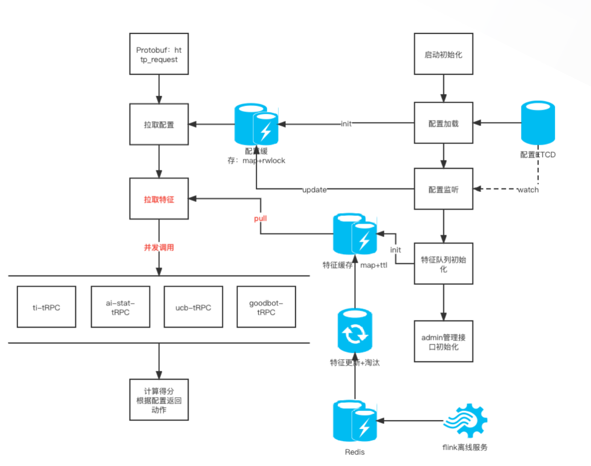

## 需求分析

### 业务

我们需要设计一个检测BOT的执行器，该执行器接受经过RS和HUB结构化的HTTP请求。在执行检测逻辑后，返回对应的处置动作。

检测逻辑分为两类：

- 确定性检测逻辑：
即匹配用户自定义的BOT规则（自定义规则）、预设专家规则（BOT-ID引擎）、搜索引擎goodbot(友好BOT)，如果匹配，则获得确定性结果，返回对应的处置动作。

- 得分类检测逻辑：
如果确定性检测逻辑都没有匹配，进入得分类检测逻辑。主要计算一下得分，得分越高，越疑似BOT。并用户配置的BOT分数区间，返回对应的执行动作。

    1.当前请求的客户端IP的得分（威胁情报）

    2.当前请求的User-Agent的得分（UA引擎）

    3.一段时间内同一个客户端请求的特征的得分（AI引擎）


### 技术

- WAF作为网络产品，会在用户的网络链路中增加时延。因此，BOT检测系统至少需要满足：**高性能，服务的超时为27ms**
- WAF作为公有云产品，需要检测多用户大量的网络流量，天然要求**高并发，系统支持QPS30w+以上的并发**
- WAF作为安全产品，要做到用户的每一个请求都要进行检测，不漏过。因此要求**高可用，满足3个9（99.9）的可用性**


## 方案

### 检测模块微服务化：

因此检测模块总多，所以将各个检测模块拆分为单独的服务，通过RPC通信。利于：

    1.利用Goroutine waitgroup进行并发调用。
    2.在必要时，利用北极星熔断服务，通过服务降级，保证可用率。
    3.保证资源调度的细粒度,按照服务性能分配资源

### feature二级缓存：

feature是实时更新的，feature更新到Redis。针对每个请求都去redis拉取feature会增加延时。因此设计二级缓存，本地缓存+redis来维护feature。将低网络时延，保证实时性。同时，针对cache进行选型业务适配，保证性能。


### 最终架构图为：



### 检测模块

- ucb
基于用户配置规则，匹配连续请求特征

- botid
基于预设规则，匹配单请求特征

- ai-stat-TRPC
基于XGBOOST的分类模型
[BOTAIEXECUTOR](botaiexecutor.md)

- ti-TRPC
IP 威胁情报

- ua-TRPC
Udger https://udger.com/ User Agent Analysis

- goodbot-TRPC
判断是否为搜索引擎的友好BOT


# 项目创新点/难点
- cache server [Cache](../basic/cache.md)。


在BOT维护Feature的过程中，才用了本地缓存 + 集中式缓存的二级缓存机制。


## 缓存技术选型

首先来梳理一下业务开发过程中经常面临的本地缓存的一些需求。
我们一般做缓存就是为了能提高系统的读写性能，缓存的命中率越高，也就意味着缓存的效果越好。但是本地缓存都受限于本地内存的大小，所有全量的数据一般存不下。

因此，我们需要利用有限的内存存储有限的数据，并且这些有限的数据需要是经常访问的。所以本地缓存至少要支持过期时间淘汰策略。并且需要考虑在加入本地缓存后引发的GC问题。

> 基于map缓存的GC问题:
当map里面数据量非常大时，会出现性能瓶颈。这是因为在Golang进行GC时，会扫描map中的每个元素。当map足够大时，GC时间过长，会对程序的性能造成巨大影响。根据bigcache介绍文章的测试，在缓存数据达到数百万条时，接口的99th百分位延迟超过了一秒。监测指标显示堆中超过4,000万个对象，GC的标记和扫描阶段耗时超过了四秒。
https://blog.csdn.net/weixin_38683995/article/details/113522023
>BigCache的GC解决方法:
https://www.cyhone.com/articles/bigcache/
https://go.p2hp.com/solutioncases/writing-fast-cache-service-in-go


本地缓存技术选型中，我们优先考虑了golang内置的标准库中是否存在这样的组件可以直接使用呢？
很遗憾，没有。golang中内置的可以直接用来做本地缓存的无非就是map和sync.Map。而这两者中，map是非并发安全的数据结构，在使用时需要加锁，性能较差；sync.Map是线程安全的，其通过读写分离，降低锁时间来提高效率；但是不适用于大量写的场景，这样会导致read map读不到数据而进一步加锁读取，同时dirty map也会一直晋升为read map，整体性能较差。参考[sync.map](../basic/syncmap.md)底层实现。

此外二者均无法支持数据的过期和淘汰，同时在存储大量数据时，又会产生比较频繁的GC问题，更严重的情况下导致线上服务无法稳定运行。

既然标准库中没有我们满足上述需求的本地缓存组件，那我们就考虑业界是否有开源成熟的方案可供选择。

本地缓存方案通常有: 

- TTLCache
- bigcache

## bigcache
https://www.cyhone.com/articles/bigcache/

bigcache的优点是：

- 数据分片存储，以降低锁冲突并提升并发量。
- 避免在map中存储指针，从而避免在GC时对map进行遍历扫描。
- 采用FIFO式的Ring Buffer设计，简化整体内存设计逻辑。

bigcache通过避免在map中存储指针，优化了因为缓存带来的GC问题。但是其数据存储使用的是FIFO式的Ring Buffer。这也导致了一些局限性：

- ringbuffer导致缓存淘汰机制是**基于统一时间的FIFO算法**，不支持lru等淘汰算法。这种FIFO式的数据淘汰相比于LRU、LFU来说，缓存命中率会低不少。
- ringbuffer导致存储数据需要序列化，序列化过程可能存在性能瓶颈，即使换成了ffjson来替换go标准库中的json操作，性能得到了不少的提升。但是比起直接存储对象的cache，序列化带来的开始不可避免。

综合来看，WAFBOT的QPS大概在30w，并且BOT业务的特征是某些key的QPS较高，并非每个Key。
所以其实并不需要海量数据缓存场景，因此GC并非瓶颈。由于bigcache不支持lru并且在json序列化存在性能损耗。因此我们转向支持lru的ttlcache。


## ttlcache

- microsoft ttlcache（原始版）:

    TTLCache - an in-memory LRU cache with expiration (LRU + expiration)
    https://github.com/microsoftarchive/ttlcache

- jellydator ttlcache (支持泛化社区版本)

    TTLCache - an in-memory cache with item expiration and generics (LRU + expiration + generics)
    https://github.com/jellydator/ttlcache

- waf ttlcache （WAF私有化版本）


    基于jellydator ttlcache进行了进一步业务适配:

    1.将sync.Mutex改成了sync.RWMutex，用以提高在读的情况下的性能。

    2.设计了分段cache，将低锁粒度，提高并发。

    3.利用singlefilght，减少缓存穿透的风险。

    4.改进批量loaderFunction。

    5.根据访问次数动态调整每一个缓存对象的TTL，既可以保证缓存刷新的实效性，还可以避免在缓存不需要更新时频繁的刷新同步数据。

    6.异步加载。

    7.priorityQueue、lruQueue，双管齐下。基于priorityQueue定时淘汰缓存，基于lruQueue主动更新缓存。


## waf ttlcache优化
基于原本的ttl，我们做了一些优化，并私有化。

### 支持多段cache
拆分多段Cache，减少锁冲突

通过对key做hash，来获得对应的cache

### 替换读写锁
提高读多写少场景下的性能

- 读写锁或互斥锁性能比较
https://geektutu.com/post/hpg-mutex.html
```
BenchmarkReadMore-8                   86          13202572 ns/op
BenchmarkReadMoreRW-8                661           1748724 ns/op
BenchmarkWriteMore-8                  87          13109525 ns/op
BenchmarkWriteMoreRW-8                94          12090900 ns/op
BenchmarkEqual-8                      85          13150321 ns/op
BenchmarkEqualRW-8                   176           6770092 ns/op
读写比为 9:1 时，读写锁的性能约为互斥锁的 8 倍
读写比为 1:9 时，读写锁性能相当
读写比为 5:5 时，读写锁的性能约为互斥锁的 2 倍
```

- [读写锁和互斥锁原理](lock.md)


### singlefilght

介绍:https://www.liwenzhou.com/posts/Go/singleflight/

原理:https://www.lixueduan.com/posts/go/singleflight/

singleflight属于Go的准标准库，它提供了重复函数调用抑制机制，使用它可以避免同时进行相同的函数调用。第一个调用未完成时后续的重复调用会等待，当第一个调用完成时则会与它们分享结果，这样以来虽然只执行了一次函数调用但是所有调用都拿到了最终的调用结果。

singleflight内部使用 waitGroup 来让同一个 key 的除了第一个请求的后续所有请求都阻塞。直到第一个请求执行 fn 返回后，其他请求才会返回。


使用注意点:

- singlefilght的第一个请求是阻塞的，如果第一个请求一直拿不到数据，那么后续的请求也会被全部阻塞.解决方法是，使用 DoChan 结合 ctx + select 做超时控制。

- singleflight第一个请求失败了，那么后续所有等待的请求都会返回同一个 error。
实际上可以根据下游能支撑的rps定时forget一下key，让更多的请求能有机会走到后续逻辑。


### 批量loaderfunction
将loaderfunction优化为多key，利用redis的pipeline，提升redis服务器吞吐量，减轻redis压力。

详见 [redis pipeline](./redis/pipeline.md)


### 异步加载

```golang
// GetByLoader(key string, customLoaderFunction LoaderFunction) (interface{}, error)
if loaderFunction != nil && !exists { //当前key不存在
    ch := cache.loaderLock.DoChan(key, func() (interface{}, error) {
        // cache is not blocked during io
        invokeData, _, err := cache.invokeLoader([]string{key}, loaderFunction)
        return invokeData, err
    }) //singlefilght加载数据

    if !cache.asyncLoader { //同步加载，阻塞等待singlefilght的ch返回
        res := <-ch
        dataReturn := res.Val.([]interface{})
        err = res.Err
        if err == nil {
            dataToReturn = dataReturn[0]
        }
    } else { //异步加载，不等待结果返回，先返回nil。
        dataToReturn = nil
        /*
            1. bot服务要求实时检测，如果cache未命中，阻塞等待将消耗大量时间，不符合时延要求。
            2. bot特征提取基于访问日志统计特征，本身就存在一定的滞后性，允许一开始无特征，缓存不命中的情况。
            所以优化为异步加载更加合适。
        */
    }
}
```


### priorityQueue 、 lruQueue
jellydator ttlcache 是基于prorityQueue来排序缓存对象的，定时清理和缓存驱逐都是基于该队列。

- 当缓存满时，新set缓存对象，会淘汰prorityQueue的pop节点。
- 定时任务会遍历prorityQueue所有的节点，清理过期的缓存。

但是在BOT业务中，需要根据访问次数动态调整每一个缓存对象的TTL，既可以保证缓存刷新的实效性，还可以避免在缓存不需要更新时频繁的刷新数据的问题。因此加入了lruQueue。

- 当缓存满时，新set缓存对象，会淘汰lruQueue的oldest节点。
- 定时任务会遍历prorityQueue所有的节点，执行loadfunction，更新缓存。


## 资料

- https://blog.csdn.net/weixin_38683995/article/details/113522023
- https://www.cyhone.com/articles/bigcache/
- https://go.p2hp.com/solutioncases/writing-fast-cache-service-in-go
- https://www.liwenzhou.com/posts/Go/singleflight/