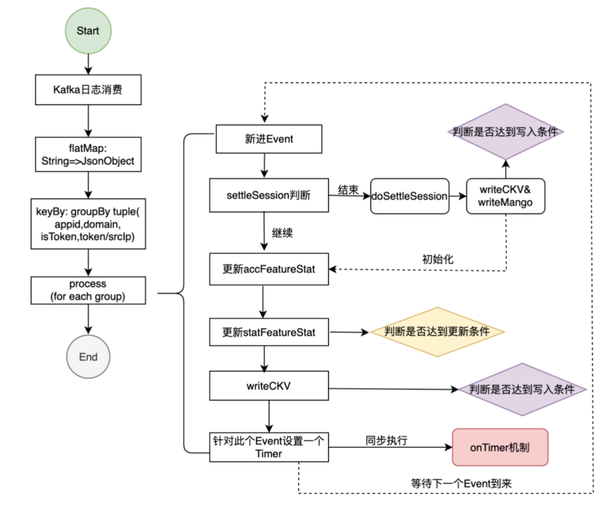
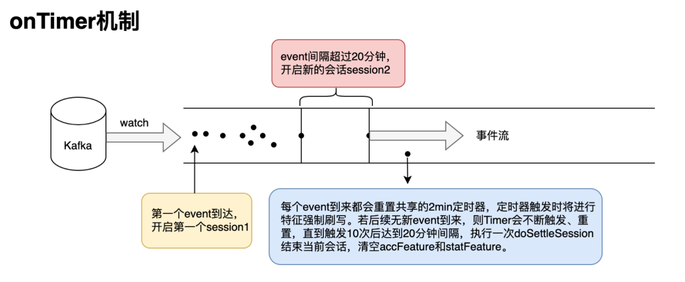
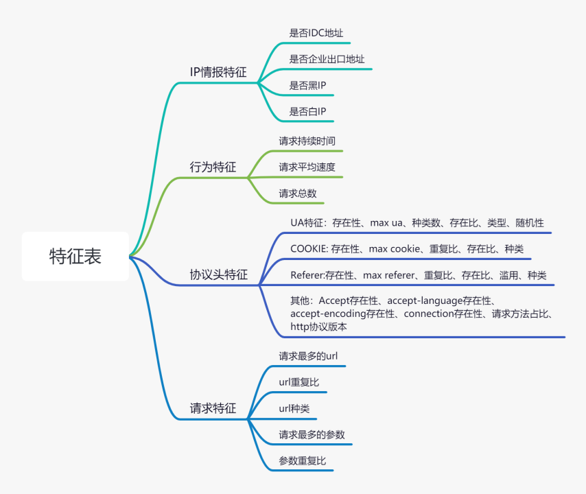
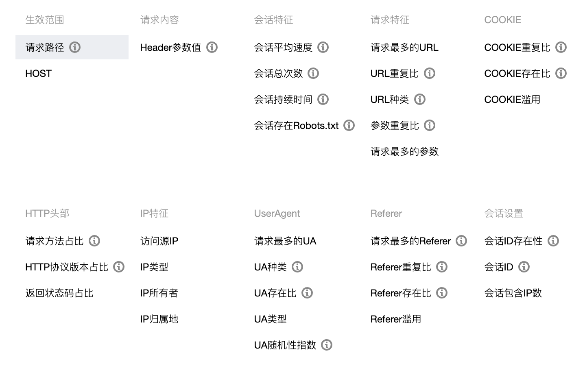
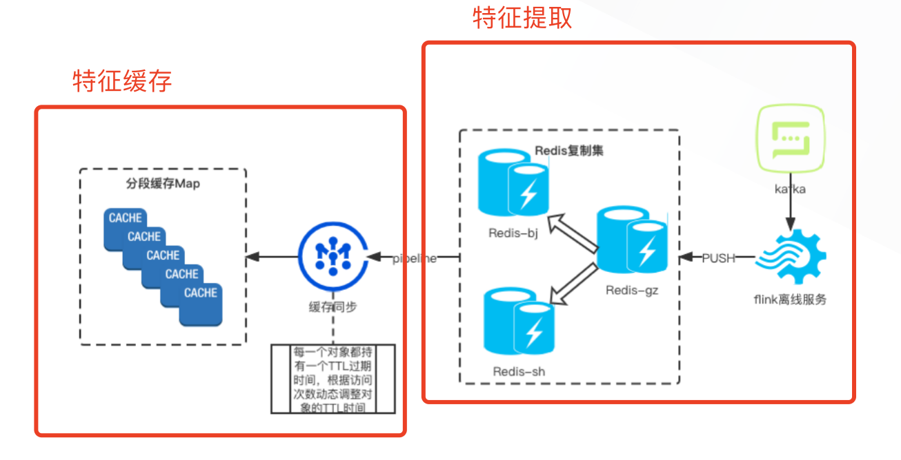

## 背景
BOT攻击区别普通请求攻击，BOT请求是一个连续的行为，而非单请求可以完成。
BOT攻击需要基于每一个客户端的行为属性来识别。
因此，例如访问次数、访问频率等，是Bot流量管理中最基础、最重要的数据。
我们把例如访问次数、访问频率等数据称为特征数据。BOT的检测都是基于特征数据的。因此,
**特征数据的稳定、高效产出，是实现实时Bot流量检测分析的前提!**

## 需求
设计一个系统。
该系统能够实时的采集用户一段时间内的请求信息，不断统计请求信息中的特征数据。
该系统输入是源源不断的用户请求信息，输出的用户请求的特征数据。
我们需要制定：

* 用户请求的开始和结尾的判断机制，从而统计这一段时间的特征数据
* 有哪些特征数据需要统计，才能比较准确的识别BOT行为
* 如何设计系统，来做这个实时的统计工作

## 方案
### 输入
该系统需要采集用户的行为信息，因此该系统的输入，我们选择了WAF的访问日志。访问日志中，包含了一个HTTP请求的大部分信息。
为了减少时延，直接使用了kafka作为数据源。kafka细节详见: [kafka](../basic/kafka.md)

### 特征提取 
特征提取需要将源源不断的用户请求信息，统计为特征数据。这是一个流计算任务。
流式计算，作为一种高频、增量、实时的数据处理模式，主要对计算方法和数据流进行处理。其功能主要体现在——对占用内存小、单次处理快、系统延迟低等要求较高的场景，以及需要在任务中持续计算的场景。

#### 技术选型
我们选择了使用Flink流计算开源框架作为基本开发框架。

Apache Flink与其他流计算框架（如Apache Storm、Apache Samza、Spark Streaming等）相比，具有一些独特的优势：

- 1.真正的流处理：Flink是一个真正的流处理框架，它从一开始就被设计为处理无界数据流。相比之下，一些其他框架（如Spark Streaming）实际上是微批处理，它们将数据分成小批量进行处理，这可能会增加延迟。（接近实时的需求）
- 2.事件时间处理和水印：Flink支持事件时间处理和水印，这使得它可以处理乱序和延迟数据。这是许多其他流处理框架所缺乏的。（WAF多集群，访问日志是乱序到来，解决了这个问题）
- 3.状态管理和容错：Flink的状态管理和容错机制非常强大。它可以在分布式环境中保持和管理大量状态（状态持久化，发生故障时通过异步快照和恢复来保证数据的一致性。）
- 4.批处理和流处理的统一：Flink可以同时处理批处理和流处理任务，这意味着你可以使用同一个框架处理实时和历史数据。这有助于简化架构和减少维护成本。（可以用历史日志数据，批量提取特征，标注后进行特征模型训练）
- 5.丰富的API和生态系统：Flink提供了丰富的API，如DataStream API、Table API和SQL API，以便开发人员可以使用不同的抽象级别进行编程。此外，Flink还与许多流行的数据存储和消息队列系统集成，如Kafka、HDFS、Cassandra等。（访问日志直接投递Kafka，使用现成的Kafka source方便读取数据）
- 6.高性能：Flink被设计为具有低延迟和高吞吐量，这使得它非常适合实时数据处理。Flink的性能通常优于其他流处理框架。（性能越高越好）

#### Flink内部逻辑设计

- flink内部处理如下:

- 最终选择的特征表：

为什么选择这些特征？
    这些特征是经验值，同安全专家沟通后决定的。
    这些特征包含了HTTP请求中最常见的信息，比如UA、URL、HEADER、COOKIE更加是容易识别出BOT的关键信息。

### 特征输出
基于解耦的思想，特征提取模块只负责，提取特征并输出到特征分类模块。
当特征生成后，如何发送到特征分类模块呢？

该过程需要考虑到特征分类模块是如何保存和更新特征的。
因为特征是随着用户的请求而不断更新的，因此在特征保存和更新过程中，为了性能考虑，一定会用到缓存机制。

比较通用的缓存机制，就是本地一级缓存 + redis二级缓存。
因此特征提取模块，在提取到特征后，采用直接将特征保存到redis的方式。

特征缓存的细节将在[BOT执行器](botexecutor.md)中详细讲解。

## Flink总结
- [data stream API](../basic/flink/datastreamapi.md)

- [state back end](../basic/flink/statebackend.md)
