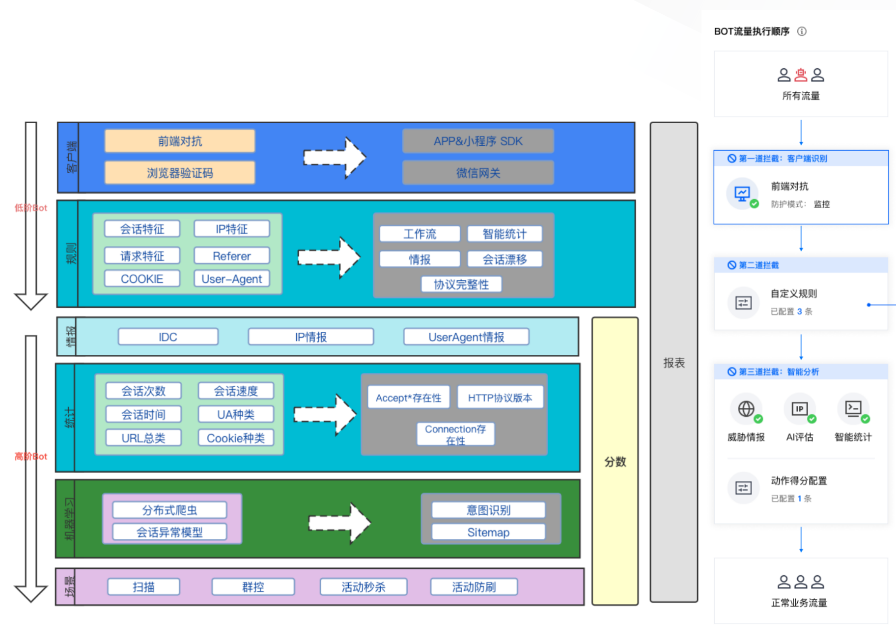
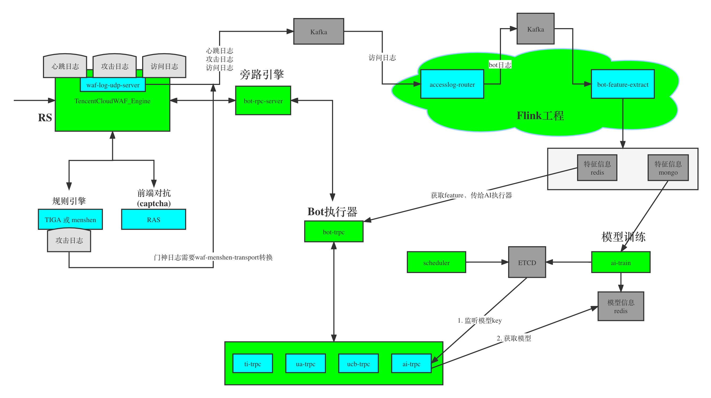

# 架构

## 方向选择

考虑点：

- WAF自身存在SaaS、CLB两种架构，两种架构在实现上存在巨大的差别，Anti-Bot的架构要考虑在WAF的两种架构上都要适用；
- 基于客户端以及流量特征的对抗效果是最好的，但是也存在了部署、升级、兼容性等一系列缺点；
- 架构要足够灵活，本身Bot对抗的场景跟业务强关联，不同的业务、场景在Bot对抗上存在比较大的差异；

最终确定:

- **以后台智能分析为主，客户端对抗为辅的大方针，做到“一码多架构”**
- 实时+离线，规则+机器学习，智能的同时足够灵活；
- 分数，请求恶意度量化，通过威胁情报、统计分析、AI策略进行评估打分（0-100，分数越高Bot恶意程度越大），通过评估出来的Bot分值，可直观的识别出对应访问请求流量的Bot的恶意程度；

## 方案架构图

## 架构设计图

上图 bot rpc server 已经重构为HUB

