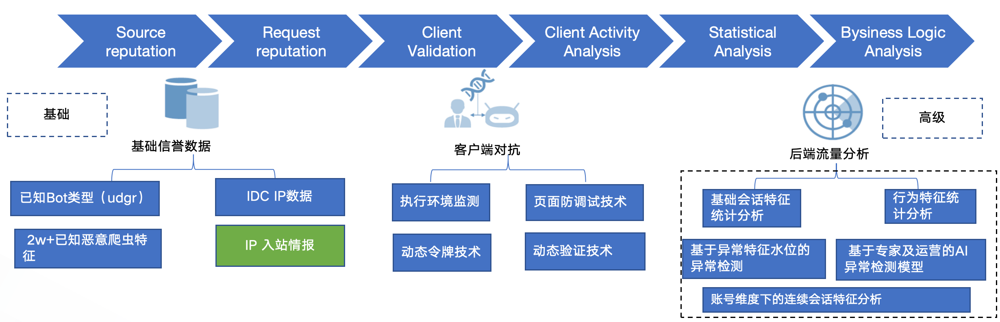

# BOT流量治理闭环
如何设计一个完整的BOT功能？
BOT分析 -> BOT分类 -> BOT处置
形成BOT流量治理闭环。

## BOT分析
- 通过实时和离线分析，对当前流量进行分析，得出当前访问流量的相关会话、统计、行为特征数据；
- 请求恶意度量化，通过威胁情报、统计分析、AI策略进行评估打分（0-100，分数越高BOT恶意程度越大），通过评估出来的BOT分值，可直观的识别出对应访问请求流量的BOT的恶意程度；
- 丰富的报表展示，支持多维度的下钻分析；

## BOT分类
- 区分恶意Bot、友好Bot；
- 通过对流量的分析透视后，支持用户对流量进行标注区分不同类型的Bot；
- 场景化，支持对登录、爬取等多种场景化配置，区分不同类型的Bot；

## BOT处置

- 支持多种处置动作；
- 支持用户自定义会话key，可以定义更细粒度的分析、处理对象，避免出口IP的问题；
- 支持设置多种处置策略，不同的业务场景、不同的客户端支持设置不同的处置策略；

## 功能点细化
BOT分析是最重要的环节，如何正确的分析BOT呢？
下图为BOT分析全景图：

细化的功能点从左到右为：

- 威胁情报/UA策略
- 前端对抗
- AI策略/智能统计/规则引擎/智能引擎