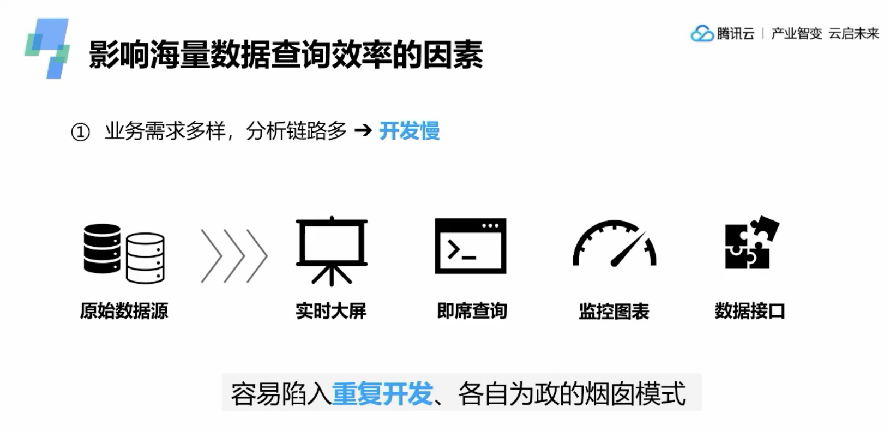
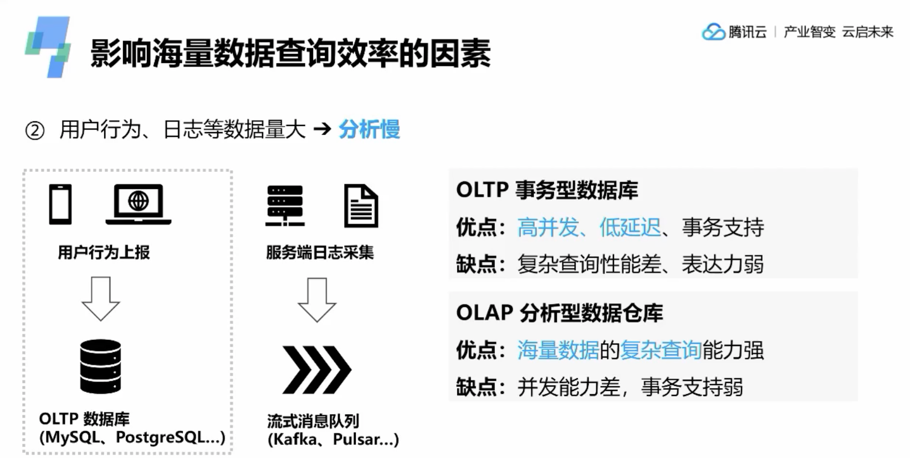
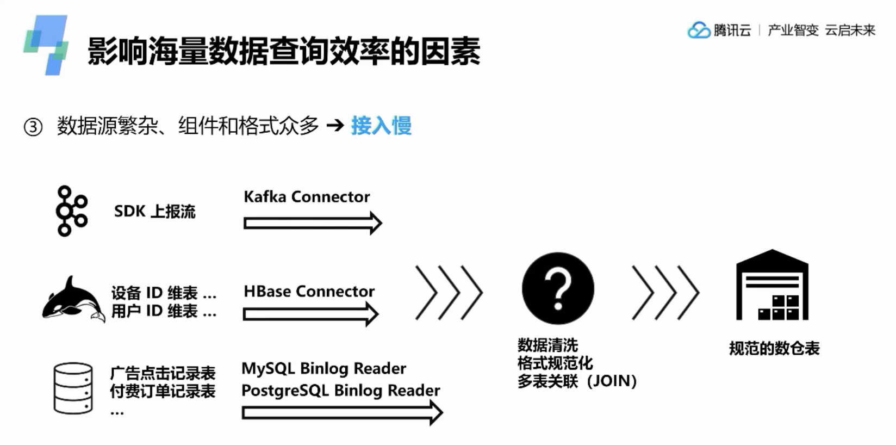
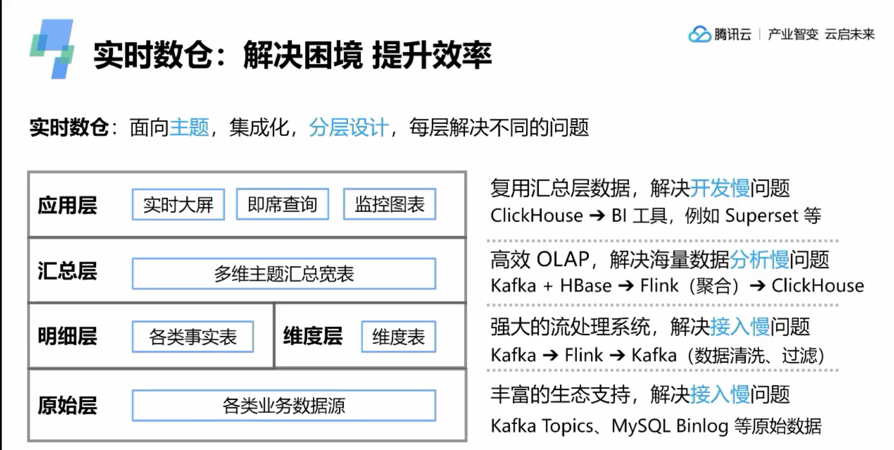
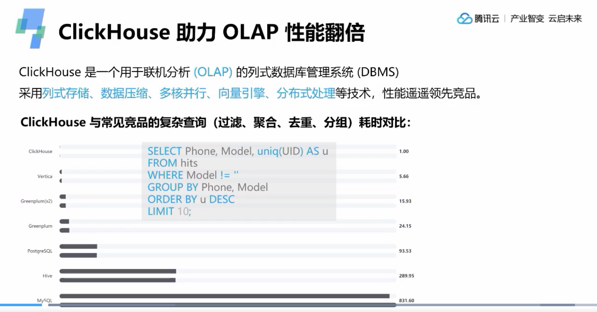
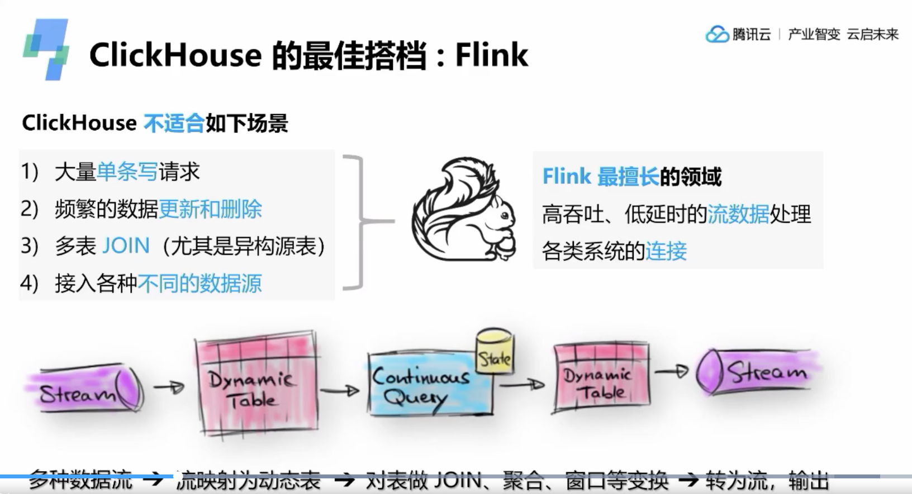
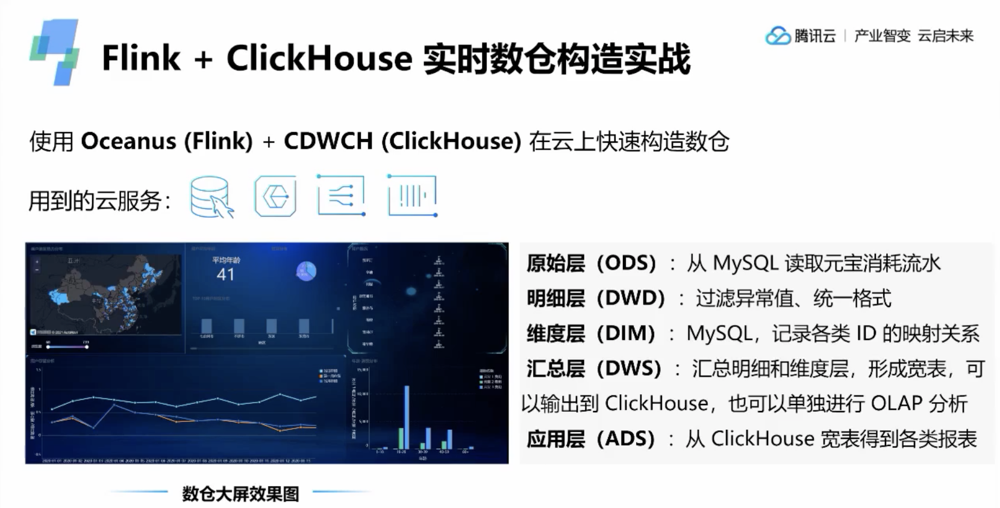

## 基于flink构建clickhouse实时数仓

### 影响海量数据查询效率的因素
#### 开发慢
每个查询需求都从数据源单独开发，复杂且效率低下

#### 分析慢
目前常用的数据保存在OLTP数据库中，负责语句查询和分析很慢。
而OLAP分析型数据仓库则查询能力较强

#### 接入慢
分析数据往往来自多种数据源

### 解决海量数据查询效率的方案

#### 分析速度对比

#### 组合使用
clickhouse在存储数据查询分析中表现优秀，但是不适合频繁的更新和删除数据。
flink一方面可以整理数据并存入clickhouse进行离线分析，一方面可以基于flink sql进行实时的数据查询。

https://cloud.tencent.com/developer/salon/live-1686?from=15716