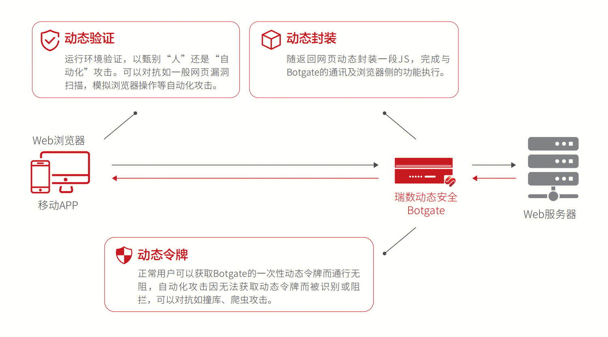
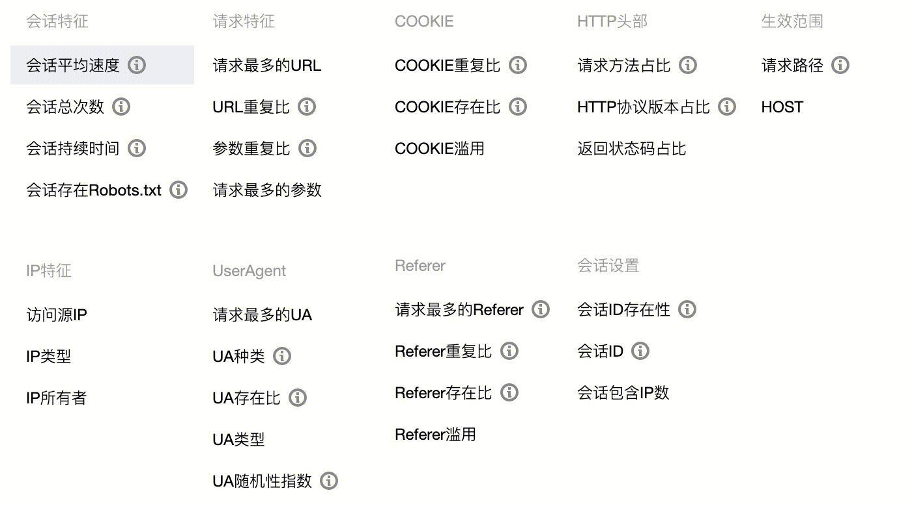
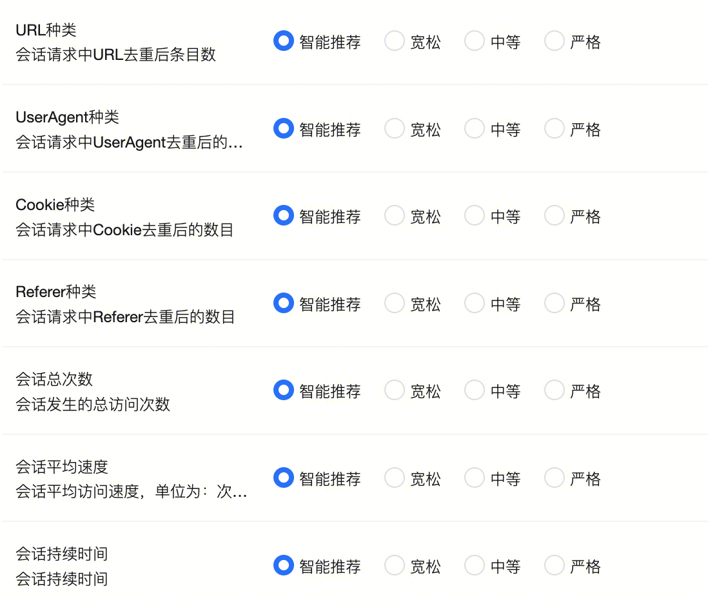
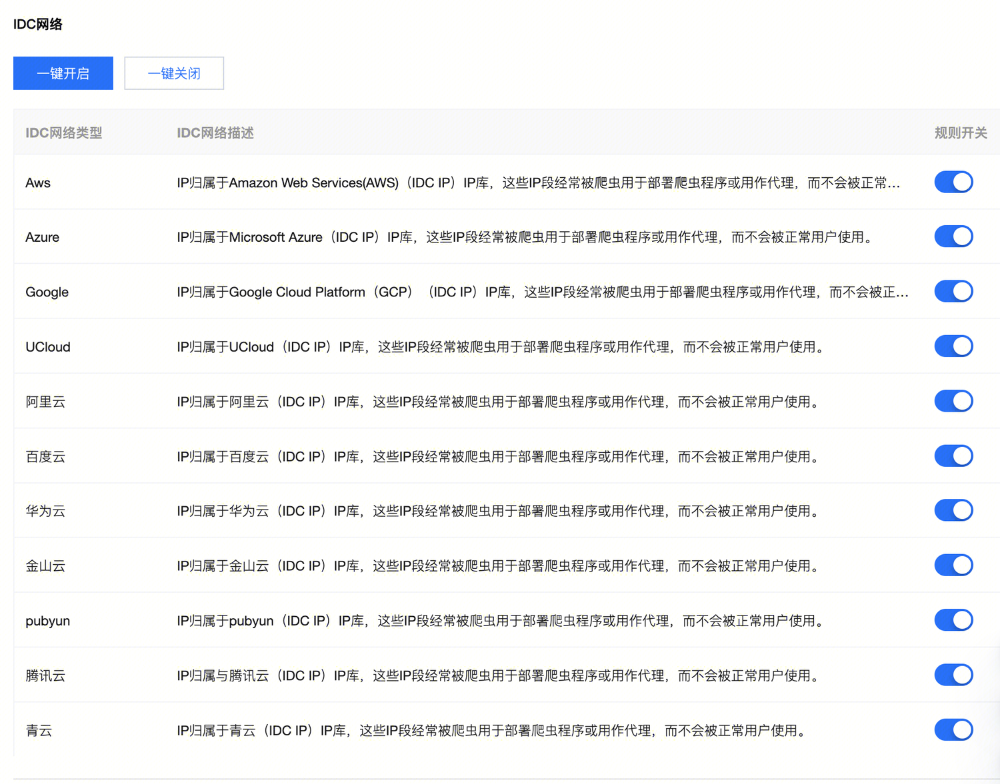
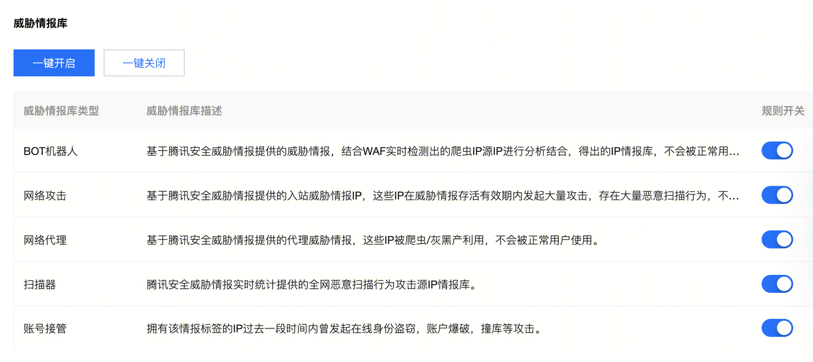
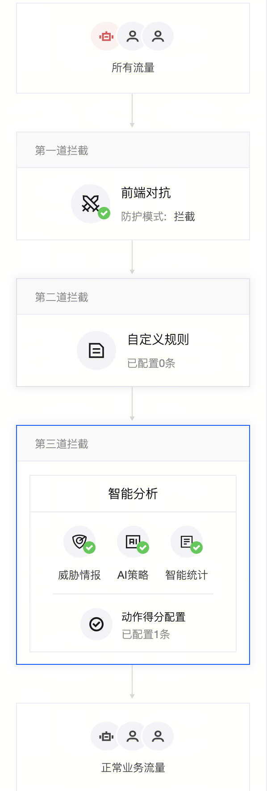

## WAF Bot 体验
### 客户端风险识别（前端对抗）
#### 自动化工具识别 + 页面防调试
- 瑞数动态验证 + 动态封装

- 页面防调试：浏览器请求的时候，会将HTML CSS JS都下载到本地后再进行CSS渲染和执行JS逻辑。在Chorm开发者工具中，可以很方便的查看CSS JS等执行过程。当程序异常复杂或代码被混淆时，查看源代码是异常难以理解程序执行逻辑的。通常调试者可以在控制台的source 的左边加上  `breakpoint`  来让程序每次走到加点的地方停下来,以便查看一些变量的值或是步骤的流程逻辑。一般方案，js中插入debugger等方法，打断调试。
### 验证码

- 客户有感验证码 腾讯云防水墙
[验证码](../security/basic/captcha/captcha.md)

- 客户无感验证码 动态令牌

### 规则
#### 自定义规则
在连续会话中，统计以下指标。一旦同个会话中，指标不合符，则被认为是Bot请求。

### 智能统计
按照经验值，设置推荐等级。

## 威胁情报
威胁情报服务商提供的威胁IP
### IDC网络

### 威胁IP

## AI引擎
### 特征提取
flink手工提取特征（主要是规则里面的特征）
### 特征分类
Xgboost进行特征分类

## 执行流程
1. 前端对抗
2. 自定义规则
3. 智能分析 ： 威胁情报 + AI策略 + 智能统计 采用三者打分的模式来评估BOT得分。配置得分范围区分Bot。

