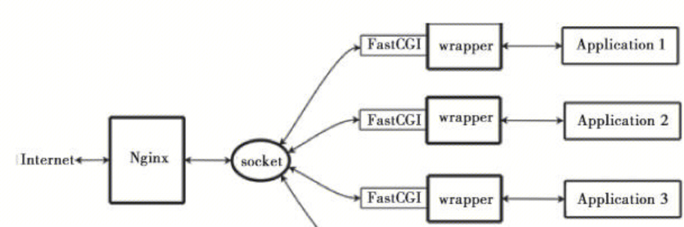

## FastCGI
FastCGI是一个HTTP server和动态脚本语言间通信的接口。
FastCGI接口方式采用C/S结构，可以将HTTP服务器和脚本解析服务器分开，同时在脚本解析服务器上启动一个或者多个脚本解析守护进程。当HTTP服务器每次遇到动态程序时，可以将其直接交付给FastCGI进程来执行，然后将得到的结果返回给浏览器。这种方式可以让HTTP服务器专一地处理静态请求或者将动态脚本服务器的结果返回给客户端，这在很大程度上提高了整个应用系统的性能。

## Nginx+FastCGI运行原理
Nginx不支持对外部程序(进程)的直接调用或者解析，所有的外部程序（包括PHP）必须通过FastCGI接口来调用。FastCGI接口在Linux下是socket（这个socket可以是文件socket，也可以是ip socket）。为了调用CGI程序，还需要一个FastCGI的wrapper（wrapper可以理解为用于启动另一个程序的程序），这个wrapper绑定在某个固定socket上，如端口或者文件socket。当Nginx将CGI请求发送给这个socket的时候，通过FastCGI接口，wrapper接收到请求，然后派生出一个新的线程，这个线程调用解释器或者外部程序处理脚本并读取返回数据；接着，wrapper再将返回的数据通过FastCGI接口，沿着固定的socket传递给Nginx；最后，Nginx将返回的数据发送给客户端。这就是Nginx+FastCGI的整个运作过程，

## PHP-FPM
FastCGI接口在脚本解析服务器上启动一个或者多个守护进程对动态脚本进行解析，这些进程就是FastCGI进程管理器，或者称为FastCGI引擎。 PHP-FPM就是支持PHP的FastCGI进程管理器。
FastCGI 的主要优点是把动态语言和HTTP Server分离开来，所以Nginx与PHP/PHP-FPM经常被部署在不同的服务器上，以分担前端Nginx服务器的压力，使Nginx专一处理静态请求和转发动态请求，而PHP/PHP-FPM服务器专一解析PHP动态请求。